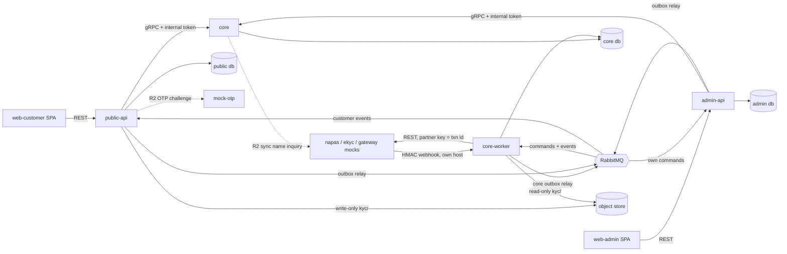
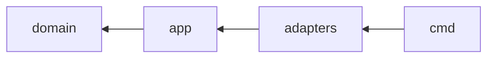
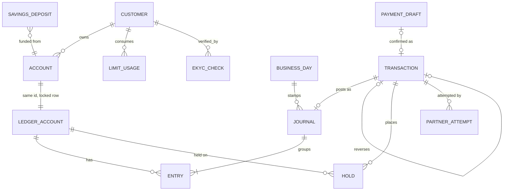
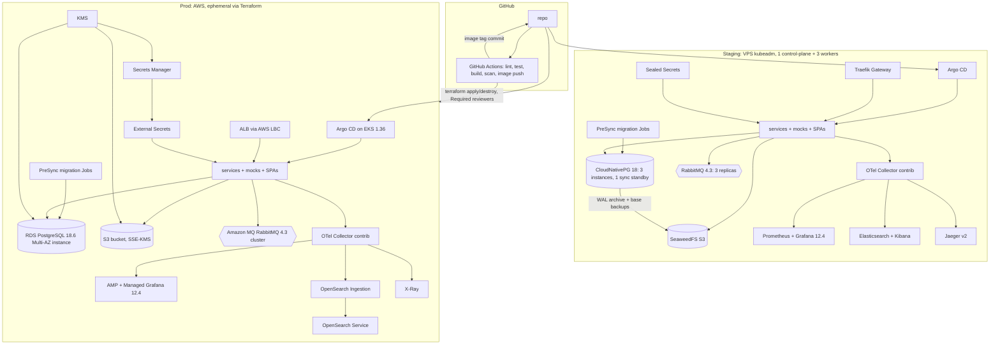

# Architecture Spine — banking-go

## Design Paradigm

Hexagonal (ports & adapters) inside every Go service: `domain` ← `app` (use cases + ports) ← `adapters` (http, grpc, postgres, rabbitmq, partner, objectstore).
**core** is a modular monolith: modules `customer`, `account`, `ledger`, `payment`, `pricing` (fee, limit), `savings` (R4), `eod` (business day from R1, EOD R3),
`recon` (R3), `audit`; one Postgres schema per module. Edge services own identity/session/workflow concerns only. Money correctness rests on
single-database ACID inside core: every core use case is exactly one Unit of Work (AD-16).



Dependency direction inside a service (a rule, enforced by import lint; cross-module rules in AD-3):



## Invariants & Rules

### AD-1 — Service set and ownership [ADOPTED]
- **Binds:** all
- **Prevents:** two services owning the same entity; business logic leaking into the wrong deployable.
- **Rule:** Deployables are exactly `public-api`, `admin-api`, `core`, `core-worker`, `mock-napas`, `mock-ekyc`, `mock-otp`, `mock-gateway`, `web-customer`, `web-admin`.
  public-api owns customer credentials (keyed by `customer_id`), refresh tokens, devices, login lockout, rate limits, (R2) OTP challenges; it holds only a projection of customer phone and status built from core events (AD-19).
  admin-api owns admin users, role assignments, TOTP, admin sessions, (R2) maker-checker requests.
  core owns customer profile (including phone, CCCD and their uniqueness) + eKYC state, accounts, ledger, transactions, fees, limits, savings, business day/EOD, reconciliation, audit log, and the object-store buckets (AD-24).
  core-worker is the same codebase as core (separate `cmd/`), same database; it is not a separate owner. It hosts core's outbox relay, message consumers, periodic jobs and the partner webhook listener.

### AD-2 — Money lives only in core [ADOPTED]
- **Binds:** FR-6..FR-19, R2–R4 money features
- **Prevents:** balances, fees or limits computed in two places.
- **Rule:** Only core modules create, mutate or compute accounts, holds, journal entries, fees, limits, interest. Edges and SPAs display values core returns; they never derive money values and never cache or decide fee, limit or OTP requirements (AD-21). A maker-checker approval in admin-api executes by calling a core command that carries an approval proof core verifies (AD-20); nothing changes until core commits.

### AD-3 — Database per service, schema per core module [ADOPTED]
- **Binds:** all services, all core modules
- **Prevents:** cross-service joins and hidden coupling through tables; one core module reaching into another's tables.
- **Rule:** One PostgreSQL 18 cluster per environment (staging CNPG, prod RDS Multi-AZ DB instance); databases `core`, `public`, `admin`, each with its own `<svc>_migrator` and `<svc>_app` roles that can access only that database (AD-26). No service reads another's database; integration is gRPC (sync) or events (async).
  Inside core each module has its own Postgres schema (`customer`, `account`, `ledger`, `payment`, `pricing`, `savings`, `eod`, `recon`, `audit`) and touches only its own schema; other modules are reached only through that module's `app` port, in the caller's UoW (AD-16). Infrastructure tables `outbox`, `inbox`, `idempotency_keys` live in schema `platform` and are written only through `pkg/outbox`, `pkg/inbox`, `pkg/idempotency`.
  Enforcement: depguard import lint — `internal/<a>/...` may import `internal/<b>/app` only, never `internal/<b>/domain` or `internal/<b>/adapters`; a module's SQL referencing another module's schema fails CI.

### AD-4 — Double-entry, append-only ledger [ADOPTED]
- **Binds:** FR-9..FR-13, BF-2..BF-4, BF-10, BF-11
- **Prevents:** money created/destroyed; silent edits of history; two sign conventions.
- **Rule:** Every money movement is one `journal` with ≥ 2 `entries`, Σdebit = Σcredit, written in the same UoW (AD-16) as the transaction it belongs to; every journal belongs to exactly one transaction (AD-23) and carries `business_date` (AD-22).
  Entries and journals are never updated or deleted: the `core_app` role has only INSERT, SELECT on `journals`, `entries` (AD-26). Corrections are reversal transactions (AD-23).
  Amounts are `BIGINT` VND đồng, > 0, sign carried by side (D/C), never floats, including intermediate values.
  Every ledger account has `normal_side`; balance = Σ normal-side − Σ opposite-side (customer accounts: C).
  Customer-account entries store `balance_after` and a per-account monotonic `seq`, both assigned under the account row lock (AD-5).

### AD-5 — Locking and hot accounts [ADOPTED]
- **Binds:** FR-8, FR-12, FR-16, FR-17, SM-1, SM-2
- **Prevents:** deadlocks, negative balances, check-then-act races on status or available balance, and internal-account contention killing throughput.
- **Rule:** Any UoW that changes a customer account's `balance`, `available_balance`, holds or status first takes `SELECT … FOR UPDATE` on that account's row (AD-17); no money operation reads status or available balance without that lock.
  Lock order in every UoW: idempotency row → transaction row (AD-18) → customer account rows in ascending `id` → limit-usage rows in ascending key (AD-21) → `business_day` share lock (AD-22).
  Internal (bank-owned) ledger accounts are never locked or balance-updated on the hot path; their balances are derived from entries by a periodic snapshot job.
  DB CHECK constraints: customer `balance ≥ 0` and `available_balance ≥ 0`.
  Hot-path UoWs run READ COMMITTED with explicit row locks (no SERIALIZABLE), `lock_timeout` 2 s and `statement_timeout` 5 s (config); a timeout aborts the whole UoW.

### AD-6 — Idempotency at the owning service [ADOPTED]
- **Binds:** FR-14, all mutating commands, system-originated commands
- **Prevents:** duplicate effects on retry; key collisions between actors; honest retries rejected; two different dedupe schemes.
- **Rule:**
  - Every mutating REST call requires header `Idempotency-Key`, except session endpoints (login, refresh, logout). Edges forward the original key in gRPC metadata `idempotency-key`; the service that performs the effect owns the record, in its own DB, in the same UoW as the effect.
  - Record `(scope, key, request_hash, state, response, created_at)` with UNIQUE `(scope, key)`; `scope` = (actor_type, actor_sub, full gRPC method).
  - `request_hash` = SHA-256 of a canonical, deterministic encoding of the RPC's business fields only (fields marked by a proto option), computed by the owning service; edge-injected fields (trace, assertions, timestamps) are excluded.
  - The record is inserted `in_progress` at the start of the UoW (`INSERT … ON CONFLICT DO NOTHING`); a concurrent request with the same key waits up to `lock_timeout`, then gets 409 `idempotency_in_progress` (retryable). Same key + same hash → stored result; same key + different hash → 422 `idempotency_conflict`.
  - Business outcomes are stored, including domain rejections that record a `failed` transaction; validation errors that create no record are not stored. For async flows the stored result references the resource, and a replay returns that resource's current state.
  - System-originated commands use deterministic keys `<origin>:<origin_entity_id>:<step>` (e.g. `mc:<request_id>:execute`, `reg:<client_key>`, `recon:<txn_id>:<attempt_no>`); random per-attempt keys are forbidden.
  - Retention 72 h (≥ 24 h per FR-14); purge runs in the owning service (AD-15).

### AD-7 — No partner call inside a DB transaction [ADOPTED]
- **Binds:** BF-1, BF-2, BF-4, BF-5, BF-8, BF-10
- **Prevents:** holding locks across network calls; lost, re-sent or double partner requests.
- **Rule:**
  - Partner interactions with effects follow: tx1 (record `pending` + hold + outbox command) → core-worker calls the partner with our transaction id as partner idempotency key → tx2 through `payment.Transition` (AD-18). No partner call is made while a DB transaction is open.
  - Before the first network call core-worker commits a `partner_attempts` row (txn_id, attempt_no, kind `submit|query`, sent_at). On redelivery, if a `submit` attempt exists, the worker sends a status query, never a second submit.
  - Each partner has `submit_timeout` and `callback_deadline` (config). Money transactions: submit timeout, or `callback_deadline` passed (detected by the unknown scan, AD-15) → `pending → unknown`, never `failed`. Only reconciliation (BF-5) moves `unknown` to a terminal state. Transaction states and transitions are exactly those in business-flows.md.
  - Non-money partner calls follow their own state machine in business-flows.md (eKYC: timeout → retry ≤ 3 with backoff → `pending_review`); same tx1/outbox/tx2 shape, no `unknown`.
  - (R2) Synchronous read-only partner calls (NAPAS name inquiry) are made by a core adapter with a timeout, with no DB transaction open and no state change.

### AD-8 — Transactional outbox → RabbitMQ, idempotent and order-safe consumers [ADOPTED]
- **Binds:** all async work and cross-service events
- **Prevents:** event lost after commit, or published without commit; double processing; stale events overwriting newer state; commands fanned out as events.
- **Rule:**
  - A service writes messages to its own `outbox` table in the same UoW as the state change. For core the relay runs only in core-worker; each edge runs its own relay in-process. The relay claims rows with `FOR UPDATE SKIP LOCKED` in `(aggregate_id, seq)` order, publishes to RabbitMQ 4.3 (staging RabbitMQ Cluster Operator; prod Amazon MQ) and marks them sent.
  - Delivery is at-least-once. Every consumer records the processed `message_id` in an `inbox` table in the same UoW as its effect, skips duplicates, and acks only after commit. Consumers use `Qos(prefetch, 0, false)` (never global QoS); all queues are durable quorum queues.
  - Events: type `banking.<context>.<entity>.<past_verb>.v<major>` (`<context>` = core module name, `identity` for public-api, `backoffice` for admin-api) on topic exchange `banking.events`; CloudEvents `subject` = aggregate id and extension `aggregateversion` = monotonic per-aggregate version. A consumer that maintains state from events stores the last applied version per subject and ignores older ones; no consumer assumes delivery order. A semantic change bumps `<major>`; producers dual-publish during migration.
  - Commands (work requests to core-worker or an edge's own worker loop): type `banking.<module>.<command_verb>.v<major>` on direct exchange `banking.commands`, one queue per command type; never published on `banking.events`.
  - Retries use delayed retry exchanges `banking.retry.<n>` → `<queue>.dlq` after the limit; DLQ depth is alerted. Exchanges, retry and DLQ topology are declared once in `deploy/`; services declare only their own queues.

### AD-9 — Contracts and their sources of truth [ADOPTED]
- **Binds:** public-api, admin-api, core, SPAs
- **Prevents:** client/server drift; breaking changes slipping in; business error codes re-mapped differently per edge.
- **Rule:** External REST is code-first with Huma v2 on chi; each edge exports `api/openapi/<service>.yaml` (OpenAPI 3.1), committed, CI fails on uncommitted diff; SPA clients are generated from it with openapi-typescript + openapi-fetch. gRPC services and event payloads are protobuf in `/proto`, built with buf; `buf breaking` runs in CI against the default branch. Events carry CloudEvents-style attributes (`id`, `type`, `source`, `time`, `subject`, `aggregateversion`, `traceparent`). REST errors use RFC 9457 problem details with a stable `code`. Core puts its stable domain code in `google.rpc.ErrorInfo.reason` (domain `banking-go`) with params in `metadata`; edges copy them verbatim into the problem `code`/params and never re-map business codes.

### AD-10 — AuthN at the edge, AuthZ against one policy, ownership in core [ADOPTED]
- **Binds:** FR-4, FR-20..FR-24, public-api, admin-api, core
- **Prevents:** a compromised or buggy edge asserting actors it does not own; IDOR on customer resources; token replay across RPCs; two permission models.
- **Rule:**
  - Edges authenticate (customer JWT; admin session + TOTP) and call core with an internal token in gRPC metadata `x-actor`, over mTLS (cert-manager internal CA). Token = EdDSA-signed JWT, `exp` ≤ 60 s, claims `iss`, `aud=core`, `kid`, `jti`, `iat`, `exp`, `rpc` (full gRPC method), `actor_type`, `sub`, `roles`, `session_id`, `client_ip`, `user_agent`, `request_id`. `client_ip` comes from the Gateway's trusted forwarded header only.
  - Each edge has its own signing key; its public keys reach core as a mounted JWKS Secret; rotation by overlapping `kid`s. Core pins `kid → (issuer, allowed actor types)`: public-api → `customer` (roles fixed `[customer]`) and `anonymous` (`sub` = `registration_id`), where core accepts `anonymous` only on `RegisterCustomer`; admin-api → `staff` only. `system:<job>` actors exist only in-process in core/core-worker and never cross the network. Core rejects a token with `aud` ≠ core, `rpc` ≠ the called method, or an actor type not allowed for its `kid`.
  - Customer actors: `sub` = `customer_id` (AD-19). Every use case resolves its target resources and checks `owner_customer_id == sub` inside the UoW before any effect; a failed check returns `not_found`. Money commands also require core customer status `active`.
  - Staff actors: one role → permission policy in `pkg/authz` (versioned in repo, table-driven tests) is evaluated by admin-api for its own use cases and by core for core use cases; default deny. Staff roles are asserted by admin-api, whose signing key is a Tier-0 secret. FR-22 no-self-assignment is a rule in that policy, enforced by admin-api. Commands subject to maker-checker also require an approval proof (AD-20).
  - Public TLS terminates at the Gateway (staging Traefik with cert-manager certificates; prod ALB with ACM certificates).

### AD-11 — Audit log owned by core [ADOPTED]
- **Binds:** FR-3, FR-7, FR-20..FR-23, SM-4
- **Prevents:** scattered, mutable, duplicated or missing audit records; secrets in audit.
- **Rule:**
  - core `audit` module is the only audit store: append-only `audit.audit_records`, `core_app` has INSERT/SELECT only.
  - The service that commits a change writes its audit record. Core writes it in the same UoW for every core state change and for every denied authZ decision (`outcome=denied`). Edges emit audit events via their outbox only for edge-owned facts: login success/failure, lockout, logout, session expiry, TOTP enrolment, admin user and role changes, maker-checker request lifecycle, OTP challenge results. An edge never emits an audit event for a change core commits.
  - One schema `banking.audit.v1.AuditRecord` in `/proto`: `id` (UUIDv7 = source event id), `occurred_at`, `actor` (type, sub, roles, session_id), optional `approver` (sub), `client_ip`, `user_agent`, `request_id`, `trace_id`, `action` (`<module>.<entity>.<verb>`), `target` (type, id), `outcome` (`success|denied|failed`), `reason_code`, `before`, `after`.
  - `before`/`after` hold only allow-listed fields per entity; never passwords or their hashes, TOTP secrets, tokens, OTPs or images, not even hashed. `client_ip`/`user_agent` come from `x-actor` (AD-10).
  - Ingestion of edge audit events dedupes on `AuditRecord.id`.

### AD-12 — Partners are external, even when mocked [ADOPTED]
- **Binds:** mocks, core-worker, core (R2 name inquiry), public-api (R2 OTP)
- **Prevents:** shortcuts that would not survive a real partner; replayed or forged callbacks.
- **Rule:**
  - Mocks are separate deployables with their own code; core never imports mock code. Calls are HTTP/JSON. Each mock dedupes submits by idempotency key (our transaction id) for ≥ 7 days and exposes a status query `GET /v1/transactions/<our_txn_id>`. Each mock exposes configurable failure modes: success, business error, timeout, slow, duplicate callback, no callback.
  - Callbacks are HMAC-SHA256-signed webhooks: headers `X-Key-Id`, `X-Timestamp`, `X-Signature: v1=<hex HMAC-SHA256(secret, timestamp + "." + raw_body)>`. Receivers verify over the raw body bytes before parsing, with constant-time compare and a ±300 s window. Secrets are per partner and per environment; two secrets are active during rotation.
  - The webhook receiver is a dedicated listener in core-worker on its own Gateway host, never routed through public-api or admin-api. Callback dedupe is by `(partner, our_txn_id, outcome)` through AD-18; partner event ids are stored, never relied on.

### AD-13 — Telemetry only through OTLP [ADOPTED]
- **Binds:** all services
- **Prevents:** vendor lock in code; staging/prod instrumentation and alerting drift.
- **Rule:** Services emit traces, metrics and logs with the OpenTelemetry Go SDK over OTLP to an OpenTelemetry Collector (contrib distribution) only — no backend-specific SDKs. Trace context propagates through HTTP, gRPC metadata and RabbitMQ message headers. Logs are JSON via `log/slog` bridged to OTel (otelslog), with `trace_id`, `span_id`, `service`, `env`. Backends are chosen by Collector config per environment; prod exports use `otlphttp` + `sigv4auth` (X-Ray with Transaction Search enabled, OpenSearch Ingestion) and remote write to AMP.
  Alert rules are Prometheus-format files in `observability/alerts/`, loaded by Prometheus/Alertmanager on staging and the AMP ruler on prod; severity labels `critical|warning`; FR-13 invariant violations, `recon_conflict` and callback mismatches are `critical`. Dashboards target the Grafana 12.4 schema (staging Grafana and AMG are both 12.4).

### AD-14 — Environments and delivery [ADOPTED]
- **Binds:** deploy/, infra/, CI
- **Prevents:** per-environment forks of manifests; prod changes outside Git; unpatched or unsupported add-ons; staging that cannot survive a node loss.
- **Rule:**
  - One Helm chart per deployable, values files per env (`values-staging.yaml`, `values-prod.yaml`); SPAs are static web-server images in-cluster in both envs, reading the API base URL from a runtime config file. Routing via Gateway API v1.6 standard-channel resources, CRDs installed before the controllers (staging Traefik, prod AWS Load Balancer Controller). Argo CD syncs both clusters from Git; nothing is `kubectl apply`'d by hand.
  - Staging: VPS kubeadm, 1 control-plane (~4 GB, tainted) + 3 workers (~8 GB). CNPG 3 instances and RabbitMQ 3 replicas are spread across the 3 workers with required pod anti-affinity; Elasticsearch, Kibana and Jaeger are single-replica, best-effort.
  - Prod: EKS, RDS PostgreSQL Multi-AZ DB instance, Amazon MQ for RabbitMQ 4.3 (`mq.m7g.large`, `CLUSTER_MULTI_AZ`), OpenSearch Service + Ingestion, AMP/AMG, X-Ray, S3, KMS, Secrets Manager — Terraform only, created/destroyed per release/demo through a GitHub Actions job behind a Required-reviewers environment, engine versions set explicitly.
  - Kubernetes minor is pinned and equal on both clusters (Stack) and bumped together. Platform and stateful add-ons are installed only through the operators/charts named in Stack; no Bitnami charts or images (sole exception: the Sealed Secrets controller image published under `bitnami/` by the active bitnami-labs project).
  - Apps read config only from environment variables; secrets arrive as Kubernetes Secrets (staging Sealed Secrets, prod External Secrets ← AWS Secrets Manager).

### AD-15 — Scheduled work [ADOPTED]
- **Binds:** BF-5, BF-9, BF-10, BF-11, FR-13, FR-19, every service's periodic jobs
- **Prevents:** a job running twice concurrently across replicas; a job touching another service's database.
- **Rule:** Core periodic jobs (unknown scan, invariant check, internal-balance snapshot, business-day roll (R1) / EOD (R3), idempotency purge) run only in core-worker. Edge-owned periodic jobs (idempotency purge, expired refresh-token cleanup, (R2) maker-checker expiry) run in the owning edge against its own database. Every run takes a PostgreSQL advisory lock named `<svc>.<job>` in its own database and is idempotent per (job, `business_date` per AD-22, or time window). Expiry may also be applied lazily at read time.

### AD-16 — Unit of Work in core [ADOPTED]
- **Binds:** all core modules, core-worker consumers/webhook/job handlers, `pkg/idempotency`, `pkg/outbox`, `pkg/inbox`, `audit`
- **Prevents:** a business record and its journal, idempotency, outbox, inbox or audit rows committing in different DB transactions; locks taken on one connection not protecting writes on another.
- **Rule:** Only the entry use case — the `app` use case invoked by a core gRPC handler or by a core-worker consumer, webhook or job handler — begins and commits the DB transaction, through `uow.Do(ctx, func(tx) error)`. Every cross-module `app` port method that reads or writes state takes the transaction handle as its parameter after `ctx`; port methods and adapters never call `Begin`, `Commit` or `Rollback` (lint + review gate). Idempotency, outbox, inbox and audit rows are written through the same handle. One use case = exactly one UoW; no UoW spans services. Edges apply the same rule inside their own database.

### AD-17 — Account row, balances and holds [ADOPTED]
- **Binds:** core `account`, `ledger`, `payment`, `savings`, invariant job; FR-6..FR-13
- **Prevents:** balance and status split across rows; two inconsistent available-balance formulas; holds released while money is in flight; sign-convention mismatches hiding drift.
- **Rule:**
  - Every ledger account (customer or internal) has one row in `ledger.ledger_accounts`; for a customer account its `id` = the account id. That row alone holds `normal_side`, `status`, `balance`, `available_balance`, `version`. The `account` module keeps metadata (number, owner, default flag) keyed by the same id and changes status only through ledger's `SetStatus`.
  - The only functions that change `balance` or `available_balance` are in `ledger`, run inside the caller's UoW under the AD-5 row lock: `Post` (per normal side, a debit lowers both, a credit raises both; for internal accounts it only appends entries), `PlaceHold` (available −= amount), `ReleaseHold` (available += amount), `CaptureHold` (in one call releases the hold and posts exactly the hold amount; a capture ≠ hold amount is rejected).
  - Holds live in `ledger.holds`, states `active → captured | released`; one hold = one transaction + one account. Holds never expire by time; while the transaction is non-terminal the hold stays, and only its terminal transition (AD-18) captures or releases it.
  - Status changes and account close (FR-8: balance = 0, no active holds, no `pending`/`unknown` transaction touching the account in either direction, default-account rule) run under the same row lock.
  - The invariant job (FR-13) runs at a consistent snapshot (REPEATABLE READ) and checks: Σdebit = Σcredit system-wide; customer `balance` = Σ entries by normal side; `available_balance` = `balance` − Σ active holds; no active hold belongs to a terminal transaction; no negative customer balance. A violation is a critical alert.

### AD-18 — Single transaction transition path [ADOPTED]
- **Binds:** core `payment`, `recon`, `savings`; every core-worker handler, webhook and job; FR-15..FR-19
- **Prevents:** racing writers (callback, timeout, scan, manual recon) overwriting each other; double posting; terminal states being overwritten; posting an amount the partner did not confirm.
- **Rule:**
  - Every transaction state change goes through `payment.Transition(ctx, tx, txn_id, expected_from, to, evidence)` inside the caller's UoW. It locks the transaction row `FOR UPDATE` before any account row (AD-5 order), applies the change only if `status = expected_from` (compare-and-set), and bumps `version`. Posting, `CaptureHold`, `ReleaseHold` and limit-usage return (AD-21) for a transaction happen only inside `Transition`.
  - A repeated transition to the same terminal state is a no-op success. Evidence for a terminal state different from the recorded one never overwrites it: it is stored as a `partner_attempts` row with outcome `conflict` and raises the critical alert `recon_conflict`; the fix is a reversal transaction (AD-23).
  - A verified callback must match `(our_txn_id, amount)` exactly. On mismatch nothing is posted, a `pending` transaction moves to `unknown`, and a critical alert is raised. A matching callback finalizes a `pending` transaction; a callback for an `unknown` transaction is recorded and triggers an immediate reconciliation query (only reconciliation finalizes `unknown`, AD-7).
  - Webhook dedupe = this CAS keyed by `(partner, our_txn_id, outcome)` plus the AD-12 replay window. Manual "reconcile now" from admin-api is a core command that enqueues a recon command; only core-worker queries partners.

### AD-19 — Customer identity and registration [ADOPTED]
- **Binds:** FR-1, FR-4, BF-1, BF-7, public-api, core `customer`, core-worker eKYC
- **Prevents:** credentials not linked to a core customer; two owners of phone/CCCD; stale or reordered status events re-enabling a blocked login.
- **Rule:**
  - `customer_id` (UUIDv7, minted by core) is the only customer identity. public-api's credential row is keyed by `customer_id`; JWT `sub` and `x-actor` `sub` = `customer_id`.
  - Core owns phone and CCCD and enforces their uniqueness (409). public-api keeps `login_phone` only as a lookup copy (blind index, AD-25), updated solely from core event `banking.customer.customer.phone_changed.v1`.
  - Registration in public-api, in order: validate password policy and hash with argon2id (the hash never leaves public-api) → upload images to `kyc/<registration_id>/` (registration_id derived from the `Idempotency-Key`, AD-24) → call core `RegisterCustomer` with key `reg:<Idempotency-Key>`, receiving `customer_id` → insert the credential keyed by `customer_id` in its own UoW. A retry with the same key replays the core call and the credential insert.
  - Core publishes `banking.customer.customer.status_changed.v1` with `aggregateversion`; public-api keeps a status projection, ignores older versions (AD-8), gates login and refresh on it, and revokes all refresh tokens of a customer entering a non-login state. Core independently requires `active` for money commands (AD-10).
  - Login-allowed states: `active`, `pending_ekyc`, `pending_review`; `rejected` and `expired` cannot log in (refresh tokens revoked). Non-`active` customers may read only their onboarding status.
  - Abandoned registration: a core customer without a credential can be completed by re-registering with the same phone + CCCD within 24 h (idempotent, returns the same `customer_id`). After 24 h a core job moves any customer still without a credential (whatever its status other than `rejected`) to `expired` (distinct from `rejected`), closes only its `active` zero-balance accounts (a `debit_blocked`/`blocked` account must be unblocked first, `invalid_status_transition`) and releases phone/CCCD uniqueness; its kyc images follow AD-24 retention.

### AD-20 — Approved-command execution (maker-checker) [ADOPTED]
- **Binds:** BF-9, R2 maker-checker, admin-api, core commands marked `requires_approval`
- **Prevents:** bypassing maker-checker by calling the core command directly; double execution on retry; applying an approval built on a stale before-value.
- **Rule:**
  - Core commands marked `requires_approval` (proto option; from R2: balance adjustment, account block/unblock, limit/fee changes, reversal) refuse to run without an `approval` claim in the internal token: `request_id`, `maker_id`, `maker_roles`, `checker_id`, `checker_roles`, `request_hash`, `approved_at`, `expires_at`, `expected_target_version`.
  - Core verifies on every call: token from admin-api's `kid`; `maker_id` ≠ `checker_id`; maker and checker roles permit request/approve for that command in `pkg/authz`; `request_hash` = the canonical business-field hash of the command (AD-6); now < `expires_at`; target version = `expected_target_version`, else `approval_stale`.
  - The idempotency key is always `mc:<request_id>:execute`.
  - admin-api request states: `waiting_approval → approved → executing → executed | execution_failed`; `waiting_approval → rejected | expired`. Execution is driven by admin-api's outbox and retried until core answers; `executed`/`execution_failed` are set only from core's response or its idempotent replay.
  - Core's audit record carries the maker as actor and the checker as approver (AD-11).

### AD-21 — Fees, limits and step-up decided once in core [ADOPTED]
- **Binds:** R2 BF-8, UJ-9; core `pricing`, `payment`, `savings`; public-api OTP
- **Prevents:** fee shown ≠ fee charged; capture ≠ hold; concurrent payments bypassing limits; OTP skipped by an edge; rounding drift.
- **Rule:**
  - Fee- or limit-bearing payments are two-step: a persisted draft records amount, fee, `fee_schedule_version`, limit-check result and `step_up_required`, with an expiry (config); confirmation creates the transaction from the draft. Hold = draft amount + fee; posting and capture use only persisted values, never recomputed.
  - Limit usage is a row per `(customer_id, limit_kind, period_key)`, locked `FOR UPDATE` in the UoW that creates the transaction; usage is reserved at creation (pending, unknown and succeeded all count) and returned only by a `failed` transition (AD-18). `period_key` uses the Asia/Ho_Chi_Minh calendar date (AD-22).
  - Core alone decides `step_up_required`. public-api runs the OTP challenge with mock-otp and passes a step-up assertion: an EdDSA JWT signed with public-api's `kid`, claims `draft_id`, `payload_hash`, `sub`, `method=otp`, `jti`, `iat`, `exp` ≤ 120 s. Core verifies the signature and the binding to draft and `sub`, and consumes it once in the confirming UoW.
  - All money arithmetic is integer; rates are stored as integers (basis points / per-million). Each rounding mode is defined once in core `pricing` and reused by `payment`, `savings`, `eod`. Interest accrues cumulatively: each business day posts round(total_to_date) − posted_to_date.

### AD-22 — Business day [ADOPTED]
- **Binds:** core `ledger`, `eod`, `pricing`, `savings`, `recon`; FR-9, BF-10, BF-11
- **Prevents:** journals stamped with different notions of "day"; postings landing in a closed day; R1 journals needing migration when EOD arrives.
- **Rule:**
  - Core `eod` owns a single `business_day` row (`open_date`, `state` open|closing, `closing_date`) from R1. The business calendar timezone is Asia/Ho_Chi_Minh. In R1 a core-worker job rolls `open_date` at 00:00 Asia/Ho_Chi_Minh; from R3 EOD replaces that job.
  - Every journal's `business_date` = `open_date`, read under a share lock on `business_day` inside the posting UoW — the date of posting (tx2), not of transaction creation.
  - EOD cutover: EOD takes `FOR UPDATE` on `business_day` (waiting only for in-flight postings), sets `open_date` := D+1, `state` := closing, `closing_date` := D, and commits; new postings go to D+1 and EOD steps for D run on frozen D. No journal is inserted with `business_date` < `open_date` except by EOD for D while closing.
  - Customer-facing periods (daily limits, statement date ranges) use the Asia/Ho_Chi_Minh calendar date of `created_at`; accounting and interest use `business_date`.

### AD-23 — Transaction kinds and corrections [ADOPTED]
- **Binds:** core `payment`, `ledger`, `recon`, `savings`, `eod`; FR-10, FR-18
- **Prevents:** reversal journals attached to the original, floating without a transaction, or flipping a terminal state.
- **Rule:**
  - Every journal belongs to exactly one transaction (`journals.transaction_id NOT NULL UNIQUE`).
  - Transaction `kind` ∈ `deposit`, `withdrawal`, `internal_transfer`, `interbank_transfer`, `fee`, `balance_adjustment`, `reversal`, `interest_accrual`, `interest_payout`, `savings_open`, `savings_settle`; extended only by spine amendment.
  - A correction is a new transaction of kind `reversal` with `reverses_transaction_id`; its journal mirrors the original's entries (fully or partially) with sides swapped; it is created only by a staff command (from R2 `requires_approval`, AD-20). The original keeps its terminal state; statements show both.
  - System-originated transactions (accrual, payout, settlement) carry actor `system:<job>` and an AD-6 deterministic key.

### AD-24 — Object store [ADOPTED]
- **Binds:** FR-1, FR-2, BF-1, BF-10 (R3 recon files), public-api, core-worker, mock-ekyc
- **Prevents:** two services each owning document storage; images reaching business DBs, logs or events; unscoped access.
- **Rule:**
  - S3-compatible object store accessed only through the S3 API with endpoint from config: staging SeaweedFS, prod Amazon S3 with SSE-KMS; one bucket per environment. Core owns buckets, prefixes, lifecycle and retention.
  - Prefix `kyc/`: public-api has write-only credentials (uploads at registration, AD-19); core and core-worker have read-only credentials. core-worker gives mock-ekyc short-TTL presigned GET URLs. Staff view images only via a core gRPC stream relayed by admin-api (no presigned URL to browsers); every view is audited. R3 recon files use prefix `recon/`, owned by core.
  - Business DBs store only object keys. Images never appear in logs, traces, events or audit records.

### AD-25 — Sensitive data protection [ADOPTED]
- **Binds:** product security criterion, SM-4, FR-1, FR-4, FR-20, FR-24; all services
- **Prevents:** plaintext PII and secrets at rest; per-module crypto schemes; lookups that need to decrypt every row.
- **Rule:**
  - Phone and CCCD (core profile and public-api's `login_phone` copy) and TOTP secrets are envelope-encrypted through `pkg/crypto`: AES-256-GCM data keys wrapped by a key-encryption key (prod AWS KMS, staging a Sealed Secret); ciphertext carries a key id so keys rotate without rewrite.
  - Lookup and uniqueness on phone/CCCD (FR-1, FR-24, login) use HMAC-SHA256 blind-index columns over the normalized value with a separate HMAC key per service; unique constraints sit on the blind index.
  - Passwords are argon2id; refresh tokens and session ids are stored hashed. Logs mask phone/CCCD to the last 4 digits and never carry credentials, tokens, OTPs or images.
  - Prod storage is KMS-encrypted (RDS, EBS, S3, Amazon MQ, OpenSearch). TLS terminates at the Gateway; internal traffic is mTLS (AD-10).

### AD-26 — Operations envelope [ADOPTED]
- **Binds:** all Go services, deploy/, infra/, SM-1, SM-3
- **Prevents:** runtime roles able to rewrite append-only tables; migrations racing rollouts; dropped in-flight work on shutdown; unrecoverable money data; failover promises measured on the wrong environment.
- **Rule:**
  - Each database has a `<svc>_migrator` role (owns schemas and tables, runs goose) and a `<svc>_app` runtime role with DML only; on `journals`, `entries`, `audit_records` the app role has INSERT, SELECT only. A CI test asserts UPDATE/DELETE on them fails under the app role.
  - Migrations run as an Argo CD PreSync hook Job per service with the migrator role; app pods never migrate. Every migration is backward-compatible with the previous release (expand → deploy → contract).
  - Every Go service exposes `/livez` and `/readyz` on a separate admin port; readiness covers DB and broker. On SIGTERM: fail readiness, stop consumers and the outbox relay, drain in-flight work within a timeout shorter than `terminationGracePeriodSeconds`, then close pools. Messages are acked only after their UoW commits.
  - Backups: staging CNPG continuous WAL archive + daily base backup (Barman Cloud plugin) to SeaweedFS, PITR restore drill once per release; CNPG keeps ≥ 1 synchronous standby so committed transactions survive primary loss. Prod: RDS automated backups (retention set in Terraform); prod data is disposable at destroy.
  - SLO 99.9% and SM-3 (primary failover under load, no lost `succeeded` transaction, recovery < 1 min) are committed and measured on staging (CNPG). Prod RDS Multi-AZ DB instance failover (~60–120 s) is acknowledged and SM-3 is not committed on prod; prod SLO is measured only within release/demo windows.

## Consistency Conventions

| Concern | Convention |
| --- | --- |
| IDs | UUIDv7 for all entities and messages; `customer_id` minted by core is the only customer identity; account number is a separate 12-digit Luhn field |
| Addressing | External APIs address own accounts by `accountId` (UUID) and counterparty accounts by `accountNumber` (12-digit, Luhn-validated at edge and core); name lookup returns a masked holder name, rate-limited per customer and audited |
| Money | `BIGINT` VND đồng end-to-end (DB, proto `int64`, JSON integer); integer arithmetic only; formatting only in SPAs |
| Time | `timestamptz` UTC; `business_date` (DATE) per AD-22; customer-facing days are Asia/Ho_Chi_Minh calendar dates; JSON RFC 3339 |
| Statements | Ordered and cursor-paginated by per-account entry `seq`; each line shows stored `balance_after` |
| Naming | Go packages singular lower-case; core DB schema = module name; tables plural snake_case; proto `banking.<service>.v1`; events `banking.<context>.<entity>.<past_verb>.v<major>` (e.g. `banking.payment.transaction.succeeded.v1`); commands `banking.<module>.<command_verb>.v<major>` |
| REST | `/v1/...` plural nouns; camelCase JSON; cursor pagination `?cursor=&limit=`; errors RFC 9457 `{type,title,status,detail,code,traceId}` |
| Errors (Go) | Domain errors are typed with stable codes; core sends them as `google.rpc.ErrorInfo.reason`; adapters map to HTTP/gRPC status; never leak SQL/stack to clients |
| Transactions | One use case = exactly one UoW in the owning service (AD-16); no transaction spans services; lock order per AD-5 |
| Messaging | Durable quorum queues; `Qos(prefetch, 0, false)`; ack after commit; inbox dedupe; per-aggregate version check for state projections |
| Health & shutdown | `/livez`, `/readyz` on the admin port; SIGTERM drain per AD-26 |
| Logging | slog JSON, levels via `LOG_LEVEL`; PII masked (phone, national id show last 4); never credentials, tokens, OTPs, images |
| Config | Env vars `BG_<SERVICE>_<KEY>`; `.env.example` lists every key |
| Charts & images | Official upstream images/charts or the operators in Stack only; no Bitnami charts or images (exception: Sealed Secrets controller) |
| i18n | Backend returns `code` + params, SPAs translate; no localized strings from services |

## Stack

| Name | Version |
| --- | --- |
| Go | 1.27.x |
| PostgreSQL (staging CNPG image / prod RDS engine) | 18.x image pinned explicitly / 18.6 |
| pgx / sqlc / goose | v5.11 / v1.31 / v3.28 |
| Huma / chi | v2.39 / v5.3 |
| grpc-go / protobuf-go / buf | v1.84 / v1.36 / v1.72 |
| RabbitMQ (staging) / Amazon MQ for RabbitMQ (prod) / amqp091-go | 4.3 / 4.3 on `mq.m7g.large`, `CLUSTER_MULTI_AZ` / v1.15 |
| OpenTelemetry Go / otelslog bridge | v1.47 / v0.21 (0.x, may break) |
| OpenTelemetry Collector | otelcol-contrib v0.162 |
| golangci-lint / gitleaks | v2.14 / v8.30 |
| testcontainers-go / k6 | v0.44 / v2.3 |
| Node.js / pnpm | 24.x LTS / 12.9.x (root `package.json` `packageManager: pnpm@12.9.1`, CI `pnpm/action-setup`) |
| React / Vite / Ant Design | 19.3 / 8.3 / 6.6 |
| TanStack Query / i18next / react-i18next | 5.104 / 26.4 / 17.0 |
| openapi-typescript / openapi-fetch (TS client from OpenAPI 3.1) | 7.13 / 0.17 |
| Kubernetes (staging kubeadm / EKS) | 1.36.x / 1.36 (same minor, pinned) |
| Gateway API CRDs | v1.6.x standard channel |
| Helm / Argo CD | v4.3 (charts must also render with Argo CD's bundled Helm 4.2) / v3.5 |
| cert-manager | v1.21.x |
| CloudNativePG | 1.30 |
| RabbitMQ Cluster Operator | v2.23 |
| SeaweedFS (staging object store, official chart) | 4.48 |
| Traefik / AWS Load Balancer Controller | v3.7 / v3.5 |
| Sealed Secrets / External Secrets | v0.40 / chart 2.11 |
| Terraform | 1.16 |
| kube-prometheus-stack (Prometheus / Grafana) | chart 91.9 (Prometheus 3.15 / Grafana pinned 12.4.x) |
| Amazon Managed Grafana | 12.4 |
| ECK / Elasticsearch / Kibana | v3.5 / 9.5 / 9.5 |
| Jaeger / official Jaeger chart | v2.21 (≥ v2.10 required for ES 9 storage) / 4.14 |
| OpenSearch Service + Ingestion (prod) | 3.5 |
| GitHub Actions setup-go | v7 |

## Structural Seed

```text
banking-go/
  go.work                 # Go workspace
  proto/                  # buf module: grpc + events + audit (banking.<svc>.v1, banking.audit.v1)
  services/
    core/                 # cmd/core, cmd/core-worker, internal/<module>/{domain,app,adapters}, migrations/ (schema per module)
    public-api/           # cmd/public-api, internal/..., api/openapi/public-api.yaml, migrations/
    admin-api/            # cmd/admin-api, internal/..., api/openapi/admin-api.yaml, migrations/
    mocks/{napas,ekyc,otp,gateway}/
  pkg/                    # shared Go libs: uow, outbox, inbox, idempotency, authn (internal token, JWKS), authz (role→permission policy),
                          #   crypto (envelope + blind index), objectstore (S3 API), problem errors, otel setup, health/shutdown
  apps/
    web-customer/  web-admin/
  packages/               # pnpm: theme, i18n, api-client-public, api-client-admin
  deploy/
    helm/<deployable>/    # values-staging.yaml, values-prod.yaml; migration PreSync Job
    platform/             # operators/charts: cert-manager, gateway-api CRDs, CNPG, RabbitMQ operator, SeaweedFS, ECK, kube-prometheus-stack, jaeger
    messaging/            # RabbitMQ topology: banking.events, banking.commands, banking.retry.<n>, dlq
    argocd/               # app-of-apps per cluster
    collector/            # otel collector (contrib) config per env
  infra/
    staging/              # kubeadm bootstrap (ansible): 1 control-plane + 3 workers, cluster add-ons
    prod/                 # terraform (aws): vpc, eks 1.36, rds, amazon mq, s3, kms, opensearch, amp/amg, x-ray, secrets manager
  observability/{alerts,dashboards}/
  tests/{e2e,chaos,load}/
```

Core entities (names + relations only):



Deployment & environments:



## Capability → Architecture Map

| Capability / Area | Lives in | Governed by |
| --- | --- | --- |
| FR-1..3 register, eKYC, review | public-api registration → core `customer` + core-worker → mock-ekyc; object store `kyc/`; review UI via admin-api | AD-7, AD-12, AD-19, AD-24, AD-25 |
| FR-4 customer login | public-api (status projection from core events) | AD-1, AD-10, AD-19 |
| FR-5..9 accounts, statement | core `account`, `ledger` | AD-2, AD-4, AD-5, AD-17 |
| FR-10..13 ledger, holds, invariants | core `ledger` (+ core-worker jobs) | AD-4, AD-5, AD-15, AD-16, AD-17, AD-23 |
| FR-14 idempotency | owning service (`pkg/idempotency`) | AD-6 |
| FR-15..19 deposit, transfer, withdraw, states, reconciliation | core `payment` + core-worker → mock-gateway | AD-5..AD-8, AD-16, AD-18 |
| FR-20..22 admin auth, roles, users | admin-api (authN, role assignment), `pkg/authz` policy (admin-api + core) | AD-1, AD-10 |
| FR-23 audit | core `audit` | AD-11 |
| FR-24 staff lookup | admin-api → core (blind-index lookup) | AD-2, AD-10, AD-25 |
| R2 interbank, OTP, limits, fees, maker-checker | core `payment`/`pricing`; public-api OTP; admin-api maker-checker | AD-2, AD-7, AD-20, AD-21 |
| R3 recon, EOD | core `recon`, `eod` in core-worker; recon files in object store `recon/` | AD-7, AD-15, AD-18, AD-22, AD-24 |
| R4 savings | core `savings` | AD-2, AD-4, AD-15, AD-21, AD-22 |
| Security | all services | AD-10, AD-11, AD-25 |
| Operations, backups, failover | deploy/, infra/ | AD-14, AD-26 |
| Observability | Collector configs per env, `observability/` | AD-13 |

## Deferred

- R2–R4 data shapes (field lists of maker-checker request, fee schedule, limit model, recon file, interest accrual) — decided per release in `/brainstorm`; invariants fixed now by AD-17, AD-18, AD-20..AD-23.
- Rounding modes for fees (R2) and interest (R4), default limits and OTP threshold (R2), NAPAS recon file format (R3) — PRD §8 open questions; AD-21 fixes integer arithmetic and single definition.
- eKYC image retention/deletion period — compliance decision before R1 staging demo with real-looking data; enforced by core-owned bucket lifecycle (AD-24). → resolved in `nfr.md` (2026-10-06)
- Alert receivers per environment (email/chat/on-call) — `observability.md`, before R1 staging go-live; rule format fixed by AD-13. → resolved in `observability.md` (2026-10-06)
- Image registry (GHCR vs ECR), digest pinning and staging→prod promotion flow — `deployment.md`, before the first prod apply. → resolved in `deployment.md` (GHCR, digest) (2026-10-06)
- SPA token storage, CSRF/CORS policy, admin cookie flags and CI security scanners (SAST, dependency, image, DAST) — security conventions before R1 public-api build (SM-4).
- Staging volume encryption at rest — depends on VPS provider; `deployment.md`. Field-level protection (AD-25) applies regardless. → resolved in `deployment.md` D-6 (2026-10-06)
- Staging capacity budget (requests/limits per component) — `deployment.md`; revisit after first R3 load test. → resolved in `deployment.md` D-10 (2026-10-06)
- Chu kỳ tra soát tự động (backoff schedule), per-partner `submit_timeout`/`callback_deadline` values and unknown alert threshold — `nfr.md` / `observability.md` (must alert before the 30-minute customer promise). → resolved in `nfr.md` NFR-P4/P5 (2026-10-06)
- Kubernetes 1.37 — move both clusters when cert-manager ≥ 1.22, CNPG ≥ 1.31 and Argo CD ≥ 3.6 list it as supported.
- CloudNativePG 1.31 — upgrade before 1.30 EOL (~Dec 2026), keeping the PostgreSQL 18.x image pinned to match RDS.
- SM-3 on prod (RDS Multi-AZ DB cluster, ~35 s failover) — revisit only if SM-3 must be demonstrated on prod.
- Ledger partitioning/archival of `entries` — needed only when volume demands; revisit after R3 load test.
- Read replicas for statements — revisit if p95 for statement queries misses NFR.
- CDN in front of the in-cluster SPA images — revisit if SPA latency misses NFR.
- Multi-region / DR beyond Multi-AZ — out of scope.
