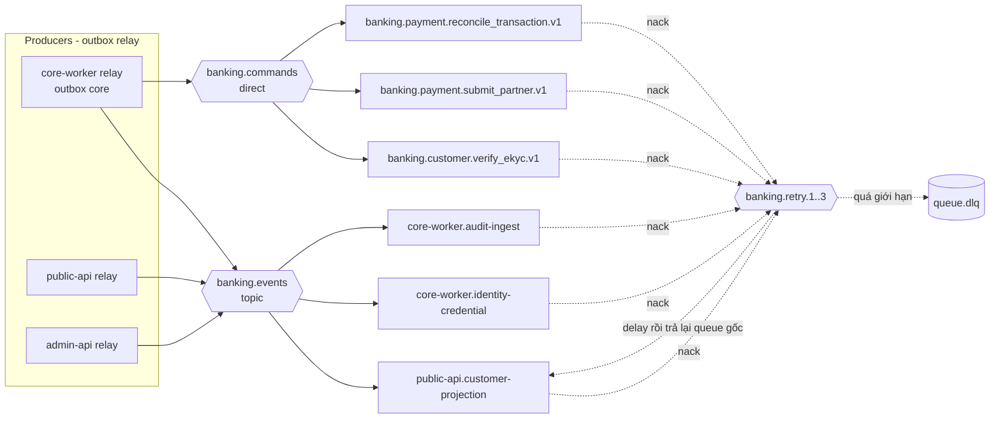

# Events & commands (R1) — banking-go

> RabbitMQ 4.3 (staging Cluster Operator / prod Amazon MQ). Payload protobuf trong `/proto`; quy tắc AD-8, AD-11, AD-12, AD-18.
> Topology (exchange, retry, DLQ) khai báo **một lần** trong `deploy/messaging/`; service chỉ khai báo queue của mình.

## Topology

| Exchange | Kiểu | Dùng cho |
|---|---|---|
| `banking.events` | topic | Event `banking.<context>.<entity>.<past_verb>.v<major>`; routing key = type `[A-4]` |
| `banking.commands` | direct | Command `banking.<module>.<command_verb>.v<major>`; **một queue / command type**, tên queue = type |
| `banking.retry.<n>` (n = 1..3) | delay (TTL + dead-letter về queue gốc) | Retry lần n; delay mặc định 10 s / 1 phút / 10 phút `[A-52]` |
| `<queue>.dlq` | queue | Sau lần retry cuối; alert khi depth > 0 (AD-8, AD-13) |

Mọi queue: durable **quorum**; consumer `Qos(prefetch, 0, false)`; ack **sau** commit; inbox dedupe theo `message_id` cùng UoW.

| Queue | Binding | Consumer | Hiệu ứng |
|---|---|---|---|
| `public-api.customer-projection` | `banking.customer.customer.*.v1` | public-api | Cập nhật `identity.customer_projections`; revoke refresh token khi `rejected`/`expired` |
| `core-worker.identity-credential` | `banking.identity.credential.created.v1` | core-worker | Set `customer.customers.credential_bound_at` `[A-8]` |
| `core-worker.audit-ingest` | `banking.identity.audit_record.created.v1`, `banking.backoffice.audit_record.created.v1` | core-worker | INSERT `audit.audit_records` (dedupe theo `id`) |
| `banking.customer.verify_ekyc.v1` | rk = type | core-worker | Gọi mock-ekyc |
| `banking.payment.submit_partner.v1` | rk = type | core-worker | Gọi mock-gateway submit |
| `banking.payment.reconcile_transaction.v1` | rk = type | core-worker | Hỏi trạng thái đối tác (BF-5) |

## Envelope
CloudEvents AMQP binary mode `[A-53]`: body = protobuf (`content_type: application/protobuf`); AMQP `message_id` = `id`, `type` = type; header `ce-specversion`, `ce-source` (`core` \| `public-api` \| `admin-api`), `ce-time`, `ce-subject` (aggregate id), `ce-aggregateversion`, `traceparent`, `tracestate`.
Consumer duy trì state từ event: lưu version cuối theo subject, **bỏ** event version ≤ đã áp; không giả định thứ tự (AD-8).
Không bao giờ có ảnh, mật khẩu/hash, token, OTP, TOTP secret trong payload hoặc header.

## Event catalog (R1)
| Type | Producer | Consumer | Subject / `aggregateversion` | Payload (proto) — field chính |
|---|---|---|---|---|
| `banking.customer.customer.phone_changed.v1` | core `customer` (relay core-worker) | public-api | `customer_id` / `customers.version` | `CustomerPhoneChanged{customer_id, phone (E.164), occurred_at}` `[A-54]` |
| `banking.customer.customer.status_changed.v1` | core `customer` | public-api | `customer_id` / `customers.version` | `CustomerStatusChanged{customer_id, status, previous_status, reason_code, occurred_at}` |
| `banking.identity.credential.created.v1` | public-api | core-worker | `customer_id` / 1 | `CredentialCreated{customer_id, created_at}` `[A-8]` |
| `banking.identity.audit_record.created.v1` | public-api | core-worker | `AuditRecord.id` / 1 | `banking.audit.v1.AuditRecord` — login success/failure, lockout, logout, refresh reuse |
| `banking.backoffice.audit_record.created.v1` | admin-api | core-worker | `AuditRecord.id` / 1 | `banking.audit.v1.AuditRecord` — login/TOTP, enrol TOTP, session expiry, admin user + role changes |

- Core phát cả `phone_changed` và `status_changed` khi `RegisterCustomer` (KH chỉ login được sau khi projection nhận event) `[A-9]`.
- Edge **không** phát audit cho thay đổi core commit (AD-11).
- Proto package payload: `banking.core.v1` (core), `banking.publicapi.v1`, `banking.adminapi.v1` (edge), `banking.audit.v1` `[A-55]`.

R2+ dự kiến (chưa phát ở R1): `banking.payment.transaction.succeeded|failed|unknown.v1` (thông báo web KH), `banking.account.account.status_changed.v1`, `banking.backoffice.maker_checker_request.*.v1`, `banking.recon.recon_file.received.v1` (R3), `banking.savings.savings_deposit.*.v1` (R4).
Spine và catalog đều dùng entity `transaction` (một entity cho mọi kind) `[A-56]`.

## Command catalog (R1)
Tất cả producer ghi qua outbox core trong UoW tạo nhu cầu; core-worker tiêu thụ; không gọi đối tác trong DB transaction (AD-7).

| Type | Producer (UoW) | Payload | Xử lý ở core-worker | Key đối tác / idempotency |
|---|---|---|---|---|
| `banking.customer.verify_ekyc.v1` | `RegisterCustomer` | `customer_id` | Commit `ekyc_checks(attempt_no, requested)` → presigned GET `kyc/` → gọi mock-ekyc (đồng bộ) `[A-57]` → tx2: `passed` → `active` + mở TK mặc định; `suspicious` → `pending_review`; `failed` → `rejected`; timeout → nack (retry exchange làm backoff), lần thứ 3 timeout → `pending_review` rồi ack | `ekyc:<customer_id>:<attempt_no>` |
| `banking.payment.submit_partner.v1` | `CreateDeposit`, `CreateWithdrawal` | `transaction_id` | Đã có attempt `submit` → chuyển sang query; chưa → commit `partner_attempts(submit)` → gọi mock-gateway → kết quả cuối: `Transition`; chấp nhận/đang xử lý: set `partner_deadline_at`; timeout: `pending → unknown` | Partner key = `transaction_id` |
| `banking.payment.reconcile_transaction.v1` | Job unknown scan (`next_recon_at` tới hạn), `RequestReconciliation`, callback cho giao dịch `unknown` | `transaction_id`, `trigger` (`scan`\|`manual`\|`callback`) | Commit `partner_attempts(query)` → `GET /v1/transactions/<txn_id>` → kết quả cuối: `Transition(unknown → succeeded\|failed)`; chưa rõ: tăng `recon_attempts`, đặt `next_recon_at` theo backoff | `recon:<txn_id>:<attempt_no>` |

Job core-worker (không phải message, advisory lock `core.<job>`, AD-15): `unknown_scan` (pending quá `partner_deadline_at` → `unknown`; enqueue recon), `invariant_check`, `internal_balance_snapshot`, `business_day_roll`, `customer_expiry`, `idempotency_purge`, `outbox_inbox_purge`.
Edge job: public-api `idempotency_purge`, `refresh_token_cleanup`, `outbox_inbox_purge`; admin-api `idempotency_purge`, `outbox_inbox_purge`.

## Webhook đối tác (không qua MQ)
Listener riêng của core-worker trên Gateway host riêng (AD-12); không đi qua public-api/admin-api.

| Method | Path | Đối tác | Body |
|---|---|---|---|
| POST | `/v1/partners/gateway/callbacks` | mock-gateway (nạp/rút) | `{ ourTransactionId, outcome: succeeded\|failed, amount, partnerRef, eventId, occurredAt }` |

- Header `X-Key-Id`, `X-Timestamp`, `X-Signature: v1=<hex HMAC-SHA256(secret, timestamp + "." + raw_body)>`; verify trên raw body trước khi parse, constant-time, cửa sổ ±300 s.
- `401` chữ ký sai/ngoài cửa sổ; `400` body hỏng; `200` cho mọi callback đã xác thực (áp dụng, trùng, lệch, conflict đều ghi `partner_attempts(kind=callback)`) `[A-58]`.
- Khớp `(our_txn_id, amount)` + `pending` → `Transition` tới trạng thái cuối. Lệch số tiền → không hạch toán, `pending → unknown`, alert `callback_mismatch`. Giao dịch `unknown` → ghi nhận + enqueue `reconcile_transaction` (trigger `callback`). Trái trạng thái cuối → `conflict`, alert `recon_conflict` (AD-18).
- Gọi ra mock: submit `POST` với idempotency key = `transaction_id`; status query `GET /v1/transactions/<our_txn_id>` (AD-12). Hợp đồng chi tiết của mock nằm trong `services/mocks/<partner>/`.

## Retry / DLQ
| Tình huống | Hành vi |
|---|---|
| Lỗi tạm (DB `resource_busy`, broker, đối tác 5xx với command query) | nack → `banking.retry.<n>` → queue gốc; sau lần 3 → `<queue>.dlq` |
| Message hỏng (không decode, type lạ) | thẳng `<queue>.dlq`, không retry |
| Trùng (`message_id` đã có trong inbox) | ack, không làm gì |
| Event version cũ | ghi inbox, ack, không áp |
| Timeout đối tác với `submit_partner` | **không** retry submit: `pending → unknown` và để BF-5 xử lý (AD-7) |
| DLQ depth > 0 | alert `warning`; DLQ của command tiền (`submit_partner`, `reconcile_transaction`) `critical` `[A-59]` |

Giá trị backoff, `submit_timeout`, `callback_deadline`, lịch tra soát chốt ở `nfr.md` / `observability.md` (spine Deferred); số ở đây là mặc định đề xuất.

## Giả định
| ID | Giả định |
|---|---|
| A-52 | 3 mức retry: 10 s, 1 phút, 10 phút, rồi DLQ |
| A-53 | CloudEvents AMQP binary mode, attribute ở header `ce-*` |
| A-54 | Event `phone_changed` mang SĐT plaintext (broker TLS + mã hóa at-rest) để public-api tự mã hóa + blind index bằng key của mình; không log payload |
| A-55 | Proto package edge: `banking.publicapi.v1`, `banking.adminapi.v1` |
| A-56 | Event giao dịch dùng entity `transaction`, không `transfer` |
| A-57 | eKYC mock trả kết quả đồng bộ (không webhook); timeout xử lý bằng retry exchange, tối đa 3 lần gọi (1 + 2 lần hỏi lại) |
| A-58 | Webhook trả `200` cho mọi callback đã xác thực chữ ký (kể cả trùng/lệch) để đối tác không gửi lại |
| A-59 | DLQ của command tiền alert mức `critical`, còn lại `warning` |
