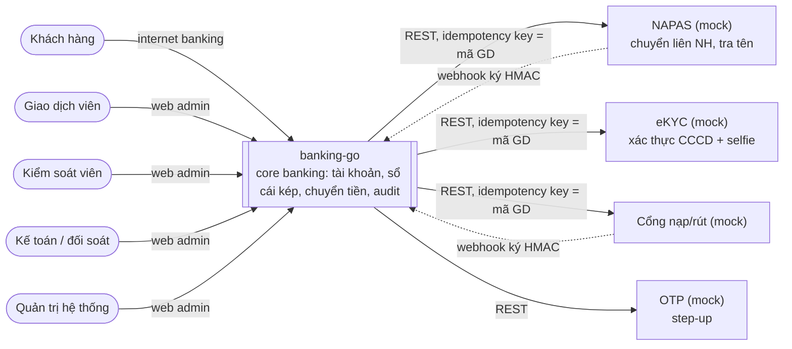
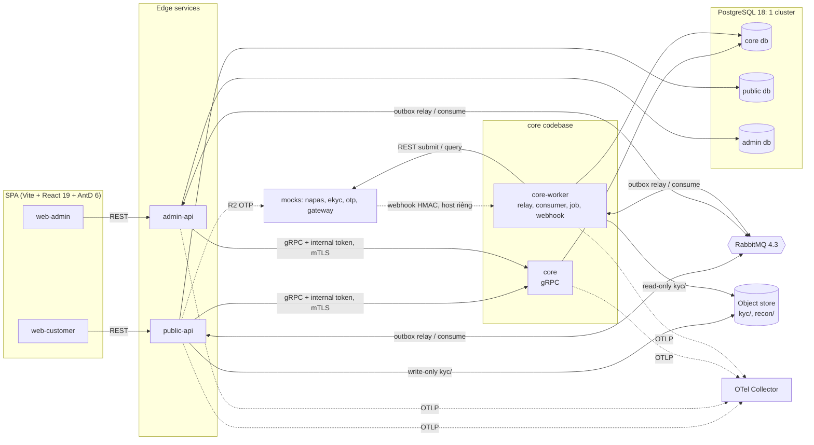
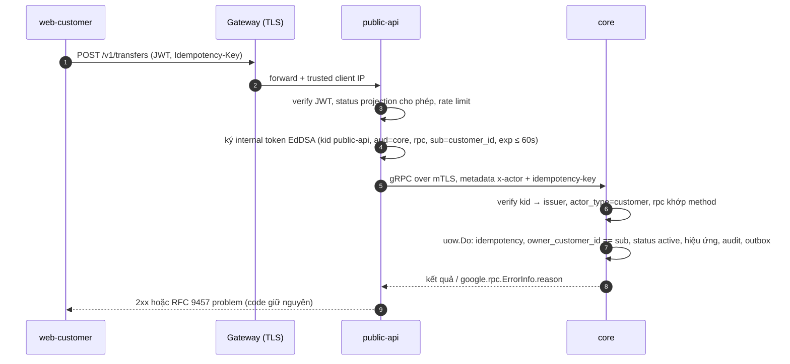
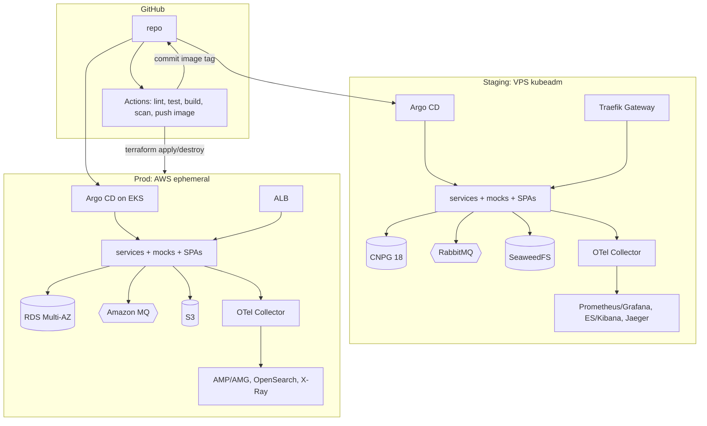

# Architecture — banking-go

> **Bản gộp.** Hợp đồng ràng buộc là [ARCHITECTURE-SPINE.md](_bmad/planning-artifacts/architecture/architecture-banking-go-2026-10-05/ARCHITECTURE-SPINE.md) (AD-n); khi mâu thuẫn, spine thắng.
> AI coding: đọc spine trước khi code; file này để định hướng nhanh. Thuật ngữ theo `glossary.md`, luồng theo `business-flows.md`.

## Tóm tắt
Hexagonal (ports & adapters) trong mọi Go service. **core** là modular monolith sở hữu mọi thứ chạm tiền, tính đúng tiền dựa trên ACID
của một database duy nhất. Hai edge service (**public-api**, **admin-api**) mỏng nhưng có nghiệp vụ riêng (danh tính, phiên, quy trình duyệt).
Bất đồng bộ qua transactional outbox → RabbitMQ. Đối tác ngoài là mock tách riêng, gọi như đối tác thật. Xem [ADR 0001](../adr/0001-core-modular-monolith-va-edge-services.md).

## C4 Level 1 — System Context


## C4 Level 2 — Container


## Ownership (AD-1, AD-2, AD-3)
| Service | Sở hữu | Không được |
|---|---|---|
| public-api | Credential KH (khóa `customer_id`), refresh token, thiết bị, lockout, rate limit, (R2) phiên OTP; projection SĐT + trạng thái KH từ event core | Tính/cache tiền, phí, hạn mức; tự quyết cần OTP; đọc DB core |
| admin-api | User admin, gán vai, TOTP, phiên admin, (R2) yêu cầu maker-checker | Thay đổi tiền trực tiếp; ghi audit cho thay đổi core commit; đọc DB core |
| core | Hồ sơ KH + eKYC (SĐT, CCCD, uniqueness), tài khoản, sổ cái, giao dịch, phí, hạn mức, tiết kiệm, ngày kế toán/EOD, đối soát, audit, bucket object store | Gọi đối tác trong DB transaction; nhận actor `system:*` qua mạng |
| core-worker | Không sở hữu riêng — cùng codebase + DB với core; chạy outbox relay, consumer, job định kỳ, webhook listener | Là owner thứ hai; chạy job ở replica khác cùng lúc (advisory lock) |
| mocks | Logic giả lập đối tác của chính nó | Bị core import code |

## Core modules
Mỗi module một Postgres schema, chỉ gọi module khác qua `app` port trong UoW của caller; depguard chặn import `domain`/`adapters` chéo (AD-3).

| Module | Trách nhiệm | AD chính |
|---|---|---|
| `customer` | Hồ sơ KH, SĐT/CCCD (mã hóa + blind index), trạng thái eKYC, đăng ký | AD-19, AD-25 |
| `account` | Metadata tài khoản (số TK, chủ, mặc định); đổi trạng thái qua `ledger.SetStatus` | AD-17 |
| `ledger` | `ledger_accounts`, journal/entry, `Post`, hold; số dư chỉ đổi ở đây | AD-4, AD-5, AD-17 |
| `payment` | Giao dịch, `payment.Transition`, draft, `partner_attempts`, tra soát `unknown` (BF-5, R1) | AD-7, AD-18, AD-21, AD-23 |
| `pricing` | Phí, hạn mức, quy tắc làm tròn (định nghĩa một lần) | AD-21 |
| `savings` (R4) | Tiết kiệm có kỳ hạn, lãi dồn tích | AD-21, AD-22 |
| `eod` | `business_day` từ R1, EOD từ R3 | AD-22 |
| `recon` (R3) | Đối soát file đối tác, danh sách lệch, file `recon/` | AD-7, AD-18 |
| `audit` | `audit_records` append-only, nhận audit event từ edge | AD-11 |

## Cơ chế then chốt
- **Sổ cái & khóa** (AD-4, AD-5, AD-17): mỗi biến động tiền = 1 journal ≥ 2 entry, ΣNợ = ΣCó, `BIGINT` VND; entry/journal không UPDATE/DELETE (quyền DB), sửa sai bằng giao dịch `reversal` (AD-23). Chỉ khóa dòng TK khách hàng (`FOR UPDATE`, thứ tự cố định: idempotency → transaction → account theo `id` tăng → limit usage → `business_day`); TK nội bộ (hot account) chỉ append entry, số dư lấy từ snapshot định kỳ. Job bất biến FR-13 chạy ở REPEATABLE READ. → [ADR 0003](../adr/0003-so-cai-kep-va-chien-luoc-khoa.md)
- **Idempotency** (AD-6): `Idempotency-Key` bắt buộc với mọi REST mutating (trừ session); service thực hiện hiệu ứng giữ bản ghi `(scope, key, request_hash)` trong cùng UoW. Cùng key + cùng hash → kết quả cũ; khác hash → 422. Lệnh hệ thống dùng key tất định (`mc:<id>:execute`, `reg:<key>`...). Lưu 72 h.
- **Gọi đối tác + `unknown`** (AD-7, AD-12, AD-18): tx1 ghi `pending` + hold + outbox command → core-worker ghi `partner_attempts` rồi gọi đối tác với mã GD làm idempotency key → tx2 qua `payment.Transition`. Timeout/quá hạn callback → `unknown`, không bao giờ `failed`; chỉ tra soát kết thúc `unknown`. Redelivery chỉ gửi query, không submit lại.
- **Outbox / inbox** (AD-8): ghi outbox cùng UoW; relay `FOR UPDATE SKIP LOCKED` → RabbitMQ (quorum queue, at-least-once). Consumer ghi `inbox` cùng UoW, ack sau commit, bỏ event cũ theo `aggregateversion`. Event trên `banking.events`, command trên `banking.commands`, retry exchange → DLQ. → [ADR 0004](../adr/0004-transactional-outbox-va-rabbitmq.md)
- **Unit of Work** (AD-16): chỉ entry use case gọi `uow.Do`; port method nhận `tx` sau `ctx`, không tự `Begin/Commit`. Idempotency, outbox, inbox, audit dùng chung handle. Một use case = đúng một UoW, không UoW xuyên service.
- **`payment.Transition`** (AD-18): đường duy nhất đổi trạng thái giao dịch — khóa dòng giao dịch, compare-and-set `expected_from`, posting/capture/release hold chỉ xảy ra bên trong. Bằng chứng mâu thuẫn với trạng thái cuối → `recon_conflict` (critical), không ghi đè.
- **Maker-checker** (AD-20, R2): admin-api giữ yêu cầu; khi duyệt, gọi lệnh core `requires_approval` kèm claim `approval` trong internal token. Core kiểm: `kid` của admin-api, maker ≠ checker, quyền theo `pkg/authz`, `request_hash` khớp, chưa hết hạn, `expected_target_version` khớp (nếu không → `approval_stale`). Key luôn là `mc:<request_id>:execute`.

### Luồng xác thực (AD-10, AD-19)

AuthN ở edge; AuthZ (ownership + policy `pkg/authz`) ở core trong UoW. Sai ownership trả `not_found`. → [ADR 0006](../adr/0006-authn-o-edge-authz-o-core.md)

## Stack (rút gọn — bản đầy đủ ở spine)
| Lớp | Lựa chọn |
|---|---|
| Backend | Go 1.27, chi v5 + Huma v2 (REST, OpenAPI 3.1), grpc-go + protobuf/buf, pgx v5 + sqlc + goose |
| Dữ liệu | PostgreSQL 18 (CNPG 1.30 staging / RDS 18.6 prod); RabbitMQ 4.3 (Cluster Operator / Amazon MQ); SeaweedFS / S3 |
| Frontend | Node 24, pnpm 12.9, React 19.3, Vite 8.3, Ant Design 6.6, TanStack Query 5, i18next, openapi-typescript + openapi-fetch |
| Platform | Kubernetes 1.36 (kubeadm / EKS), Gateway API v1.6 (Traefik / AWS LBC), Helm 4, Argo CD 3.5, cert-manager, Sealed Secrets / External Secrets, Terraform 1.16 |
| Observability | OTel Go SDK → otelcol-contrib; Prometheus + Grafana 12.4, Elasticsearch/Kibana 9.5, Jaeger v2 / AMP + AMG, OpenSearch, X-Ray |
| Chất lượng | golangci-lint v2, gitleaks, testcontainers-go, k6 |

## Deployment (AD-14, AD-26)
| | Staging | Prod |
|---|---|---|
| Hạ tầng | VPS kubeadm: 1 control-plane (~4 GB) + 3 worker (~8 GB), chạy liên tục | AWS EKS, dựng/hủy theo release/demo qua Terraform (GitHub Actions + Required reviewers) |
| PostgreSQL | CNPG 3 instance, ≥ 1 sync standby, anti-affinity | RDS PostgreSQL 18.6 Multi-AZ DB instance |
| Broker | RabbitMQ 3 replica (Cluster Operator) | Amazon MQ RabbitMQ 4.3 `CLUSTER_MULTI_AZ` |
| Object store | SeaweedFS | S3 + SSE-KMS |
| Gateway / TLS | Traefik + cert-manager | ALB (AWS LBC) + ACM |
| Secrets | Sealed Secrets | External Secrets ← Secrets Manager, KMS |
| Observability | Prometheus/Grafana, Elasticsearch/Kibana, Jaeger v2 | AMP/AMG, OpenSearch, X-Ray |
| Backup | WAL archive + base backup (Barman Cloud) → SeaweedFS, diễn tập PITR mỗi release | RDS automated backup; dữ liệu bỏ khi destroy |
| SLO / SM-3 | 99.9% + failover < 1 phút **cam kết và đo ở đây** | Đo trong cửa sổ release; RDS failover 60–120 s, không cam kết SM-3 |


Migration chạy bằng Argo CD PreSync Job với role `<svc>_migrator`; app pod không migrate; migration expand → deploy → contract. → [ADR 0007](../adr/0007-moi-truong-staging-kubeadm-va-prod-eks.md)

## Source tree
```text
banking-go/
  go.work
  proto/                  # buf: grpc + events + audit
  services/
    core/                 # cmd/core, cmd/core-worker, internal/<module>/{domain,app,adapters}, migrations/
    public-api/           # cmd/, internal/, api/openapi/public-api.yaml, migrations/
    admin-api/            # cmd/, internal/, api/openapi/admin-api.yaml, migrations/
    mocks/{napas,ekyc,otp,gateway}/
  pkg/                    # uow, outbox, inbox, idempotency, authn, authz, crypto, objectstore, problem, otel, health
  apps/{web-customer,web-admin}/
  packages/               # theme, i18n, api-client-public, api-client-admin
  deploy/{helm,platform,messaging,argocd,collector}/
  infra/{staging,prod}/   # ansible kubeadm / terraform aws
  observability/{alerts,dashboards}/
  tests/{e2e,chaos,load}/
```

## Nợ kỹ thuật đã biết
Chưa có (dự án mới).

## Quyết định hoãn
Xem mục **Deferred** trong [spine](_bmad/planning-artifacts/architecture/architecture-banking-go-2026-10-05/ARCHITECTURE-SPINE.md#deferred): shape dữ liệu R2–R4, quy tắc làm tròn,
token storage/CSRF/scanner, K8s 1.37, CNPG 1.31, SM-3 trên prod, partition sổ cái, read replica, CDN.

Đã chốt (2026-10-06):
- Hạn lưu ảnh eKYC → resolved in `nfr.md` (2026-10-06)
- Alert receiver → resolved in `observability.md` (2026-10-06)
- Image registry + promotion → resolved in `deployment.md` (GHCR, digest) (2026-10-06)
- Mã hóa volume staging → resolved in `deployment.md` D-6 (2026-10-06)
- Capacity staging → resolved in `deployment.md` D-10 (2026-10-06)
- Backoff tra soát, timeout đối tác → resolved in `nfr.md` NFR-P4/P5 (2026-10-06)

## ADR
| # | Quyết định |
|---|---|
| [0001](../adr/0001-core-modular-monolith-va-edge-services.md) | core modular monolith + edge services có nghiệp vụ riêng |
| [0002](../adr/0002-postgresql-database-per-service.md) | PostgreSQL 18, database-per-service trên một cluster |
| [0003](../adr/0003-so-cai-kep-va-chien-luoc-khoa.md) | Sổ cái kép append-only, chiến lược khóa, UoW, `payment.Transition` |
| [0004](../adr/0004-transactional-outbox-va-rabbitmq.md) | Transactional outbox + RabbitMQ |
| [0005](../adr/0005-hop-dong-api-rest-huma-va-grpc.md) | REST code-first Huma v2 + gRPC/protobuf nội bộ |
| [0006](../adr/0006-authn-o-edge-authz-o-core.md) | AuthN ở edge, AuthZ ở core, internal token + mTLS |
| [0007](../adr/0007-moi-truong-staging-kubeadm-va-prod-eks.md) | Staging kubeadm / prod EKS ephemeral, GitOps |
| [0008](../adr/0008-observability-qua-otel-collector.md) | Observability qua OTel Collector theo môi trường |
| [0009](../adr/0009-frontend-hai-spa-vite-react.md) | 2 SPA Vite + React 19 + Ant Design 6 |
| [0010](../adr/0010-object-store-va-ma-hoa-pii.md) | Object store ảnh eKYC + mã hóa PII |
| [0011](../adr/0011-moi-truong-kind-cho-gitops-local.md) | Môi trường `kind` cho GitOps/Helm/observability trên máy dev |
| [0012](../adr/0012-repo-va-ghcr-public.md) | Repo GitHub và package GHCR public (gói Free: ruleset, Required reviewer; bỏ pull secret) |
| [0013](../adr/0013-alert-nen-tang-tuong-minh.md) | Alert nền tảng khai báo tường minh (có runbook + promtool test) thay `defaultRules` của kube-prometheus-stack |
| [0014](../adr/0014-argocd-keo-git-qua-https.md) | Argo CD kéo Git qua HTTPS không credential (repo public); kind: repo-server qua proxy máy dev bằng ConfigMap từ bootstrap |
