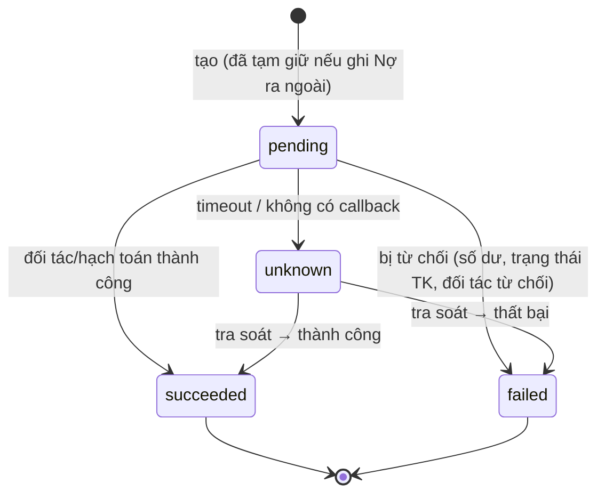
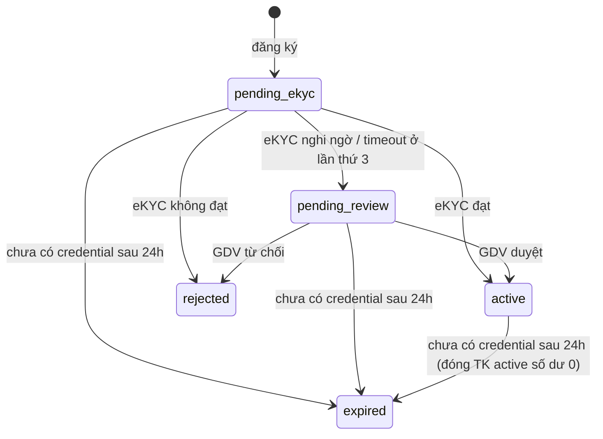
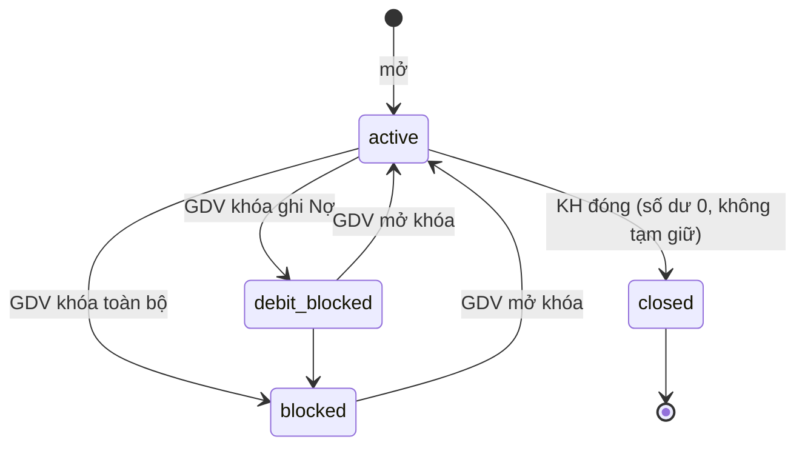
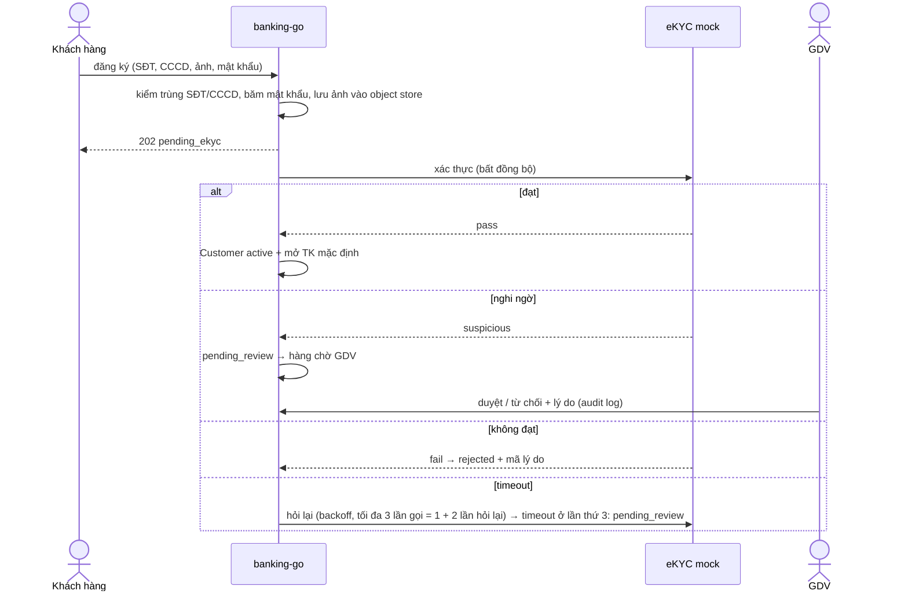
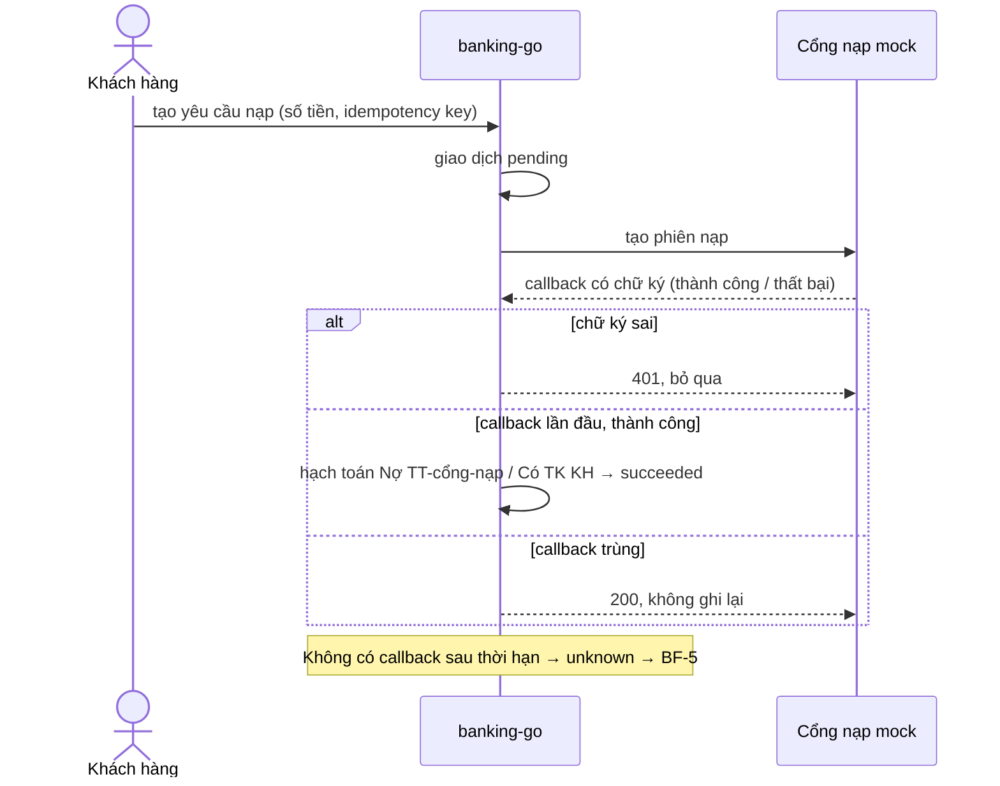
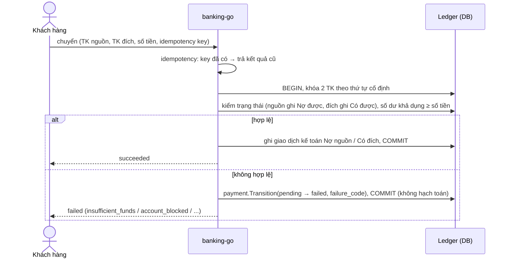
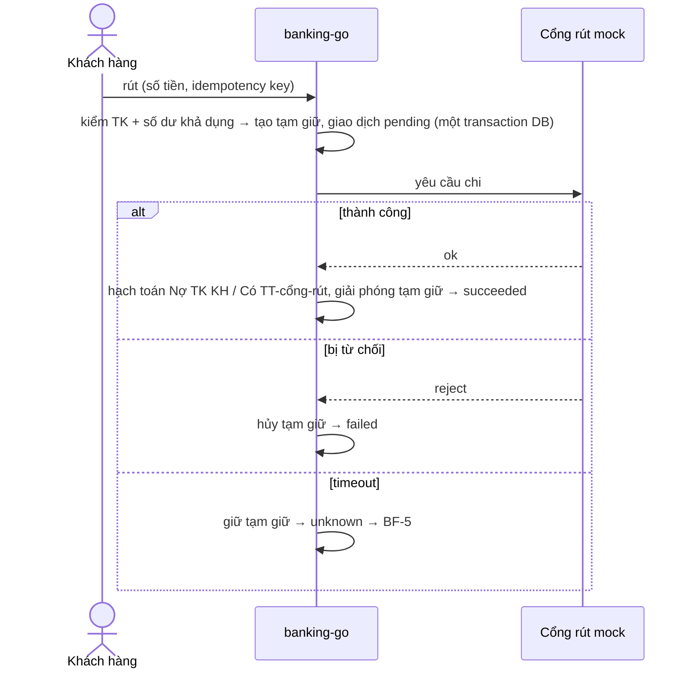
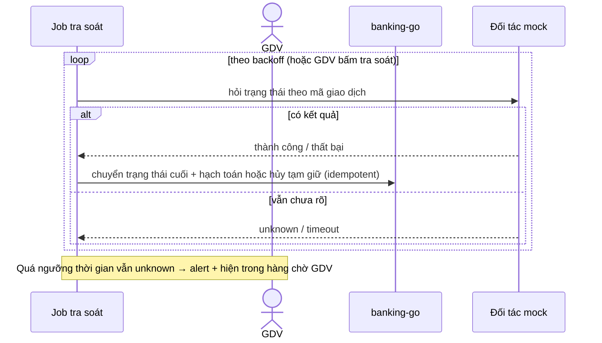

# Business flows — banking-go

> Nguồn: PRD `_bmad/planning-artifacts/prds/prd-banking-go-2026-10-05/prd.md`. Thuật ngữ theo `glossary.md`.
> R1 chi tiết; R2–R4 khung, chi tiết hóa khi `/brainstorm` release đó (qua `/foundation update business-flows`).

## Mục lục
| ID | Flow | Release | FR | UJ |
|---|---|---|---|---|
| BF-1 | Đăng ký + eKYC | R1 | FR-1..3, FR-6 | UJ-1 |
| BF-2 | Nạp tiền | R1 | FR-14, FR-15 | UJ-2 |
| BF-3 | Chuyển nội bộ | R1 | FR-14, FR-16 | UJ-3 |
| BF-4 | Rút tiền | R1 | FR-12, FR-14, FR-17 | UJ-4 |
| BF-5 | Tra soát giao dịch unknown | R1 | FR-19 | UJ-2, UJ-4, UJ-5 |
| BF-6 | Khóa / đóng tài khoản | R1 | FR-7, FR-8 | UJ-5 |
| BF-7 | Đăng nhập KH / admin | R1 | FR-4, FR-20 | UJ-5, UJ-6 |
| BF-8 | Chuyển liên ngân hàng | R2 | — | UJ-7 |
| BF-9 | Maker-checker | R2 | — | UJ-8, UJ-9 |
| BF-10 | Đối soát + EOD | R3 | — | UJ-10 |
| BF-11 | Tiết kiệm | R4 | — | UJ-11 |

FR-9, FR-13, FR-21–24 (UJ-6) là đọc/CRUD admin, không có luồng riêng — xem `api-contracts/admin-api.md`.

## Quy tắc chung (mọi flow tạo giao dịch)
1. Yêu cầu có idempotency key. Cùng key + cùng nội dung → trả kết quả cũ; khác nội dung → 422 (FR-14).
2. Mọi biến động tiền = một giao dịch kế toán cân, ghi nguyên tử; không sửa/xóa bút toán, sai thì đảo (FR-10).
3. Gọi đối tác ngoài **không** nằm trong transaction DB. Trước khi gọi: ghi trạng thái + tạm giữ; sau khi có kết quả: hạch toán.
4. Timeout từ đối tác → `unknown`, **không** tự coi là thất bại; chỉ tra soát mới quyết định kết quả cuối.
5. Số tiền: số nguyên VND, > 0.

## Máy trạng thái

### Giao dịch (FR-18)

Chuyển nội bộ (BF-3) không qua đối tác nên không bao giờ `unknown`.

### Khách hàng (FR-2, FR-3)

Đăng nhập được: `active`, `pending_ekyc`, `pending_review` (chưa `active` chỉ xem trạng thái hồ sơ). `rejected`, `expired`: không đăng nhập.
`expired` giải phóng SĐT/CCCD để đăng ký lại; trong 24h đăng ký lại cùng SĐT + CCCD → hoàn tất hồ sơ cũ (idempotent).

### Tài khoản thanh toán (FR-6..8)

| Trạng thái | Ghi Nợ | Ghi Có |
|---|---|---|
| active | được | được |
| debit_blocked | từ chối | được |
| blocked | từ chối | từ chối |
| closed | từ chối | từ chối |

## R1

### BF-1. Đăng ký + eKYC

Ngoại lệ: SĐT/CCCD trùng → 409, không tạo bản ghi; ảnh đã upload dọn theo lifecycle `kyc/`.

### BF-2. Nạp tiền

### BF-3. Chuyển nội bộ

Ngoại lệ: TK nguồn = TK đích → 422. Request đồng thời trên cùng TK được tuần tự hóa; không âm số dư.

### BF-4. Rút tiền

### BF-5. Tra soát giao dịch unknown

### BF-6. Khóa / đóng tài khoản
- Khóa/mở: GDV chọn mức (`debit_blocked` / `blocked`) + lý do → cập nhật trạng thái → audit log. Giao dịch đang `pending`/`unknown`
  vẫn đi tới kết quả cuối; giao dịch mới tuân theo bảng Ghi Nợ/Ghi Có.
- Đóng: KH yêu cầu → kiểm TK đang `active` (TK `debit_blocked`/`blocked` → `invalid_status_transition`, phải mở khóa trước), số dư = 0, không tạm giữ, không có giao dịch `pending`/`unknown` liên quan (cả tiền đến), không phải TK mặc định khi còn TK khác → `closed`.

### BF-7. Đăng nhập
- KH: SĐT + mật khẩu → access JWT 15 phút + refresh token xoay vòng. Sai 5 lần liên tiếp → khóa 15 phút. Đăng xuất → thu hồi refresh token. Chỉ trạng thái KH `active`/`pending_ekyc`/`pending_review` đăng nhập được; mọi lệnh tiền cần `active`.
- Admin: mật khẩu + TOTP → phiên, hết hạn sau 30 phút không thao tác. Mọi lần đăng nhập (đúng/sai) vào audit log.

## R2–R4 (khung)

### BF-8. Chuyển liên ngân hàng (R2)
Tra tên người nhận (NAPAS mock) → kiểm hạn mức → OTP nếu vượt ngưỡng → tính phí → tạm giữ tiền + phí → gửi NAPAS mock →
callback: thành công (hạch toán Nợ TK KH / Có TT-NAPAS + Có TK thu phí), thất bại (hủy tạm giữ), timeout (`unknown` → BF-5).

### BF-9. Maker-checker (R2)
Maker tạo yêu cầu (điều chỉnh số dư, khóa/mở TK, đổi hạn mức/phí) → `waiting_approval` → checker (≠ maker, đúng vai) duyệt → thực hiện;
từ chối → đóng kèm lý do; quá hạn → hết hiệu lực. Chưa duyệt thì chưa có hiệu lực.

### BF-10. Đối soát + EOD (R3)
Nhận file đối soát NAPAS mock → so khớp theo mã giao dịch → khớp / chỉ có bên ta / chỉ có bên đối tác / lệch số tiền → kế toán xử lý
(qua maker-checker) → EOD: khóa ngày kế toán, dồn tích lãi, kiểm bất biến, báo cáo cân đối, mở ngày kế toán mới.

### BF-11. Tiết kiệm (R4)
Mở sổ (Nợ TK thanh toán / Có TK tiết kiệm) → EOD dồn tích lãi hằng ngày → đến hạn tự tất toán về TK mặc định (gốc + lãi) →
trước hạn: đảo lãi đã dồn tích, tính lãi không kỳ hạn cho toàn bộ thời gian gửi.
