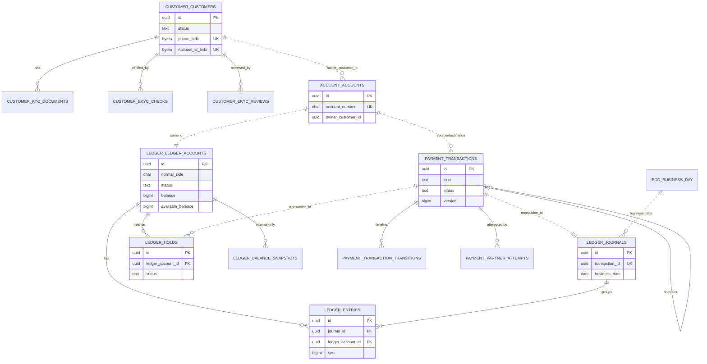
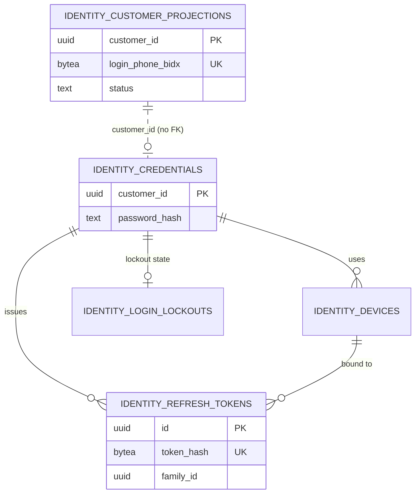
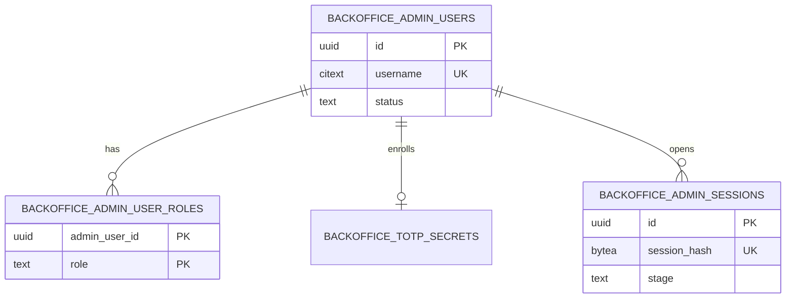

# Data model — banking-go

> Nguồn ràng buộc: [ARCHITECTURE-SPINE.md](_bmad/planning-artifacts/architecture/architecture-banking-go-2026-10-05/ARCHITECTURE-SPINE.md) (AD-n); khi mâu thuẫn, spine thắng.
> Trạng thái theo `business-flows.md`, thuật ngữ theo `glossary.md`. R1 chi tiết; R2–R4 chỉ tên bảng, chi tiết hóa khi `/brainstorm` release đó
> (qua `/foundation update data-model`). Mọi lựa chọn spine không nói → mục [Giả định](#giả-định) (đánh dấu `[A-n]`).

## Mục lục
- [Tổng quan](#tổng-quan) · [Quy ước](#quy-ước) · [Bảng dùng chung `platform`](#bảng-dùng-chung-platform-mọi-database)
- [core db](#core-db) · [public db](#public-db) · [admin db](#admin-db)
- [Ví dụ hạch toán](#ví-dụ-hạch-toán) · [R2–R4](#r2r4-khung) · [Giả định](#giả-định)

## Tổng quan
Một cluster PostgreSQL 18 mỗi môi trường, ba database, không service nào đọc database của service khác (AD-3).

| Database | Owner | Schema | Ghi chú |
|---|---|---|---|
| `core` | core + core-worker (cùng codebase) | `customer`, `account`, `ledger`, `payment`, `eod`, `audit`, `platform`; R2 `pricing`, R3 `recon`, R4 `savings` | Mỗi module chỉ chạm schema của mình; module khác chỉ qua `app` port trong UoW của caller |
| `public` | public-api | `identity`, `platform` `[A-1]` | Credential, refresh token, thiết bị, lockout, projection KH |
| `admin` | admin-api | `backoffice`, `platform` `[A-1]` | User admin, vai, TOTP, phiên; R2 maker-checker |

### Role (AD-26)
| Role | Quyền |
|---|---|
| `<svc>_migrator` (`core_migrator`, `public_migrator`, `admin_migrator`) | Owner schema + bảng, chạy goose trong Argo CD PreSync Job. Chỉ kết nối database của mình |
| `<svc>_app` (`core_app`, `public_app`, `admin_app`) | DML (SELECT/INSERT/UPDATE/DELETE) trên bảng của database mình; **không** DDL |
| Ngoại lệ append-only | `core_app` chỉ có **INSERT, SELECT** trên `ledger.journals`, `ledger.entries`, `audit.audit_records`. CI test khẳng định UPDATE/DELETE thất bại dưới `core_app` |

### Quy tắc khóa ngoại (AD-3)
- FK **chỉ trong cùng một schema**. Tham chiếu sang schema khác (kể cả trong `core`) là cột `uuid` **không FK**, kiểm bằng code qua `app` port.
- Ví dụ: `account.accounts.id` = `ledger.ledger_accounts.id` (cùng giá trị, không FK); `ledger.journals.transaction_id` → `payment.transactions.id` (không FK).
- SQL của một module tham chiếu schema module khác → CI fail.

## Quy ước
| Mục | Quy ước |
|---|---|
| ID | `uuid` UUIDv7, sinh ở app (không `DEFAULT gen_random_uuid()`) |
| Tiền | `bigint` VND đồng; số tiền giao dịch/bút toán `> 0`, chiều do `side` (`D`/`C`) |
| Thời gian | `timestamptz` UTC; `business_date` kiểu `date` (AD-22); ngày hiển thị cho KH = ngày lịch Asia/Ho_Chi_Minh của `created_at` |
| Enum | `text` + `CHECK (col IN (...))` (thêm giá trị = migration expand) `[A-2]` |
| Tên | schema = tên module; bảng số nhiều snake_case; cột snake_case; index `ix_<table>_<cols>`, unique `ux_<table>_<cols>` |
| PII | Cột `*_enc bytea` = envelope AES-256-GCM qua `pkg/crypto` (ciphertext mang key id); `*_bidx bytea` = HMAC-SHA256 32 byte trên giá trị chuẩn hóa, key HMAC riêng mỗi service (AD-25) |
| Chuẩn hóa | SĐT → E.164 `+84…`; CCCD → 12 chữ số `[A-3]` |
| Ảnh | Chỉ lưu object key (`kyc/<registration_id>/<kind>`), không lưu ảnh (AD-24) |
| Version | `version bigint NOT NULL DEFAULT 1`, tăng mỗi thay đổi; dùng cho optimistic check và `aggregateversion` của event |
| Audit cột | `created_at`, `updated_at` `timestamptz NOT NULL DEFAULT now()` trên bảng mutable |

## Bảng dùng chung `platform` (mọi database)
Chỉ ghi qua `pkg/outbox`, `pkg/inbox`, `pkg/idempotency`, cùng UoW với hiệu ứng (AD-6, AD-8, AD-16). Cấu trúc giống nhau ở `core`, `public`, `admin`.

### `platform.idempotency_keys`
| Cột | Kiểu | Null | Ghi chú |
|---|---|---|---|
| `scope` | text | N | `<actor_type>:<actor_sub>:<full gRPC method>` (edge: method/route của chính edge) |
| `key` | text | N | `Idempotency-Key` gốc hoặc key tất định `<origin>:<id>:<step>`; ≤ 200 ký tự |
| `request_hash` | bytea | N | SHA-256 các business field (proto option), do service sở hữu tính |
| `state` | text | N | `in_progress` \| `completed` |
| `response` | bytea | Y | Kết quả đã lưu (proto/JSON) gồm cả lỗi nghiệp vụ đã ghi `failed`; null khi `in_progress` |
| `resource_type`, `resource_id` | text, uuid | Y | Luồng async: replay trả trạng thái hiện tại của resource |
| `created_at`, `completed_at` | timestamptz | N, Y | |

PK `(scope, key)`. Index `ix_idempotency_keys_created_at` (purge 72 h, AD-6). `INSERT … ON CONFLICT DO NOTHING` đầu UoW; trùng → chờ `lock_timeout` rồi 409 `idempotency_in_progress`; khác hash → 422 `idempotency_conflict`.

### `platform.outbox`
| Cột | Kiểu | Null | Ghi chú |
|---|---|---|---|
| `id` | uuid | N | PK = message id (CloudEvents `id`) |
| `seq` | bigint | N | `GENERATED ALWAYS AS IDENTITY`; thứ tự claim |
| `message_kind` | text | N | `event` \| `command` |
| `type` | text | N | `banking.<context>.<entity>.<past_verb>.v1` hoặc `banking.<module>.<command_verb>.v1` |
| `exchange` | text | N | `banking.events` \| `banking.commands` (CHECK khớp `message_kind`) |
| `routing_key` | text | N | = `type` `[A-4]` |
| `aggregate_type`, `aggregate_id` | text, uuid | N | CloudEvents `subject` = `aggregate_id` |
| `aggregate_version` | bigint | Y | Bắt buộc với `event` (`aggregateversion`) |
| `payload` | bytea | N | Protobuf |
| `headers` | jsonb | N | `traceparent`, `source`, `time`… |
| `created_at`, `sent_at` | timestamptz | N, Y | |
| `publish_attempts`, `last_error` | int, text | N, Y | |

Index `ix_outbox_unsent (aggregate_id, seq) WHERE sent_at IS NULL`. Relay: `FOR UPDATE SKIP LOCKED` theo `(aggregate_id, seq)`; dòng đã gửi purge sau 7 ngày `[A-5]`.

### `platform.inbox`
| Cột | Kiểu | Null | Ghi chú |
|---|---|---|---|
| `consumer` | text | N | Tên consumer/queue |
| `message_id` | uuid | N | CloudEvents `id` |
| `message_type` | text | N | |
| `processed_at` | timestamptz | N | |

PK `(consumer, message_id)`. Purge sau 7 ngày `[A-5]`. Version per subject lưu ở chính bảng projection (không ở inbox).

## core db

### ERD
Đường liền = FK cùng schema; đường đứt = tham chiếu id khác schema (không FK). Tên entity = `<SCHEMA>_<TABLE>`.

Bảng không vẽ: `ledger.invariant_checks`, `audit.audit_records`, `platform.*`.

### Schema `customer` (module `customer`)

#### `customer.customers` — ghi bởi `customer`
| Cột | Kiểu | Null | Ghi chú |
|---|---|---|---|
| `id` | uuid | N | PK; `customer_id` — danh tính KH duy nhất (AD-19) |
| `registration_id` | uuid | N | UNIQUE; suy từ `Idempotency-Key` đăng ký `[A-6]`; prefix ảnh `kyc/<registration_id>/` |
| `status` | text | N | CHECK `pending_ekyc`, `pending_review`, `active`, `rejected`, `expired` |
| `status_reason_code` | text | Y | Mã lý do `rejected`/`pending_review` |
| `full_name` | text | N | Họ tên KH khai khi đăng ký `[A-7]` |
| `phone_enc` | bytea | N | SĐT mã hóa |
| `phone_bidx` | bytea | N | Blind index SĐT |
| `national_id_enc` | bytea | N | CCCD mã hóa |
| `national_id_bidx` | bytea | N | Blind index CCCD |
| `credential_bound_at` | timestamptz | Y | Set khi nhận event `banking.identity.credential.created.v1` `[A-8]` |
| `version` | bigint | N | Tăng mỗi thay đổi; `aggregateversion` cho mọi event customer `[A-9]` |
| `created_at`, `updated_at`, `activated_at` | timestamptz | N, N, Y | |

- UNIQUE `ux_customers_phone_bidx (phone_bidx) WHERE status <> 'expired'`; tương tự `ux_customers_national_id_bidx` — `expired` giải phóng SĐT/CCCD (AD-19); `rejected` vẫn giữ `[A-10]`.
- Index `ix_customers_expiry (created_at) WHERE status NOT IN ('rejected','expired') AND credential_bound_at IS NULL` (job expire 24 h).
- Index `ix_customers_review (updated_at) WHERE status = 'pending_review'` (hàng chờ GDV).

#### `customer.kyc_documents` — ghi bởi `customer`
| Cột | Kiểu | Null | Ghi chú |
|---|---|---|---|
| `id` | uuid | N | PK |
| `customer_id` | uuid | N | FK → `customers.id` |
| `kind` | text | N | CHECK `id_front`, `id_back`, `selfie` |
| `object_key` | text | N | Key trong object store, không có ảnh |
| `created_at` | timestamptz | N | |

UNIQUE `(customer_id, kind)`.

#### `customer.ekyc_checks` — ghi bởi `customer` (core-worker consumer)
| Cột | Kiểu | Null | Ghi chú |
|---|---|---|---|
| `id` | uuid | N | PK |
| `customer_id` | uuid | N | FK → `customers.id` |
| `attempt_no` | int | N | 1..3 (FR-2) |
| `status` | text | N | CHECK `requested`, `passed`, `suspicious`, `failed`, `timeout`, `error` |
| `reason_code` | text | Y | Mã từ eKYC mock |
| `partner_ref` | text | Y | Mã tham chiếu phía mock |
| `requested_at`, `completed_at` | timestamptz | N, Y | `requested_at` commit trước khi gọi mạng (AD-7) |

UNIQUE `(customer_id, attempt_no)`.

#### `customer.ekyc_reviews` — ghi bởi `customer` (lệnh staff)
| Cột | Kiểu | Null | Ghi chú |
|---|---|---|---|
| `id` | uuid | N | PK |
| `customer_id` | uuid | N | FK → `customers.id`; UNIQUE (một quyết định cuối) |
| `decision` | text | N | CHECK `approved`, `rejected` |
| `reason_code` | text | N | |
| `note` | text | Y | ≤ 500 ký tự |
| `reviewer_sub` | uuid | N | admin user id (từ `x-actor`) |
| `decided_at` | timestamptz | N | |

### Schema `account` (module `account`)

#### `account.accounts` — ghi bởi `account`
| Cột | Kiểu | Null | Ghi chú |
|---|---|---|---|
| `id` | uuid | N | PK; **= `ledger.ledger_accounts.id`** (không FK) |
| `account_number` | char(12) | N | UNIQUE; CHECK `~ '^[0-9]{12}$'`; chữ số cuối Luhn (FR-5) |
| `owner_customer_id` | uuid | N | → `customer.customers.id` (không FK) |
| `is_default` | boolean | N | |
| `version` | bigint | N | `aggregateversion` event account |
| `opened_at`, `closed_at` | timestamptz | N, Y | `closed_at` chỉ là mốc hiển thị; trạng thái thật ở `ledger_accounts.status` |
| `created_at`, `updated_at` | timestamptz | N | |

- **Không có cột `status`**: trạng thái chỉ ở `ledger.ledger_accounts` (AD-17); `account` đổi qua `ledger.SetStatus`.
- UNIQUE `ux_accounts_default (owner_customer_id) WHERE is_default`.
- Index `ix_accounts_owner (owner_customer_id)`.
- Sequence `account.account_number_seq`: số TK = 11 chữ số từ sequence (zero-pad) + Luhn `[A-11]`.
- Tối đa 5 TK chưa `closed`/KH: kiểm dưới `SELECT … FOR UPDATE` dòng `customer.customers` (qua port) `[A-12]`.

### Schema `ledger` (module `ledger`)

#### `ledger.ledger_accounts` — ghi bởi `ledger` (duy nhất `Post`, `PlaceHold`, `ReleaseHold`, `CaptureHold`, `SetStatus`)
| Cột | Kiểu | Null | Ghi chú |
|---|---|---|---|
| `id` | uuid | N | PK; TK KH: = account id |
| `kind` | text | N | CHECK `customer`, `internal` |
| `code` | text | Y | UNIQUE; mã TK nội bộ (bảng dưới); CHECK `(kind = 'internal') = (code IS NOT NULL)` |
| `name` | text | N | |
| `normal_side` | char(1) | N | CHECK `D`, `C`; CHECK `kind <> 'customer' OR normal_side = 'C'` |
| `status` | text | N | CHECK `active`, `debit_blocked`, `blocked`, `closed` |
| `status_reason_code` | text | Y | Lý do khóa (FR-7) |
| `balance` | bigint | N | DEFAULT 0 |
| `available_balance` | bigint | N | DEFAULT 0; = `balance` − Σ hold `active` |
| `last_entry_seq` | bigint | N | DEFAULT 0; cấp `seq` cho entry dưới row lock `[A-13]` |
| `version` | bigint | N | |
| `currency` | char(3) | N | CHECK `= 'VND'` |
| `created_at`, `updated_at` | timestamptz | N | |

CHECK:
- `kind <> 'customer' OR (balance >= 0 AND available_balance >= 0 AND available_balance <= balance)` (AD-5).
- `kind <> 'internal' OR (balance = 0 AND available_balance = 0 AND status = 'active')` — TK nội bộ không cập nhật số dư trên hot path; số dư thật = `balance_snapshots` `[A-14]`.

TK nội bộ R1 (seed bằng migration, UUID cố định `[A-15]`):
| `code` | Nghĩa | `normal_side` |
|---|---|---|
| `GW_DEPOSIT_CLEARING` | Trung gian cổng nạp (phải thu từ cổng) | D |
| `GW_WITHDRAW_CLEARING` | Trung gian cổng rút (phải trả cho cổng) | C |

#### `ledger.journals` — ghi bởi `ledger` (INSERT, SELECT only)
| Cột | Kiểu | Null | Ghi chú |
|---|---|---|---|
| `id` | uuid | N | PK |
| `transaction_id` | uuid | N | UNIQUE (AD-23); → `payment.transactions.id` (không FK) |
| `business_date` | date | N | = `eod.business_day.open_date` đọc dưới share lock lúc hạch toán (AD-22) |
| `posted_at` | timestamptz | N | |

Σ Nợ = Σ Có của một journal kiểm trong `ledger.Post` + job bất biến; không trigger `[A-16]`. Index `ix_journals_business_date`.

#### `ledger.entries` — ghi bởi `ledger` (INSERT, SELECT only)
| Cột | Kiểu | Null | Ghi chú |
|---|---|---|---|
| `id` | uuid | N | PK |
| `journal_id` | uuid | N | FK → `journals.id` |
| `ledger_account_id` | uuid | N | FK → `ledger_accounts.id` |
| `side` | char(1) | N | CHECK `D`, `C` |
| `amount` | bigint | N | CHECK `> 0` |
| `seq` | bigint | Y | Chỉ TK KH: `last_entry_seq + 1` dưới row lock |
| `balance_after` | bigint | Y | Chỉ TK KH; CHECK `>= 0` |
| `created_at` | timestamptz | N | `clock_timestamp()` lúc ghi |

- CHECK `(seq IS NULL) = (balance_after IS NULL)`.
- UNIQUE `ux_entries_account_seq (ledger_account_id, seq) WHERE seq IS NOT NULL` — sao kê phân trang theo `seq`.
- Index `ix_entries_account_created (ledger_account_id, created_at)` (lọc khoảng ngày sao kê); `ix_entries_journal (journal_id)`.

#### `ledger.holds` — ghi bởi `ledger`
| Cột | Kiểu | Null | Ghi chú |
|---|---|---|---|
| `id` | uuid | N | PK |
| `transaction_id` | uuid | N | → `payment.transactions.id` (không FK) |
| `ledger_account_id` | uuid | N | FK → `ledger_accounts.id` (chỉ TK KH) |
| `amount` | bigint | N | CHECK `> 0` |
| `status` | text | N | CHECK `active`, `captured`, `released` |
| `created_at`, `finalized_at` | timestamptz | N, Y | CHECK `(status = 'active') = (finalized_at IS NULL)` |

UNIQUE `(transaction_id, ledger_account_id)` (một hold = một giao dịch + một TK). Index `ix_holds_active (ledger_account_id) WHERE status = 'active'`. Không hết hạn theo thời gian (AD-17).

#### `ledger.balance_snapshots` — ghi bởi `ledger` (job snapshot, core-worker)
| Cột | Kiểu | Null | Ghi chú |
|---|---|---|---|
| `id` | uuid | N | PK |
| `ledger_account_id` | uuid | N | FK → `ledger_accounts.id` (TK nội bộ) |
| `taken_at` | timestamptz | N | Snapshot REPEATABLE READ |
| `debit_total`, `credit_total` | bigint | N | CHECK `>= 0` |
| `balance` | bigint | N | Theo `normal_side`; có thể âm |
| `entry_count` | bigint | N | |

UNIQUE `(ledger_account_id, taken_at)`. Tính lại toàn bộ mỗi lần chạy (R1) `[A-17]`.

#### `ledger.invariant_checks` — ghi bởi `ledger` (job FR-13)
| Cột | Kiểu | Null | Ghi chú |
|---|---|---|---|
| `id` | uuid | N | PK |
| `started_at`, `finished_at` | timestamptz | N, Y | |
| `ok` | boolean | Y | null khi đang chạy |
| `violations` | jsonb | Y | Danh sách vi phạm (mã + id), không PII |

Index `ix_invariant_checks_started (started_at DESC)`. Dùng cho ops overview `[A-18]`.

### Schema `payment` (module `payment`)

#### `payment.transactions` — ghi bởi `payment` (trạng thái chỉ qua `payment.Transition`, AD-18)
| Cột | Kiểu | Null | Ghi chú |
|---|---|---|---|
| `id` | uuid | N | PK; cũng là idempotency key gửi đối tác |
| `kind` | text | N | CHECK `deposit`, `withdrawal`, `internal_transfer`, `interbank_transfer`, `fee`, `balance_adjustment`, `reversal`, `interest_accrual`, `interest_payout`, `savings_open`, `savings_settle` (AD-23; R1 dùng 3 kind đầu) |
| `status` | text | N | CHECK `pending`, `succeeded`, `failed`, `unknown` |
| `version` | bigint | N | Tăng mỗi transition; `aggregateversion` |
| `amount` | bigint | N | CHECK `> 0` |
| `currency` | char(3) | N | CHECK `= 'VND'` |
| `source_account_id` | uuid | Y | → account id (không FK) |
| `destination_account_id` | uuid | Y | → account id (không FK) |
| `source_customer_id` | uuid | Y | Chủ TK nguồn, chép lúc tạo (ownership/list) `[A-19]` |
| `destination_customer_id` | uuid | Y | Chủ TK đích, chép lúc tạo |
| `partner` | text | Y | CHECK `gateway` (R1), `napas` (R2) |
| `partner_deadline_at` | timestamptz | Y | `submit + callback_deadline`; quá hạn → `unknown` (AD-7) |
| `next_recon_at` | timestamptz | Y | Lịch tra soát kế tiếp (backoff) khi `unknown` |
| `recon_attempts` | int | N | DEFAULT 0 |
| `failure_code` | text | Y | Mã trong bảng lỗi chung; CHECK `(status = 'failed') = (failure_code IS NOT NULL)` |
| `description` | varchar(140) | Y | Nội dung KH nhập |
| `reverses_transaction_id` | uuid | Y | FK → `transactions.id`; CHECK `(kind = 'reversal') = (reverses_transaction_id IS NOT NULL)` |
| `business_date` | date | Y | = `journals.business_date` khi hạch toán; CHECK `status <> 'succeeded' OR business_date IS NOT NULL` |
| `actor_type`, `actor_sub` | text, text | N | `customer`/`staff`/`system:<job>` |
| `created_at`, `updated_at`, `finalized_at` | timestamptz | N, N, Y | |

CHECK theo kind:
- `deposit`: `destination_account_id NOT NULL AND source_account_id IS NULL AND partner IS NOT NULL`.
- `withdrawal`: `source_account_id NOT NULL AND destination_account_id IS NULL AND partner IS NOT NULL`.
- `internal_transfer`: cả hai NOT NULL, `source_account_id <> destination_account_id`, `partner IS NULL`; không bao giờ `unknown`: CHECK `kind <> 'internal_transfer' OR status <> 'unknown'`.

Index:
- `ix_transactions_src_cust (source_customer_id, created_at DESC)`, `ix_transactions_dst_cust (destination_customer_id, created_at DESC)`.
- `ix_transactions_inflight_src (source_account_id) WHERE status IN ('pending','unknown')`, `ix_transactions_inflight_dst (destination_account_id) WHERE …` (điều kiện đóng TK, FR-8).
- `ix_transactions_deadline (partner_deadline_at) WHERE status = 'pending' AND partner IS NOT NULL` (unknown scan).
- `ix_transactions_recon (next_recon_at) WHERE status = 'unknown'`.
- `ix_transactions_status_created (status, created_at DESC)` (admin lọc `status=unknown`).

#### `payment.transaction_transitions` — ghi bởi `payment` (trong `Transition`)
| Cột | Kiểu | Null | Ghi chú |
|---|---|---|---|
| `id` | uuid | N | PK |
| `transaction_id` | uuid | N | FK → `transactions.id` |
| `version` | bigint | N | `transactions.version` sau transition |
| `from_status` | text | Y | null cho lần tạo |
| `to_status` | text | N | CHECK cùng enum |
| `reason_code` | text | Y | |
| `trigger` | text | N | CHECK `api`, `callback`, `query`, `scan`, `manual` |
| `actor_type`, `actor_sub` | text | N | |
| `occurred_at` | timestamptz | N | |

UNIQUE `(transaction_id, version)`. Nguồn cho timeline `GET /v1/transactions/{id}` `[A-20]`.

#### `payment.partner_attempts` — ghi bởi `payment` (core-worker)
| Cột | Kiểu | Null | Ghi chú |
|---|---|---|---|
| `id` | uuid | N | PK |
| `transaction_id` | uuid | N | FK → `transactions.id` |
| `attempt_no` | int | N | Tăng dần theo giao dịch |
| `kind` | text | N | CHECK `submit`, `query`, `callback` `[A-21]` |
| `partner` | text | N | |
| `sent_at` | timestamptz | N | `submit`/`query`: commit **trước** khi gọi mạng; `callback`: lúc nhận |
| `completed_at` | timestamptz | Y | |
| `outcome` | text | Y | CHECK `succeeded`, `failed`, `processing`, `timeout`, `error`, `duplicate`, `mismatch`, `conflict` |
| `partner_status` | text | Y | Trạng thái thô từ đối tác |
| `partner_ref`, `partner_event_id` | text | Y | Lưu, không dựa vào để dedupe (AD-12) |
| `reported_amount` | bigint | Y | Số tiền đối tác báo; so khớp `(our_txn_id, amount)` (AD-18) |
| `error_code` | text | Y | |

UNIQUE `(transaction_id, attempt_no)`. Index `ix_partner_attempts_conflict (sent_at) WHERE outcome IN ('conflict','mismatch')` (alert `recon_conflict`).
Redelivery: đã có dòng `submit` → chỉ gửi `query`, không submit lại (AD-7).

### Schema `eod` (module `eod`)

#### `eod.business_day` — ghi bởi `eod` (R1: job roll 00:00 Asia/Ho_Chi_Minh)
| Cột | Kiểu | Null | Ghi chú |
|---|---|---|---|
| `id` | smallint | N | PK, CHECK `id = 1` (một dòng duy nhất) |
| `open_date` | date | N | Ngày kế toán đang mở |
| `state` | text | N | CHECK `open`, `closing` |
| `closing_date` | date | Y | CHECK `(state = 'closing') = (closing_date IS NOT NULL)` |
| `updated_at` | timestamptz | N | |

Posting đọc `FOR SHARE`; roll/EOD lấy `FOR UPDATE` (AD-22). Roll idempotent: chỉ đổi khi `open_date < ngày hiện tại` theo Asia/Ho_Chi_Minh.

### Schema `audit` (module `audit`)

#### `audit.audit_records` — ghi bởi `audit` (INSERT, SELECT only)
Ánh xạ 1-1 proto `banking.audit.v1.AuditRecord` (AD-11).
| Cột | Kiểu | Null | Ghi chú |
|---|---|---|---|
| `id` | uuid | N | PK = id event nguồn → dedupe ingest edge (`ON CONFLICT DO NOTHING`) |
| `occurred_at` | timestamptz | N | |
| `source_service` | text | N | CHECK `core`, `public-api`, `admin-api` |
| `actor_type` | text | N | `customer`, `staff`, `system:<job>`, `anonymous` (chỉ đăng ký, `[A-49]`) |
| `actor_sub` | text | Y | |
| `actor_roles` | text[] | N | DEFAULT `{}` |
| `session_id` | text | Y | |
| `approver_sub` | text | Y | R2 maker-checker: checker |
| `client_ip` | inet | Y | Từ `x-actor` |
| `user_agent` | text | Y | |
| `request_id`, `trace_id` | text | Y | |
| `action` | text | N | `<module>.<entity>.<verb>`, vd `account.account.blocked` |
| `target_type`, `target_id` | text | Y | |
| `outcome` | text | N | CHECK `success`, `denied`, `failed` |
| `reason_code` | text | Y | |
| `before`, `after` | jsonb | Y | Chỉ field allow-list; không mật khẩu/hash, TOTP secret, token, OTP, ảnh |
| `recorded_at` | timestamptz | N | |

Index `ix_audit_occurred (occurred_at DESC)`, `ix_audit_actor (actor_sub, occurred_at DESC)`, `ix_audit_target (target_type, target_id, occurred_at DESC)`, `ix_audit_action (action, occurred_at DESC)`.

### Schema `platform` (core)
`idempotency_keys`, `outbox`, `inbox` như [mục chung](#bảng-dùng-chung-platform-mọi-database). Outbox core chỉ được relay bởi core-worker.

## public db
Schema `identity` (public-api). Không FK sang core; `customer_id` là id do core cấp.

### ERD


#### `identity.credentials`
| Cột | Kiểu | Null | Ghi chú |
|---|---|---|---|
| `customer_id` | uuid | N | PK (AD-19) |
| `password_hash` | text | N | argon2id PHC string; không bao giờ rời public-api |
| `password_changed_at` | timestamptz | N | |
| `created_at`, `updated_at` | timestamptz | N | |

Insert `ON CONFLICT (customer_id) DO NOTHING` (retry đăng ký replay an toàn) + outbox `banking.identity.credential.created.v1` cùng UoW `[A-8]`.

#### `identity.customer_projections` — từ event core (AD-19) `[A-9]`
| Cột | Kiểu | Null | Ghi chú |
|---|---|---|---|
| `customer_id` | uuid | N | PK |
| `status` | text | Y | CHECK cùng enum customer; null khi chưa nhận `status_changed` |
| `status_version` | bigint | N | DEFAULT 0; bỏ event có version ≤ giá trị này |
| `login_phone_enc` | bytea | Y | Bản copy tra cứu SĐT |
| `login_phone_bidx` | bytea | Y | Blind index (key HMAC của public-api) |
| `phone_version` | bigint | N | DEFAULT 0 |
| `updated_at` | timestamptz | N | |

UNIQUE `ux_customer_projections_phone (login_phone_bidx) WHERE status IS DISTINCT FROM 'expired'`. Vi phạm unique do event đến lệch thứ tự → consumer nack, retry tới khi event `expired` của KH cũ tới.
Vào trạng thái không đăng nhập được (`rejected`, `expired`) → revoke toàn bộ refresh token của KH trong cùng UoW.

#### `identity.refresh_tokens`
| Cột | Kiểu | Null | Ghi chú |
|---|---|---|---|
| `id` | uuid | N | PK |
| `customer_id` | uuid | N | FK → `credentials.customer_id` |
| `family_id` | uuid | N | Chuỗi xoay vòng; dùng lại token đã xoay → revoke cả family |
| `device_id` | uuid | Y | FK → `devices.id` |
| `token_hash` | bytea | N | UNIQUE; SHA-256 của token (AD-25) |
| `issued_at`, `expires_at` | timestamptz | N | TTL 7 ngày `[A-22]` |
| `rotated_at`, `revoked_at` | timestamptz | Y | |
| `replaced_by_id` | uuid | Y | FK → `refresh_tokens.id` |
| `revoke_reason` | text | Y | CHECK `logout`, `rotated_reuse`, `status_change`, `expired_cleanup` |

Index `ix_refresh_tokens_customer (customer_id) WHERE revoked_at IS NULL`, `ix_refresh_tokens_expires (expires_at)` (job dọn).

#### `identity.devices`
| Cột | Kiểu | Null | Ghi chú |
|---|---|---|---|
| `id` | uuid | N | PK |
| `customer_id` | uuid | N | FK → `credentials.customer_id` |
| `device_key` | text | N | Header `X-Device-Id` do client sinh `[A-23]` |
| `user_agent` | text | Y | |
| `last_ip` | inet | Y | |
| `first_seen_at`, `last_seen_at` | timestamptz | N | |

UNIQUE `(customer_id, device_key)`.

#### `identity.login_lockouts`
| Cột | Kiểu | Null | Ghi chú |
|---|---|---|---|
| `customer_id` | uuid | N | PK, FK → `credentials.customer_id` |
| `consecutive_failures` | int | N | CHECK `>= 0`; reset khi đăng nhập đúng |
| `last_failed_at` | timestamptz | Y | |
| `locked_until` | timestamptz | Y | = lần sai thứ 5 + 15 phút (FR-4) |

SĐT không tồn tại không tạo dòng (chỉ rate limit) `[A-24]`. Lịch sử đăng nhập đi qua audit event, không lưu bảng riêng.

#### `platform.*` (public)
`idempotency_keys`, `outbox`, `inbox` như mục chung.

## admin db
Schema `backoffice` (admin-api).

### ERD


#### `backoffice.admin_users`
| Cột | Kiểu | Null | Ghi chú |
|---|---|---|---|
| `id` | uuid | N | PK; = `sub` staff trong `x-actor` |
| `username` | citext | N | UNIQUE |
| `display_name` | text | N | |
| `password_hash` | text | N | argon2id |
| `password_must_change` | boolean | N | true với mật khẩu tạm khi tạo/reset `[A-25]` |
| `status` | text | N | CHECK `active`, `locked` (khóa bởi quản trị, FR-22) |
| `consecutive_failures` | int | N | Sai mật khẩu/TOTP liên tiếp |
| `login_locked_until` | timestamptz | Y | 5 lần sai → 15 phút `[A-26]` |
| `version` | bigint | N | |
| `created_by` | uuid | Y | FK → `admin_users.id`; null cho admin bootstrap `[A-27]` |
| `created_at`, `updated_at` | timestamptz | N | |

#### `backoffice.admin_user_roles`
| Cột | Kiểu | Null | Ghi chú |
|---|---|---|---|
| `admin_user_id` | uuid | N | FK → `admin_users.id` |
| `role` | text | N | CHECK `operator`, `supervisor`, `accountant`, `administrator` `[A-28]` |
| `granted_by` | uuid | N | FK → `admin_users.id`; CHECK `granted_by <> admin_user_id` (FR-22) |
| `granted_at` | timestamptz | N | |

PK `(admin_user_id, role)`. Không có bảng `roles`: quyền của vai định nghĩa trong `pkg/authz` (code, versioned) `[A-28]`.

#### `backoffice.totp_secrets`
| Cột | Kiểu | Null | Ghi chú |
|---|---|---|---|
| `admin_user_id` | uuid | N | PK, FK → `admin_users.id` |
| `secret_enc` | bytea | N | Envelope-encrypted (AD-25) |
| `confirmed_at` | timestamptz | Y | null = chưa xác nhận enrolment |
| `last_used_step` | bigint | Y | Chặn dùng lại cùng mã TOTP |
| `created_at` | timestamptz | N | |

#### `backoffice.admin_sessions`
| Cột | Kiểu | Null | Ghi chú |
|---|---|---|---|
| `id` | uuid | N | PK; = `session_id` trong `x-actor` |
| `admin_user_id` | uuid | N | FK → `admin_users.id` |
| `session_hash` | bytea | N | UNIQUE; SHA-256 giá trị cookie (AD-25) |
| `stage` | text | N | CHECK `mfa_pending`, `active` |
| `client_ip` | inet | Y | |
| `user_agent` | text | Y | |
| `created_at`, `last_activity_at` | timestamptz | N | |
| `idle_expires_at` | timestamptz | N | `last_activity_at + 30 phút` (FR-20); `mfa_pending`: + 5 phút |
| `absolute_expires_at` | timestamptz | N | `created_at + 8 h` `[A-29]` |
| `revoked_at` | timestamptz | Y | |

Index `ix_admin_sessions_user (admin_user_id) WHERE revoked_at IS NULL`.

#### `platform.*` (admin)
`idempotency_keys`, `outbox`, `inbox` như mục chung.

## Ví dụ hạch toán
Pseudo-SQL; thực tế đi qua `ledger.Post` / `payment.Transition` trong `uow.Do` (AD-16). READ COMMITTED, `lock_timeout = 2s`, `statement_timeout = 5s`.
Thứ tự khóa (AD-5): idempotency → transaction → TK KH theo `id` tăng → (R2) limit usage → `business_day` share.

### Chuyển nội bộ (BF-3) — một UoW, đồng bộ
```sql
BEGIN;
-- 1. idempotency (trùng key: chờ lock → replay / 422 / 409)
INSERT INTO platform.idempotency_keys (scope, key, request_hash, state, created_at)
VALUES (:scope, :key, :hash, 'in_progress', now()) ON CONFLICT (scope, key) DO NOTHING;

-- 2. transaction row (INSERT giữ lock dòng mới)
INSERT INTO payment.transactions (id, kind, status, version, amount, currency,
  source_account_id, destination_account_id, source_customer_id, destination_customer_id, actor_type, actor_sub, ...)
VALUES (:txn, 'internal_transfer', 'pending', 1, :amt, 'VND', :src, :dst, :sub, :dst_owner, 'customer', :sub, ...);
INSERT INTO payment.transaction_transitions (..., version, from_status, to_status, trigger) VALUES (..., 1, NULL, 'pending', 'api');

-- 3. TK KH theo id tăng dần (cả hai chiều cùng thứ tự → không deadlock)
SELECT id, status, balance, available_balance, last_entry_seq
FROM ledger.ledger_accounts WHERE id IN (:src, :dst) ORDER BY id FOR UPDATE;
-- kiểm: owner(src) = sub; src.status = 'active'; dst.status IN ('active','debit_blocked'); src.available_balance >= :amt
-- không đạt → payment.Transition(pending → failed, failure_code) rồi tới bước 6

-- 4. business_day share lock
SELECT open_date FROM eod.business_day WHERE id = 1 FOR SHARE;

-- 5. payment.Transition(pending → succeeded) → ledger.Post
UPDATE payment.transactions SET status = 'succeeded', version = version + 1, business_date = :open_date, finalized_at = now()
WHERE id = :txn AND status = 'pending';                       -- CAS
INSERT INTO ledger.journals (id, transaction_id, business_date, posted_at) VALUES (:j, :txn, :open_date, now());
UPDATE ledger.ledger_accounts SET balance = balance - :amt, available_balance = available_balance - :amt,
  last_entry_seq = last_entry_seq + 1, version = version + 1 WHERE id = :src RETURNING balance, last_entry_seq;
INSERT INTO ledger.entries (id, journal_id, ledger_account_id, side, amount, seq, balance_after, created_at)
VALUES (:e1, :j, :src, 'D', :amt, :src_seq, :src_balance, clock_timestamp());
UPDATE ledger.ledger_accounts SET balance = balance + :amt, available_balance = available_balance + :amt,
  last_entry_seq = last_entry_seq + 1, version = version + 1 WHERE id = :dst RETURNING balance, last_entry_seq;
INSERT INTO ledger.entries (...) VALUES (:e2, :j, :dst, 'C', :amt, :dst_seq, :dst_balance, clock_timestamp());
INSERT INTO payment.transaction_transitions (..., version, from_status, to_status, trigger) VALUES (..., 2, 'pending', 'succeeded', 'api');

-- 6. audit + outbox + đóng idempotency, cùng UoW
INSERT INTO audit.audit_records (...);                       -- action payment.transaction.created
INSERT INTO platform.outbox (...);                           -- nếu có event cho kind/trạng thái này
UPDATE platform.idempotency_keys SET state = 'completed', response = :resp, resource_type = 'transaction',
  resource_id = :txn, completed_at = now() WHERE scope = :scope AND key = :key;
COMMIT;
```

### Nạp tiền (BF-2) — TK nội bộ không bị khóa
```sql
-- tx1 (core, gRPC CreateDeposit)
BEGIN;
INSERT INTO platform.idempotency_keys (...) ON CONFLICT DO NOTHING;
INSERT INTO payment.transactions (id, kind, status, amount, destination_account_id, partner, ...)
VALUES (:txn, 'deposit', 'pending', :amt, :acc, 'gateway', ...);
SELECT status FROM ledger.ledger_accounts WHERE id = :acc FOR UPDATE;   -- chỉ để kiểm status ghi Có được
INSERT INTO platform.outbox (type, ...) VALUES ('banking.payment.submit_partner.v1', ...);
UPDATE platform.idempotency_keys SET state = 'completed', ...;
COMMIT;
-- core-worker: commit partner_attempts(kind=submit) → gọi mock-gateway (key = :txn); không mở transaction DB khi gọi mạng

-- tx2 (core-worker, webhook callback hợp lệ: chữ ký đúng, (our_txn_id, amount) khớp)
BEGIN;
INSERT INTO payment.partner_attempts (..., kind, outcome, reported_amount) VALUES (..., 'callback', 'succeeded', :amt);
SELECT status, version FROM payment.transactions WHERE id = :txn FOR UPDATE;      -- Transition: lock txn trước
SELECT balance, last_entry_seq FROM ledger.ledger_accounts WHERE id = :acc FOR UPDATE;  -- chỉ TK KH
SELECT open_date FROM eod.business_day WHERE id = 1 FOR SHARE;
UPDATE payment.transactions SET status = 'succeeded', version = version + 1, business_date = :open_date
WHERE id = :txn AND status = 'pending';                       -- 0 dòng + đã succeeded → no-op (callback trùng)
INSERT INTO ledger.journals (...) VALUES (:j, :txn, :open_date, now());
INSERT INTO ledger.entries (id, journal_id, ledger_account_id, side, amount, seq, balance_after)
VALUES (:e1, :j, :GW_DEPOSIT_CLEARING, 'D', :amt, NULL, NULL);  -- TK nội bộ: chỉ append, không UPDATE, không lock
UPDATE ledger.ledger_accounts SET balance = balance + :amt, available_balance = available_balance + :amt,
  last_entry_seq = last_entry_seq + 1, version = version + 1 WHERE id = :acc RETURNING ...;
INSERT INTO ledger.entries (...) VALUES (:e2, :j, :acc, 'C', :amt, :seq, :balance_after);
INSERT INTO payment.transaction_transitions (...); INSERT INTO audit.audit_records (...); INSERT INTO platform.outbox (...);
COMMIT;
```
- tx2 hạch toán kể cả khi TK đã bị khóa sau tx1 (BF-6: giao dịch đang xử lý đi tới kết quả cuối). TK không thể `closed` vì FR-8 chặn đóng khi có `pending`/`unknown`.
- Rút tiền (BF-4): tx1 lock TK nguồn, kiểm `active` + `available_balance ≥ amount`, `PlaceHold` (INSERT `holds` + `available_balance -= amount`). tx2 thành công: `CaptureHold` (hold → `captured`, `available += amount`, rồi Post Nợ KH / Có `GW_WITHDRAW_CLEARING` → net available không đổi); thất bại: `ReleaseHold` (hold → `released`, `available += amount`); timeout: giữ nguyên hold, `pending → unknown`.

## R2–R4 (khung)
Tên + mục đích; cột chi tiết khi `/brainstorm` release đó (spine Deferred).

| Release | DB.schema | Bảng | Mục đích |
|---|---|---|---|
| R2 | core.pricing | `fee_schedules` | Bảng phí có version (`fee_schedule_version`), rate số nguyên (bps/per-million) |
| R2 | core.pricing | `limit_definitions` | Hạn mức theo giao dịch/ngày, ngưỡng OTP |
| R2 | core.pricing | `limit_usages` | `(customer_id, limit_kind, period_key)` — khóa `FOR UPDATE` theo AD-21 |
| R2 | core.payment | `payment_drafts` | Draft: amount, fee, `fee_schedule_version`, limit result, `step_up_required`, `expires_at` |
| R2 | core.payment | `step_up_consumptions` | `jti` của step-up assertion đã dùng (consume once) |
| R2 | core.payment | cột mới `transactions.draft_id`, `fee_amount`, `counterparty_account_number`, `counterparty_name_masked` | Liên NH + phí |
| R2 | core.ledger | seed `FEE_INCOME`, `NAPAS_CLEARING` | TK nội bộ R2 (FR-11) |
| R2 | public.identity | `otp_challenges` | Phiên OTP với mock-otp (draft_id, payload_hash, attempts, expires_at) |
| R2 | admin.backoffice | `maker_checker_requests` | Yêu cầu `waiting_approval → approved → executing → executed \| execution_failed`; `rejected`, `expired` (AD-20) |
| R2 | admin.backoffice | `maker_checker_request_events` | Lịch sử chuyển trạng thái yêu cầu |
| R2 | — | approval proof | Không có bảng ở core: chống chạy lại bằng idempotency `mc:<request_id>:execute`; checker ghi ở `audit_records.approver_sub` `[A-30]` |
| R3 | core.recon | `recon_files` | File đối soát NAPAS (object key `recon/…`, ngày, checksum, trạng thái nhận) |
| R3 | core.recon | `recon_items` | Kết quả so khớp: `matched`, `ours_only`, `theirs_only`, `amount_mismatch` |
| R3 | core.recon | `recon_resolutions` | Cách xử lý từng lệch (qua maker-checker) |
| R3 | core.eod | `eod_runs`, `eod_steps` | Lần chạy EOD theo `business_date`, từng bước idempotent |
| R3 | core.eod | `trial_balances` | Báo cáo cân đối theo `business_date` |
| R4 | core.savings | `savings_products` | Kỳ hạn, lãi suất (số nguyên), version |
| R4 | core.savings | `savings_deposits` | Sổ tiết kiệm: TK nguồn, gốc, ngày mở/đáo hạn, trạng thái |
| R4 | core.savings | `interest_accruals` | Lãi dồn tích mỗi `business_date`: total_to_date, posted_to_date |
| R4 | core.ledger | seed `INTEREST_EXPENSE`, `INTEREST_PAYABLE`, TK tiết kiệm | TK nội bộ R4 (FR-11) |

## Giả định
Spine không quy định → chọn phương án đơn giản nhất nhất quán với spine. Cần user xác nhận.

| ID | Giả định |
|---|---|
| A-1 | Edge DB dùng schema `identity` (public) và `backoffice` (admin) + `platform` cho outbox/inbox/idempotency, giống core |
| A-2 | Enum dùng `text` + CHECK thay vì Postgres `ENUM` type (migration expand dễ) |
| A-3 | Chuẩn hóa trước blind index: SĐT E.164 `+84…`, CCCD 12 chữ số |
| A-4 | Routing key RabbitMQ = `type` của message |
| A-5 | Outbox đã gửi và inbox giữ 7 ngày rồi purge |
| A-6 | `registration_id` = UUIDv5(namespace cố định, `Idempotency-Key`); `Idempotency-Key` phải là UUID |
| A-7 | Đăng ký nhận thêm `fullName` (KH khai); `full_name` lưu plaintext (spine chỉ bắt mã hóa SĐT/CCCD/TOTP) |
| A-8 | Core biết "đã có credential" qua event `banking.identity.credential.created.v1` → `customers.credential_bound_at`. Đăng ký lại < 24 h với KH chưa có credential (mọi trạng thái trừ `rejected`/`expired`) trả `customer_id` cũ, giữ ảnh/eKYC cũ. Job expire áp cho mọi KH (trừ `rejected`) chưa có credential sau 24 h → `expired`, đóng TK `active` số dư 0 (AD-19), giải phóng SĐT/CCCD (user chốt 2026-10-06) |
| A-9 | Một `customers.version` chung cho aggregate; projection ở public-api so version riêng theo nhóm field (`status_version`, `phone_version`) để event phone và status đến lệch thứ tự không che nhau; core phát cả `phone_changed` và `status_changed` khi đăng ký; tên bảng `customer_projections` (số nhiều theo quy ước) |
| A-10 | `rejected` vẫn giữ uniqueness SĐT/CCCD (chỉ `expired` giải phóng, AD-19) |
| A-11 | Số TK = 11 chữ số từ sequence + 1 chữ số Luhn |
| A-12 | Giới hạn 5 TK và đổi TK mặc định tuần tự hóa bằng `FOR UPDATE` dòng `customer.customers` |
| A-13 | `ledger_accounts.last_entry_seq` cấp `seq` cho entry (thay vì `max(seq)+1`) |
| A-14 | TK nội bộ giữ `balance = available_balance = 0`, luôn `active`; số dư thật lấy từ `balance_snapshots` |
| A-15 | TK nội bộ seed bằng migration với UUID và `code` cố định |
| A-16 | Σ Nợ = Σ Có kiểm trong `ledger.Post` + job bất biến, không dùng constraint trigger |
| A-17 | Snapshot TK nội bộ tính lại toàn bộ từ entries mỗi lần (R1), chưa incremental |
| A-18 | Kết quả job bất biến lưu `ledger.invariant_checks` để ops overview hiển thị |
| A-19 | `payment.transactions` chép `source_customer_id`/`destination_customer_id` lúc tạo để kiểm ownership và list mà không gọi chéo |
| A-20 | Bảng `payment.transaction_transitions` lưu timeline trạng thái giao dịch |
| A-21 | `partner_attempts.kind` thêm `callback` (spine liệt kê `submit\|query` cho dòng trước khi gọi mạng) để mọi bằng chứng đối tác + `conflict` ở một bảng |
| A-22 | Refresh token TTL 7 ngày, xoay vòng mỗi lần dùng, phát hiện reuse → revoke cả family |
| A-23 | Thiết bị nhận diện qua header `X-Device-Id` (UUID client sinh) |
| A-24 | Lockout theo `customer_id`; SĐT không tồn tại chỉ bị rate limit (in-process, theo IP + SĐT) |
| A-25 | Tạo/reset user admin sinh mật khẩu tạm (trả một lần), bắt đổi ở lần đăng nhập đầu |
| A-26 | Admin cũng khóa đăng nhập 15 phút sau 5 lần sai liên tiếp (mật khẩu hoặc TOTP) |
| A-27 | Admin đầu tiên tạo bằng lệnh CLI bootstrap của admin-api (chạy một lần, có audit) |
| A-28 | Mã vai: `operator` (GDV/vận hành), `supervisor` (KSV), `accountant` (kế toán/đối soát), `administrator` (quản trị); không có bảng `roles` |
| A-29 | Phiên admin có hạn tuyệt đối 8 h ngoài idle 30 phút; bước `mfa_pending` hết hạn sau 5 phút |
| A-30 | Approval proof (R2) không lưu bảng riêng ở core |
