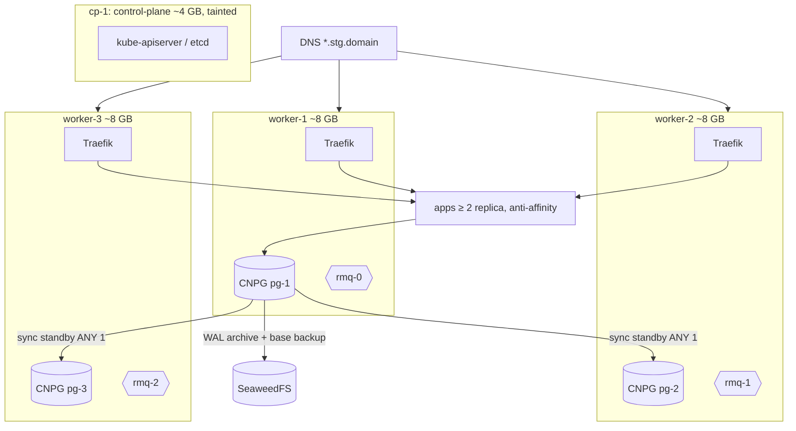
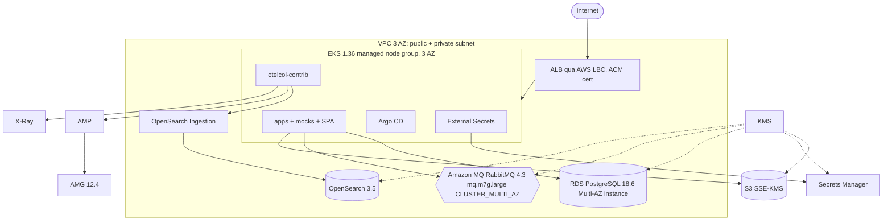
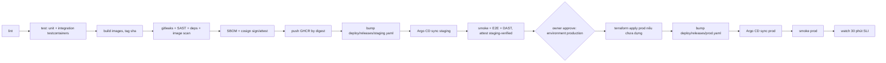

# Deployment — banking-go

> Môi trường, pipeline, release/promotion, migration, secret, rollback, dựng/hủy prod. Nguồn: spine AD-13, AD-14, AD-15, AD-26 + Stack + Deferred,
> `nfr.md` (NFR-A*, NFR-S5/S7), `constitution.md` §IV, quyết định của owner ngày 2026-10-06. Mâu thuẫn → spine thắng.
> Mục gắn `[D-n]` là giả định (không có trong spine/quyết định owner), liệt kê ở cuối. Đổi file này qua `/foundation update deployment`.

## Nguyên tắc
- **Build một lần mỗi commit**, push GHCR, ký cosign + SBOM; mọi môi trường chạy **cùng digest**; prod chạy đúng digest đã qua staging (promotion theo digest).
- **GitOps**: trạng thái mong muốn nằm trong Git; Argo CD sync; không `kubectl apply`/console sửa tay (constitution IV.2). Hạ tầng prod chỉ qua Terraform.
- **Prod chỉ đổi qua pipeline có duyệt tay**; người duyệt duy nhất là owner. AI không deploy, không duyệt, không rollback prod (constitution IV.3).
- Rollout = Kubernetes rolling update có readiness gate; rollback = `git revert` commit digest → Argo CD sync; DB không bao giờ `down` migration ở staging/prod.

## Môi trường
| | Local dev | Kind | CI | Staging | Prod |
|---|---|---|---|---|---|
| Mục đích | Code + debug | Thử GitOps/Helm/add-on/observability trước staging (ADR 0011) | Gate mọi PR / commit `main` | Tích hợp liên tục, demo E2E, đo SLO/HA (NFR-A1..A4) | Release/demo trên managed AWS |
| Hạ tầng | `docker compose` trên máy dev | kind 1.36 trên máy dev, 1 CP + 2 worker | GitHub-hosted runner `ubuntu-latest` | VPS kubeadm 1 CP + 3 worker, K8s 1.36 | AWS: EKS 1.36 + managed services, **ephemeral** |
| Chạy gì | PostgreSQL 18, RabbitMQ 4.3, SeaweedFS, otelcol-contrib + Jaeger v2 + Prometheus/Grafana (profile `obs`); Go service chạy `go run`/compose; SPA `vite dev`; 4 mock | Mọi deployable + add-on platform bản nhẹ (1 replica, không ECK; Jaeger in-memory) | Lint, unit, integration (testcontainers PG 18 + RabbitMQ 4.3), contract check, scan, build image | Mọi deployable (AD-1) + add-on platform + observability tự dựng | Mọi deployable (kể cả mock) + dịch vụ AWS |
| Dữ liệu | Seed dev, xóa thoải mái | Seed dev, xóa cluster là mất | Container tạm | Dữ liệu demo bền, backup + PITR | Disposable, mất khi destroy |
| Deploy | Thủ công | Tự động mỗi commit `main` (bot bump `deploy/releases/kind.yaml`, Argo CD trên kind kéo GitHub) | — | Tự động mỗi commit `main` (digest bump) | `release-prod.yml` + owner duyệt |
| Thời gian sống | — | Khi dev bật (`make kind-up` / `kind-down`) | Mỗi job | Liên tục | Chỉ trong cửa sổ release/demo |
| Rollback | `docker compose down -v` + `git checkout` | `rollback.yml -f env=kind` | n/a — chạy lại job / revert PR | `rollback.yml` / `db-pitr.yml` theo § Rollback | `rollback.yml` / `db-pitr.yml` theo § Rollback (owner duyệt) |

Compose dùng image upstream chính thức (không Bitnami); file `deploy/compose/compose.yaml` + `.env.example` `[D-1]`.

## Staging topology


| Thành phần | Cấu hình |
|---|---|
| Node | `cp-1` ~4 GB (taint `NoSchedule`), `worker-1..3` ~8 GB; Ubuntu LTS + containerd `[D-2]`; kubeadm **1.36.x** (bằng EKS) |
| Bootstrap | Ansible trong `infra/staging/` chạy qua workflow `staging-infra.yml` (owner duyệt); cài kubeadm, CNI, Argo CD lần đầu, rồi Argo CD tự quản lý chính nó |
| CNI / storage | Cilium (NetworkPolicy) `[D-3]`; local-path-provisioner cho PV (CNPG, RabbitMQ, ES dùng đĩa local + replica ở tầng app) `[D-4]` |
| Ingress | Traefik v3.7 DaemonSet `hostPort` 80/443 trên 3 worker; DNS A record trỏ 3 worker (không có cloud LB) `[D-5]`; Gateway API v1.6 |
| Stateful | CNPG 3 instance + RabbitMQ 3 replica, required pod anti-affinity theo `kubernetes.io/hostname` (NFR-A4); ES/Kibana/Jaeger 1 replica best-effort |
| Mã hóa đĩa | Dùng mã hóa đĩa của nhà cung cấp VPS nếu có; không có → LUKS cho đĩa dữ liệu worker qua Ansible `[D-6]`. AD-25 (mã hóa field) áp dụng bất kể |
| etcd | Snapshot hằng ngày lên SeaweedFS (CronJob trên CP) `[D-7]` |

### Add-on platform (Argo CD app-of-apps, `deploy/argocd/staging/`)
Root app `bg-staging-root` → các Application con; thứ tự bằng `argocd.argoproj.io/sync-wave`. Chỉ chart/operator upstream trong Stack, **không Bitnami** (AD-14).

| Wave | Add-on | Version (Stack) | Cách cài |
|---|---|---|---|
| -30 | Gateway API CRDs | v1.6.x standard | Manifest upstream (cài trước controller) |
| -25 | Argo CD (self-managed) | v3.5 | Chart `argo/argo-cd` |
| -20 | cert-manager (+ ClusterIssuer Let's Encrypt, internal CA cho mTLS) | v1.21.x | Chart jetstack |
| -20 | Sealed Secrets | v0.40 | Chart **controller** của project sealed-secrets (repo `https://bitnami.github.io/sealed-secrets`, không phải Bitnami charts catalog) `[D-8]` |
| -20 | Cilium, local-path-provisioner, metrics-server | pin trong values `[D-3]` `[D-4]` | Chart upstream |
| -15 | Traefik (Gateway provider) | v3.7 | Chart traefik |
| -15 | CloudNativePG operator + Barman Cloud plugin | 1.30 | Chart cloudnative-pg |
| -15 | RabbitMQ Cluster Operator + Messaging Topology Operator | v2.23 | Manifest upstream `[D-9]` |
| -15 | ECK operator | v3.5 | Chart elastic |
| -15 | SeaweedFS | 4.48 | Chart seaweedfs chính thức |
| -10 | kube-prometheus-stack (Prometheus 3.15, Alertmanager, Grafana 12.4.x pin) | chart 91.9 | Chart prometheus-community |
| -10 | Elasticsearch + Kibana (CR ECK) | 9.5 | CR trong `deploy/platform/eck/` |
| -10 | Jaeger v2 (storage ES) | v2.21 / chart 4.14 | Chart jaegertracing |
| -10 | OpenTelemetry Collector contrib | v0.162 | Chart open-telemetry, config `deploy/collector/staging.yaml` |
| -5 | Data: CNPG `Cluster pg` (3 instance, sync ANY 1), `Database`/managed roles; `RabbitmqCluster rmq` (3); topology `deploy/messaging/`; bucket SeaweedFS | — | CR trong Git |
| 0 | Apps: 4 service + 4 mock + 2 SPA (Helm `deploy/helm/<deployable>`, `values-staging.yaml` + `deploy/releases/staging.yaml`; env kind: `values-kind.yaml` + `deploy/releases/kind.yaml`, app-of-apps `deploy/argocd/kind/`) | digest | Argo CD auto-sync, prune, selfHeal |

### Capacity budget staging (spine Deferred) `[D-10]`
Tổng request bộ nhớ mục tiêu ≤ 18 GiB / 24 GiB worker (chừa ~1 GiB/node cho kubelet/system). Xem lại sau load test R3.

| Nhóm | Request mem (tổng) |
|---|---|
| CNPG 3 × 1 GiB · RabbitMQ 3 × 1 GiB | 6 GiB |
| Elasticsearch 2.5 GiB · Kibana 1 GiB · Jaeger 0.25 GiB | 3.75 GiB |
| Prometheus 1.5 GiB · Grafana/Alertmanager/exporters 0.5 GiB · Collector 2 × 0.25 GiB | 2.5 GiB |
| Argo CD 1 GiB · SeaweedFS 1 GiB · Traefik/cert-manager/operators/Sealed Secrets 1 GiB | 3 GiB |
| Apps: core, core-worker, public-api, admin-api × 2 replica (~0.25 GiB) · mock × 4 · SPA × 2 × 2 | ~2.5 GiB |

## Prod topology (AWS, ephemeral)


| Thành phần | Cấu hình |
|---|---|
| Region | `ap-southeast-1` `[D-11]` |
| VPC | 3 AZ, subnet public (ALB, NAT) + private (EKS node, RDS, MQ, OpenSearch); **1 NAT gateway** để tiết kiệm `[D-12]` |
| EKS | 1.36; managed node group 3 × `t3.large` on-demand, 1/AZ `[D-13]`; add-on EKS: VPC CNI, CoreDNS, kube-proxy, EBS CSI, Pod Identity agent; IAM cho pod bằng EKS Pod Identity `[D-14]` |
| RDS | PostgreSQL **18.6**, Multi-AZ DB instance (sync standby, RPO 0 trong cluster), `db.t4g.large` `[D-13]`, KMS, backup retention 7 ngày `[D-15]`, `skip_final_snapshot = true` (dữ liệu disposable) |
| Amazon MQ | RabbitMQ **4.3**, `mq.m7g.large`, `CLUSTER_MULTI_AZ`, private, KMS |
| S3 | 1 bucket/env, SSE-KMS, block public access, lifecycle `kyc/` theo AD-24; `force_destroy = true` |
| Secrets | Secrets Manager (KMS) ← External Secrets chart 2.11 |
| Ingress | AWS Load Balancer Controller v3.5 + Gateway API v1.6; ACM cert; target type `ip` + pod readiness gate |
| DNS | Route 53 hosted zone `<domain>` + external-dns ghi record từ HTTPRoute `[D-16]` |
| Observability | otelcol-contrib → AMP (remote write + sigv4auth), OpenSearch Ingestion → OpenSearch Service 3.5, X-Ray (Transaction Search); AMG 12.4 |
| Platform in-cluster | Argo CD, ESO, AWS LBC, cert-manager (chỉ internal CA cho mTLS), external-dns `[D-16]`, otelcol-contrib, metrics-server — app-of-apps `deploy/argocd/prod/` |

### Terraform
```text
infra/prod/
  bootstrap/            # long-lived, apply 1 lần bằng tay bởi owner: S3 state bucket [+ D-17: GitHub OIDC role, Route 53 zone]
  modules/
    network/  eks/  rds/  mq/  s3/  kms/  secrets/  iam-workloads/
    observability/      # amp, amg, opensearch, osis pipeline, x-ray transaction search
    alerting/           # SNS topics, CloudWatch alarms, Lambda sns→telegram (observability.md)
    argocd-bootstrap/   # helm_release argo-cd + root Application deploy/argocd/prod [D-18]
  envs/prod/            # backend.tf, versions.tf, main.tf, variables.tf, prod.tfvars, outputs.tf
```

```hcl
terraform {
  required_version = "~> 1.16"
  backend "s3" {
    bucket       = "bg-tfstate-<account_id>"
    key          = "prod/terraform.tfstate"
    region       = "ap-southeast-1"
    encrypt      = true
    use_lockfile = true   # S3 native lock, không DynamoDB
  }
}
```
- State bucket: versioning, SSE-S3, block public access, `prevent_destroy`; là **tài nguyên dài hạn duy nhất có dữ liệu/chi phí** (state của `bootstrap/` cũng nằm trong bucket, key `bootstrap/terraform.tfstate`).
- Engine version đặt tường minh: EKS `1.36`, RDS `18.6`, MQ `4.3`, OpenSearch `OpenSearch_3.5`. Provider pin trong `versions.tf` + `.terraform.lock.hcl` commit.
- GitHub Actions vào AWS bằng OIDC (không access key tĩnh) `[D-17]`.

## Pipeline

- Thứ tự thật: image build `--load` → scan local → push theo digest → cosign ký **digest** (keyless, OIDC GitHub) + `cosign attest` SBOM SPDX `[D-19]`. Digest chưa ký/scan fail thì không bao giờ được ghi vào `deploy/releases/*`.
- Ngưỡng fail: gitleaks bất kỳ phát hiện; SAST/deps/image: Critical/High có fix (NFR-S5); DAST staging: High.

| Stage | Công cụ `[D-20]` |
|---|---|
| Lint | golangci-lint v2.14 (depguard, forbid float trong module tiền), `buf lint`, `buf breaking`, OpenAPI diff, ESLint + i18n lint, `helm lint` + `helm template` (Helm 4.2 tương thích), `terraform fmt/validate`, `tflint` |
| Test | `go test` unit + integration (testcontainers v0.44), test quyền `core_app` (UPDATE/DELETE `journals`/`entries`/`audit_records` fail), migration up trên DB rỗng + trên schema release trước; Vitest + axe (NFR-U1) |
| Secret scan | gitleaks v8.30 (PR + main) |
| SAST | CodeQL (Go, TS) + gosec qua golangci-lint |
| Deps | govulncheck, osv-scanner (Go + pnpm lockfile) |
| Image scan | Trivy (OS + lib) |
| SBOM / ký | syft (SPDX JSON) + cosign v3 keyless; verify `cosign verify --certificate-identity-regexp '^https://github.com/<owner>/banking-go/.github/workflows/main.yml@refs/heads/main$' --certificate-oidc-issuer https://token.actions.githubusercontent.com` |
| E2E / DAST | Playwright (`tests/e2e`) với mock failure mode; OWASP ZAP baseline trên `*.stg` |

### GitHub Actions workflows (`.github/workflows/`)
| File | Trigger | Việc | Environment |
|---|---|---|---|
| `ci.yml` | `pull_request`, `workflow_call` | Lint, test, contract check, gitleaks, SAST, deps scan; build image không push | — |
| `main.yml` | `push` → `main` | Gọi `ci.yml` → build → scan → SBOM/ký → push GHCR → commit bump `deploy/releases/staging.yaml` và `deploy/releases/kind.yaml` (concurrency `staging-deploy`) | — |
| `staging-verify.yml` | `workflow_run` (`main.yml` success), `workflow_dispatch` | `argocd app wait` staging → smoke → E2E → DAST → `cosign attest --type staging-verified` cho từng digest → watch 10 phút (không chặn, `observability.md` § Post-deploy watch) | `staging` |
| `staging-drills.yml` | `workflow_dispatch` (`drill`: `chaos\|pitr\|node-drain\|failover\|load\|all`) | NFR-M2, NFR-A2, NFR-A3, NFR-A4, NFR-P1 trên staging; mở PR lưu báo cáo `tests/*/reports/` | `staging` |
| `staging-infra.yml` | `workflow_dispatch` | Ansible `infra/staging/` (kubeadm, OS patch, nâng K8s) `[D-21]` | `staging-infra` (owner duyệt) |
| `infra-prod.yml` | `pull_request` paths `infra/prod/**` (plan), `workflow_dispatch` (`action`: `plan\|apply\|destroy`) | Terraform prod; apply/destroy chỉ sau duyệt | `production` |
| `release-prod.yml` | `workflow_dispatch` (`release`: tag `vX.Y.Z`) | Preflight → duyệt → terraform apply nếu chưa dựng → bump `deploy/releases/prod.yaml` → wait sync → smoke → watch 30 phút | `production` |
| `rollback.yml` | `workflow_dispatch` (`env`, `revert_sha`) | Commit chỉ đổi `deploy/releases/*` (digest): bot `git revert` + push thẳng; commit config: bot mở PR revert (`gh pr create`), owner merge → wait sync → smoke | `staging` / `production` |
| `db-pitr.yml` | `workflow_dispatch` (`env`, `target_time`) | PITR theo mục Rollback DB; mọi commit Git (maintenance, CR restore, đổi host) do bot mở PR, owner merge | `staging` / `production` |
| `nightly.yml` | `schedule` 02:00 Asia/Ho_Chi_Minh | Quét lại digest đang chạy (Trivy, osv), kiểm chữ ký, kiểm cert sắp hết hạn | — |

- Commit bump digest do GitHub App `bg-release-bot` thực hiện, chỉ được bypass ruleset cho `deploy/releases/*` `[D-22]`.

## Release & promotion
Digest của mọi deployable cho một môi trường nằm trong **một file**: `deploy/releases/<env>.yaml` (Argo CD đưa vào làm values file cuối) `[D-23]`.

```yaml
release: v0.1.0            # staging: sha-<gitsha>
gitSha: 3f2c1ab
images:
  core:         ghcr.io/<owner>/banking-go/core@sha256:…   # core-worker dùng chung image core (cmd khác)
  public-api:   ghcr.io/<owner>/banking-go/public-api@sha256:…
  web-customer: ghcr.io/<owner>/banking-go/web-customer@sha256:…
  # … admin-api, web-admin, mock-napas, mock-ekyc, mock-otp, mock-gateway
```

| # | Bước | Ai / gì |
|---|---|---|
| 1 | PR merge vào `main` (CI xanh, owner review) | Owner |
| 2 | `main.yml` build + ký + push; bot commit `deploy/releases/staging.yaml`; Argo CD sync staging (PreSync migration → rolling) | Pipeline |
| 3 | `staging-verify.yml`: smoke + E2E + DAST → attestation `staging-verified` trên từng digest | Pipeline |
| 4 | Gate theo release (mỗi release, không mỗi commit): demo E2E (constitution IV.5), chaos NFR-M2, PITR drill NFR-A3, node drain NFR-A4; R3: load NFR-P1, failover NFR-A2 — `staging-drills.yml` | Owner kích hoạt, pipeline chạy |
| 5 | Owner tag commit bump staging đã verify: `git tag -s v0.1.0 <bump_sha> && git push origin v0.1.0`; release note gồm danh sách digest, migration (expand/contract), `revert_sha` dự kiến | Owner |
| 6 | `gh workflow run release-prod.yml -f release=v0.1.0` | Owner |
| 7 | Job `preflight` (không cần duyệt): đọc `deploy/releases/staging.yaml` tại tag; `cosign verify` + `cosign verify-attestation --type staging-verified` cho mọi digest; in kế hoạch (infra cần dựng?, migration) | Pipeline |
| 8 | Job `deploy` dùng environment `production` → **chờ owner Approve** trên GitHub | Owner |
| 9 | Nếu prod chưa dựng: `terraform apply` (`infra-prod`), chờ Argo CD bootstrap + platform healthy | Pipeline |
| 10 | Copy `images` từ staging sang `deploy/releases/prod.yaml`, commit `release(prod): v0.1.0` | Pipeline (bot) |
| 11 | `argocd app wait bg-prod-apps --sync --health --timeout 1200` (PreSync migration → rolling update) | Pipeline |
| 12 | Smoke prod: health qua Gateway, login KH smoke + đọc số dư, login admin smoke, 1 chuyển nội bộ 1.000 VND giữa 2 TK smoke `[D-24]` | Pipeline |
| 13 | Watch 30 phút theo `observability.md` § Post-deploy watch; vượt ngưỡng → job fail + Telegram kèm lệnh rollback đề xuất | Pipeline → owner quyết |
| 14 | Hết demo: `gh workflow run infra-prod.yml -f action=destroy` (owner duyệt) | Owner |

### Rolling update (NFR-A5)
| Thiết lập | Giá trị |
|---|---|
| Strategy | `RollingUpdate`, `maxUnavailable: 0`, `maxSurge: 1`, `minReadySeconds: 10`, `progressDeadlineSeconds: 300` |
| Readiness | `/readyz` (admin port) gồm DB + broker; prod thêm ALB pod readiness gate (namespace label `elbv2.k8s.aws/pod-readiness-gate-inject=enabled`) |
| Shutdown | `preStop` sleep 5 s → SIGTERM → fail readiness, dừng consumer/relay, drain ≤ 30 s; `terminationGracePeriodSeconds: 45` (AD-26) |
| Availability | Replica ≥ 2 (app), PDB `minAvailable: 1`, anti-affinity mềm theo node/AZ |
| Kẹt rollout | Pod mới không ready → pod cũ vẫn phục vụ; quá `progressDeadlineSeconds` → Argo CD `Degraded` → pipeline fail → đề xuất rollback |

## Migration (AD-26)
| Mục | Quy tắc |
|---|---|
| Chạy ở đâu | Argo CD **PreSync hook Job** mỗi service (`argocd.argoproj.io/hook: PreSync`, `hook-delete-policy: BeforeHookCreation`), cùng image digest với app, lệnh `<svc> migrate up` (goose v3.28) `[D-25]` |
| Role | `<svc>_migrator` (sở hữu schema/bảng); app pod chạy `<svc>_app` (DML; `journals`, `entries`, `audit_records` chỉ INSERT/SELECT). App pod không bao giờ migrate |
| Thứ tự | Wave platform/data → Job `db-bootstrap` (tạo database + role idempotent; staging dùng CNPG managed roles/`Database` CR) `[D-26]` → PreSync migration từng service → rolling update app. Migration fail → sync dừng, bản cũ vẫn chạy |
| Session | `SET lock_timeout = '5s'`, `statement_timeout` theo migration; index lớn dùng `CREATE INDEX CONCURRENTLY` + `-- +goose NO TRANSACTION` `[D-27]` |
| Down | Không chạy `goose down` ở staging/prod. Sửa sai = migration mới (forward fix) hoặc PITR |

Expand → deploy → contract (bản trước luôn chạy được trên schema mới):

| Release N (expand) — được phép | Cấm trong cùng release với code dùng nó |
|---|---|
| Thêm bảng, cột nullable / có default, index concurrently, constraint `NOT VALID` rồi `VALIDATE` | Drop/rename cột hoặc bảng, đổi kiểu, thêm `NOT NULL` không default, đổi nghĩa giá trị enum/status |
| Code N ghi cả cũ + mới (dual-write) nếu đổi cấu trúc; backfill bằng job idempotent theo lô | Backfill trong PreSync Job chạy lâu (> 1 phút) |
| **Release N+1 (contract)**: drop cột/bảng cũ khi không còn bản nào đọc (N đã chạy hết trên mọi env) | Contract khi rollback về N−1 còn có thể xảy ra |

CI gate: chạy migration của commit trên schema của release trước + test của release trước trên schema mới (bảo đảm rollback app an toàn) `[D-28]`.

## Secrets
| Secret | Dùng bởi | Staging (Sealed Secrets) | Prod (ESO ← Secrets Manager) | Xoay vòng `[D-29]` |
|---|---|---|---|---|
| DB `<svc>_app`, `<svc>_migrator` (core, public, admin) | service / migration Job | CNPG tạo + Secret | Terraform `random_password` → SM; master RDS `manage_master_user_password` | 90 ngày; prod mới mỗi lần dựng |
| RabbitMQ user mỗi service | relay, consumer | Topology Operator `User` | Topology Operator `User` trên Amazon MQ; admin broker do Terraform → SM | 90 ngày |
| Object store | public-api (write `kyc/`), core/core-worker (read) | Key SeaweedFS S3 riêng từng quyền | Không secret: IAM qua Pod Identity | 90 ngày (staging) |
| Signing key EdDSA internal token + JWT KH + step-up (public-api) | public-api | Sealed | SM | 180 ngày, overlap `kid` (AD-10) |
| Signing key internal token admin-api (Tier-0) | admin-api | Sealed | SM | 180 ngày, overlap `kid` |
| JWKS công khai của edge | core | Secret mount | ExternalSecret | Theo key trên |
| KEK envelope (AD-25) | core, public-api, admin-api | Sealed Secret | **KMS key** (không rời KMS) | Key id mới; ciphertext cũ đọc bằng key id cũ |
| HMAC blind index (mỗi service) | core, public-api | Sealed | SM | Không xoay định kỳ (đổi = reindex), chỉ khi lộ |
| HMAC webhook mỗi đối tác | core-worker + mock tương ứng | Sealed | SM | 90 ngày, 2 secret active khi xoay (AD-12) |
| API key gọi đối tác (mock) | core-worker | Sealed | SM | 90 ngày `[D-30]` |
| GHCR pull | mọi namespace app | Sealed `ghcr-pull` | ESO | Token fine-grained read:packages, 90 ngày `[D-31]` |
| Telegram bot token, SMTP | Alertmanager / Lambda | Sealed | SM | Khi lộ |
| Argo CD repo deploy key | Argo CD | Sealed | SM | 180 ngày |
| Internal CA mTLS | cert-manager | Tự sinh trong cluster | Tự sinh trong cluster | Leaf 90 ngày tự renew |

- Sealed Secrets controller key tự renew 30 ngày; backup controller key (mã hóa) ngoài cluster do owner giữ `[D-32]`. Không secret nào trong Git dạng rõ, image hay log (NFR-S7).
- Ứng dụng đọc secret qua env var lúc khởi động; đổi secret → bump `secretsRevision` trong values (annotation pod template) bằng commit Git → rolling restart. ESO `refreshInterval: 5m` `[D-33]`.
- GitHub: environment `production` giữ `AWS_ROLE_ARN` (var), `TELEGRAM_BOT_TOKEN`; environment `staging` giữ `ARGOCD_STAGING_TOKEN` (account Argo CD chỉ get/sync) `[D-34]`.

## Rollback
Pipeline hoặc owner chạy; AI chỉ được **đề xuất** lệnh, không chạy với prod.
Bot `bg-release-bot` chỉ push thẳng commit bump digest trong `deploy/releases/*` (D-22); mọi commit khác của rollback config, PITR và cờ maintenance
đi qua PR do bot mở (`gh pr create`), owner merge.

### App (image digest)
```bash
# Owner: tìm commit bump cần revert
git log --oneline -- deploy/releases/prod.yaml | head -5
gh workflow run rollback.yml -f env=prod -f revert_sha=<bump_sha>      # chờ owner Approve (environment production)

# Workflow thực thi (bot; commit chỉ đổi deploy/releases/* nên push thẳng, D-22):
git revert --no-edit <bump_sha> && git push origin main
argocd app wait bg-prod-apps --sync --health --timeout 900
tests/e2e/smoke.sh https://api.<domain>
```
- An toàn vì migration chỉ expand: bản trước chạy trên schema mới; PreSync migration của bản trước là no-op (goose bỏ qua version đã áp) `[D-28]`.
- Staging giống hệt với `-f env=staging` (không cần duyệt).

### Config
- Config nằm trong `values-<env>.yaml` → `rollback.yml -f revert_sha=<config_sha>`; bot không push thẳng mà mở PR, owner merge:
```bash
# Workflow thực thi (bot):
git switch -c rollback/<config_sha> && git revert --no-edit <config_sha>
git push origin rollback/<config_sha> && gh pr create --base main --fill --label rollback
# Owner review + merge → argocd app wait → smoke
```
- Secret prod: đưa version trước về `AWSCURRENT`, rồi bump `secretsRevision` qua PR (bot mở, owner merge):
```bash
aws secretsmanager update-secret-version-stage --secret-id bg/prod/<name> \
  --version-stage AWSCURRENT --move-to-version-id <prev_version_id> --remove-from-version-id <cur_version_id>
```

### DB (forward fix trước, PITR khi mất/hỏng dữ liệu)
1. Ưu tiên **forward fix**: migration mới hoặc giao dịch `reversal` có duyệt (AD-23). Không sửa tay dữ liệu tiền.
2. PITR: `gh workflow run db-pitr.yml -f env=<staging|prod> -f target_time=2026-10-06T08:00:00Z` (prod cần owner duyệt). Workflow:

| Bước | Staging (CNPG) | Prod (RDS) |
|---|---|---|
| Chặn ghi | Bot mở PR `maintenance.enabled: true` (`gh pr create`), owner merge (Gateway trả 503 cho route ghi, worker dừng consumer) `[D-35]` | Như staging |
| Restore | Bot mở PR thêm CR `Cluster pg-restore` với `bootstrap.recovery` + `recoveryTarget.targetTime`, owner merge → Argo CD sync | `terraform apply -var 'pitr_restore_time=<target_time>'` → `aws_db_instance.pitr` với `restore_to_point_in_time` |
| Kiểm | Invariant check (FR-13), đếm giao dịch `succeeded` trước/sau, smoke đọc | Như staging |
| Chuyển | Bot mở PR đổi DB host trong values (`pg-restore-rw`), owner merge | Cập nhật secret host trong SM → PR bump `secretsRevision` (bot mở, owner merge) |
| Mở lại | Bot mở PR `maintenance.enabled: false`, owner merge; xóa cluster cũ sau 24 h (PR) | Như staging; destroy instance cũ ở apply sau |
| Đối soát | GD có `partner_attempts` sau `target_time` (lấy id từ log/trace) → tra soát với đối tác, xử lý bằng điều chỉnh có duyệt | Như staging |

- RPO/RTO: trong cluster RPO 0 (sync standby); mất cả cluster DB RPO ≤ 5 phút (WAL archive `archive_timeout` 5 phút / RDS PITR), RTO ≤ 1 giờ (NFR-A3). PITR drill mỗi release trên staging; prod tùy chọn trong cửa sổ release (restore ra instance riêng, kiểm, hủy).

### Infra (prod)
```bash
git revert --no-edit <infra_sha> && git push origin main      # qua PR, owner review
gh workflow run infra-prod.yml -f action=plan                   # xem plan
gh workflow run infra-prod.yml -f action=apply                  # owner Approve; job chạy:
terraform -chdir=infra/prod/envs/prod plan -out tfplan -var-file=prod.tfvars
terraform -chdir=infra/prod/envs/prod apply tfplan
```
Phương án cuối: destroy + dựng lại (prod disposable). Staging infra: revert commit Ansible → `staging-infra.yml`.

## Dựng / hủy prod
**Dựng** (~30–45 phút `[D-36]`): `gh workflow run infra-prod.yml -f action=apply` → owner Approve →

| # | Bước (pipeline) |
|---|---|
| 1 | `terraform apply`: VPC → KMS → EKS + node group → RDS, Amazon MQ, S3, Secrets Manager, OpenSearch + OSIS, AMP/AMG, X-Ray, SNS/alarm |
| 2 | Module `argocd-bootstrap`: Argo CD + root app `deploy/argocd/prod` `[D-18]` |
| 3 | Argo CD sync platform (Gateway API CRDs → ESO, AWS LBC, cert-manager, external-dns, Collector) → `db-bootstrap` → apps theo `deploy/releases/prod.yaml` |
| 4 | Nạp alert rule + alertmanager definition AMP, dashboard AMG (`observability.md`) |
| 5 | Smoke; sau đó release theo § Release (bước 10+) |

**Hủy**: `gh workflow run infra-prod.yml -f action=destroy` → owner Approve →
1. Lưu evidence (báo cáo smoke/watch, snapshot dashboard) vào artifact workflow / PR `docs/releases/` `[D-37]`.
2. `argocd app delete bg-prod-root --cascade` và chờ ALB/target group do AWS LBC tạo bị xóa (nếu không VPC destroy sẽ treo).
3. `terraform destroy` (RDS `skip_final_snapshot`, S3 `force_destroy`, Secrets Manager `recovery_window_in_days = 0`, KMS `deletion_window_in_days = 7`).
4. Kiểm còn sót: `aws resourcegroupstaggingapi get-resources --tag-filters Key=project,Values=banking-go` chỉ còn state bucket (+ `[D-17]`).

**Chi phí**: ước tính của owner **~250–400 USD/tháng nếu để chạy liên tục** — chưa kiểm bằng AWS Pricing Calculator; khoản lớn: Amazon MQ cluster 3 broker, RDS Multi-AZ, EKS control plane, node, NAT gateway, OpenSearch. Vì vậy prod chỉ sống trong cửa sổ release/demo; tag `project=banking-go` + AWS Budget cảnh báo email `[D-38]`.

## SPA
| Mục | Cách |
|---|---|
| Image | `web-customer`, `web-admin`: build Vite một lần → image `nginxinc/nginx-unprivileged` (upstream chính thức) phục vụ static `[D-39]`; cùng digest mọi env |
| Runtime config | `/config.json` mount từ ConfigMap (values env): `{ "apiBaseUrl": "https://api.<domain>", "env": "prod", "release": "v0.1.0" }`; SPA fetch lúc khởi động, không bake URL vào bundle |
| Cache | `index.html`, `config.json`: `no-cache`; asset có hash: `public, max-age=31536000, immutable` |
| Header | CSP (`connect-src` = API host từ config), HSTS (ở Gateway), `X-Content-Type-Options`, `Referrer-Policy`; CSRF/CORS/cookie chốt ở security conventions (spine Deferred) |
| CDN | Không (spine Deferred) |

## Domain & TLS
| Host | Staging | Prod | Backend |
|---|---|---|---|
| Web KH | `app.stg.<domain>` | `app.<domain>` | web-customer |
| API KH | `api.stg.<domain>` | `api.<domain>` | public-api |
| Web admin | `admin.stg.<domain>` | `admin.<domain>` | web-admin |
| API admin | `admin-api.stg.<domain>` | `admin-api.<domain>` | admin-api |
| Webhook đối tác | `hooks.stg.<domain>` | `hooks.<domain>` | core-worker listener (AD-12) |
| Điều khiển mock | `mocks.stg.<domain>` (token, cho E2E) | không public | mock-* `[D-40]` |
| Vận hành | `argocd.stg`, `grafana.stg`, `kibana.stg`, `jaeger.stg` (IP allowlist + đăng nhập) `[D-41]` | AMG URL; OpenSearch Dashboards qua datasource AMG | — |

- Staging: cert-manager v1.21 + Let's Encrypt (ACME HTTP-01 qua Gateway API solver) `[D-42]`; Traefik terminate TLS.
- Prod: ACM certificate (Terraform, DNS validation Route 53) gắn vào ALB qua AWS LBC.
- Nội bộ: mTLS bằng internal CA cert-manager ở cả hai env (AD-10). TLS 1.2+ mọi kết nối công khai (NFR-S7).

## Người duyệt & quyền
| Hành động | Ai được làm | Cơ chế |
|---|---|---|
| Merge vào `main` | Owner (review PR) | Ruleset `main`: PR bắt buộc, CI xanh, CODEOWNERS = owner cho `deploy/`, `infra/`, `.github/` |
| Deploy staging | Tự động sau merge | Bot chỉ ghi `deploy/releases/staging.yaml` |
| Drill staging, `staging-infra.yml` | Owner kích hoạt | Environment `staging-infra` có Required reviewer = owner |
| Deploy / rollback / PITR / terraform prod | **Chỉ owner duyệt** | Environment `production`: Required reviewers = owner, branch policy chỉ `main`/tag `v*`; "Prevent self-review" tắt (một người) |
| AI (Claude, agent) | Viết code, mở PR, đọc log/metric, **đề xuất** lệnh rollback | Không có quyền duyệt environment, không token AWS prod, không chạy workflow `production` (constitution IV.3) |
| Console AWS / `kubectl` ghi | Không ai (trừ break-glass) | Break-glass: owner, ghi lại trong `docs/incidents/` + đưa thay đổi về Git ngay sau `[D-43]` |

## Giả định
| ID | Giả định |
|---|---|
| D-1 | Local dev bằng `deploy/compose/compose.yaml`, image upstream chính thức, profile `obs` cho observability |
| D-2 | Node staging Ubuntu LTS + containerd |
| D-3 | CNI staging là Cilium (Stack chưa chọn CNI) |
| D-4 | PV staging dùng local-path-provisioner; HA dữ liệu ở tầng CNPG/RabbitMQ replica |
| D-5 | Không cloud LB ở VPS: Traefik DaemonSet hostPort trên 3 worker, DNS A record trỏ 3 worker |
| D-6 | Mã hóa đĩa staging: của nhà cung cấp nếu có, không thì LUKS qua Ansible |
| D-7 | Snapshot etcd hằng ngày lên SeaweedFS |
| D-8 | Sealed Secrets cài bằng chart của project sealed-secrets (chart repo `https://bitnami.github.io/sealed-secrets`, mã nguồn bitnami-labs; không phải Bitnami charts catalog); image controller của project nằm dưới namespace `bitnami` trên registry — owner đã xác nhận là ngoại lệ của AD-14 (2026-10-06) |
| D-9 | Topology RabbitMQ (exchange, retry, DLQ, user) khai báo bằng Messaging Topology Operator ở cả hai env; prod trỏ tới Amazon MQ qua `connectionSecret` (cluster ngoài) |
| D-10 | Capacity budget staging theo bảng, xem lại sau load test R3 |
| D-11 | Region prod `ap-southeast-1` |
| D-12 | Một NAT gateway (tiết kiệm, chấp nhận điểm lỗi đơn cho egress) |
| D-13 | Kích thước: node `t3.large` × 3, RDS `db.t4g.large` |
| D-14 | IAM cho pod prod bằng EKS Pod Identity |
| D-15 | RDS backup retention 7 ngày |
| D-16 | Route 53 hosted zone + external-dns cho record từ HTTPRoute (không có trong Stack) |
| D-17 | Ngoài state bucket còn GitHub OIDC provider/IAM role và Route 53 zone tồn tại lâu (miễn phí hoặc ~0.5 USD/tháng); lệch nhẹ quyết định "state bucket là tài nguyên dài hạn duy nhất" — owner đã đồng ý (2026-10-06) |
| D-18 | Terraform cài Argo CD + root app (helm provider) khi dựng prod |
| D-19 | cosign keyless (Fulcio/Rekor, OIDC GitHub), SBOM SPDX bằng syft, attest lên GHCR |
| D-20 | Bộ scanner: CodeQL, gosec, govulncheck, osv-scanner, Trivy, ZAP baseline (spine Deferred để security conventions chốt) |
| D-21 | Ansible staging chạy qua workflow có duyệt (SSH key trong environment `staging-infra`) |
| D-22 | Bot commit digest là GitHub App `bg-release-bot` bypass ruleset chỉ cho `deploy/releases/*` |
| D-23 | Digest mỗi env nằm trong một file `deploy/releases/<env>.yaml`; core-worker dùng chung image core |
| D-24 | Smoke prod dùng KH/admin smoke seed + 1 chuyển nội bộ 1.000 VND |
| D-25 | Binary service có subcommand `migrate up`; migration Job dùng cùng image digest |
| D-26 | Job `db-bootstrap` (prod) dùng secret master RDS tạo database + role; staging dùng CNPG managed roles + `Database` CR |
| D-27 | Migration đặt `lock_timeout` 5 s; index lớn tạo concurrently ngoài transaction |
| D-28 | CI chạy test rollback-compat (migration mới + code release trước); migrator bản cũ là no-op trên schema mới |
| D-29 | Chu kỳ xoay secret 90/180 ngày như bảng |
| D-30 | core-worker xác thực với mock bằng API key riêng mỗi đối tác |
| D-31 | Package GHCR private, pull bằng token fine-grained |
| D-32 | Owner giữ bản backup mã hóa của Sealed Secrets controller key ngoài cluster |
| D-33 | ESO `refreshInterval` 5 phút; restart pod qua `secretsRevision` trong Git |
| D-34 | GitHub runner gọi Argo CD staging qua API `argocd.stg` bằng token chỉ get/sync; prod dùng `aws eks update-kubeconfig` + `argocd --core` |
| D-35 | Có cờ `maintenance.enabled` chặn ghi ở Gateway và dừng consumer core-worker |
| D-36 | Dựng prod mất ~30–45 phút (chưa đo) |
| D-37 | Evidence release lưu ở `docs/releases/<version>.md` + artifact workflow |
| D-38 | AWS Budget cảnh báo email theo tag `project=banking-go` |
| D-39 | SPA image dựa trên `nginxinc/nginx-unprivileged` |
| D-40 | Endpoint điều khiển failure mode của mock chỉ mở ở staging, có token |
| D-41 | UI vận hành staging bảo vệ bằng IP allowlist Traefik + đăng nhập riêng của từng tool |
| D-42 | Let's Encrypt HTTP-01 qua Gateway API solver cho staging |
| D-43 | Có thủ tục break-glass ghi vào `docs/incidents/` |
