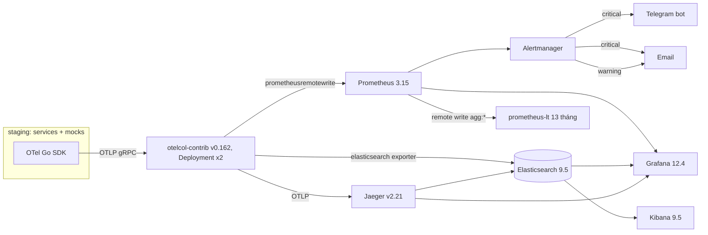
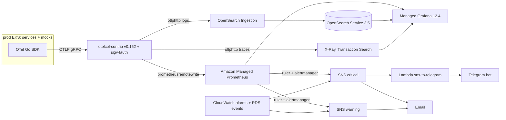

# Observability — banking-go

> SLI/SLO, chuẩn telemetry, pipeline theo môi trường, alert, dashboard, runbook, watch sau deploy, retention. Nguồn: spine AD-13 (OTLP only, alert rule
> Prometheus-format trong `observability/alerts/`, Grafana 12.4), AD-15, AD-17, AD-18, AD-26; `nfr.md`; `api-contracts/events.md` (retry/DLQ); quyết định owner 2026-10-06.
> Mục gắn `[O-n]` là giả định, liệt kê ở cuối. Đổi file này qua `/foundation update observability`.

## SLI / SLO
SLO cam kết và đo liên tục trên **staging**; prod chỉ đo trong cửa sổ release/demo (AD-26). Cửa sổ SLO 30 ngày; error budget 0.1%.

| Service | SLI | Đo bằng (sau khi dịch sang Prometheus) | SLO | NFR |
|---|---|---|---|---|
| public-api | Availability: request không 5xx / tổng (bỏ 4xx) | `http_server_request_duration_seconds_count{service_name="public-api"}` theo `http_response_status_code` | ≥ 99.9% | NFR-A1 |
| public-api | Latency p95 theo `route_class` `[O-1]` | `histogram_quantile(0.95, …_bucket)` | read < 100 ms · write < 300 ms · login < 500 ms · transfer < 200 ms | NFR-P2, P3, P1 |
| public-api | Tải chuyển nội bộ | k6 trên staging | 500 TPS, p95 < 200 ms, lỗi < 0.1% (R3) | NFR-P1 |
| admin-api | Availability | như public-api, `service_name="admin-api"` | ≥ 99.9% | NFR-A1 |
| admin-api | Latency p95 | như trên | read < 100 ms · write < 300 ms · login (mật khẩu + TOTP) < 500 ms | NFR-P2, P3 |
| core (gRPC) | Lỗi server: `Internal`, `Unknown`, `Unavailable`, `DeadlineExceeded`, `DataLoss` / tổng | `rpc_server_duration_milliseconds_count` theo `rpc_grpc_status_code`, `rpc_method` | ≥ 99.9% | NFR-A1 |
| core (gRPC) | Latency p95 theo method (ngân sách con của edge) `[O-2]` | `histogram_quantile(0.95, …)` | đọc < 60 ms · ghi < 200 ms · chuyển nội bộ < 120 ms | NFR-P1..P3 |
| core-worker | Xử lý message thành công (không vào DLQ) | `banking_messaging_processed_total{result}` | ≥ 99.9%; DLQ tiền = 0 | NFR-A1 |
| core-worker | Outbox lag (tuổi bản ghi chưa gửi cũ nhất) | `banking_outbox_lag_seconds` | p99 < 5 s `[O-3]` | NFR-P4 (gián tiếp) |
| core-worker | Job định kỳ chạy đúng hạn | `banking_job_last_success_timestamp_seconds{job_name}` | trễ ≤ 2 chu kỳ | AD-15 |
| partner integration | GD `unknown` có kết quả ≤ 30 phút | `banking_payment_unknown_resolution_duration_seconds` (≤ 1800 s / tổng) | ≥ 99% | NFR-P4 |
| partner integration | Timeout submit (10 s) / tổng submit, theo đối tác | `banking_partner_timeouts_total` / `banking_partner_requests_total` | < 1% `[O-4]` | NFR-P5 |
| partner integration | Callback đến trước hạn 2 phút | `banking_partner_callbacks_total{result}` + GD chuyển `unknown` do quá hạn | ≥ 99% `[O-4]` | NFR-P5 |
| ledger invariant | Lần chạy pass / tổng (mỗi 5 phút) | `banking_ledger_invariant_check_result{check}` | 100%; vi phạm = sự cố cao nhất | NFR-M1 |
| ledger invariant | Độ tươi | `time() - banking_ledger_invariant_check_last_success_timestamp_seconds` | ≤ 10 phút | NFR-M1 |

NFR không đo bằng SLI liên tục:

| NFR | Đo bằng | Ở đâu |
|---|---|---|
| NFR-M2 chaos, NFR-A2 failover, NFR-A4 mất node | `staging-drills.yml`; dashboard `failover.json` (đếm `succeeded` trước/sau, thời gian phục hồi) | `tests/chaos/reports/`, `tests/load/reports/` |
| NFR-M4 RPO 0 | Số replica sync (CNPG) + đối chiếu số GD sau failover | Alert `PostgresSyncStandbyMissing` |
| NFR-A3 RPO ≤ 5 phút / RTO ≤ 1 giờ | WAL archive alert + PITR drill mỗi release (thời gian restore) | `deployment.md` § Rollback DB |
| NFR-A5 deploy không downtime | Smoke liên tục trong lúc sync + watch 30 phút | § Post-deploy watch |
| NFR-S1, S6 | Metric login/lockout, audit `outcome=denied` | `security.json` |
| NFR-S2..S5, S7, NFR-U1..U4 | Gate CI (test authN/authZ, scan log PII, SAST/deps/image/DAST, gitleaks, axe, i18n lint); S7 thêm alert cert (`CertificateExpiringSoon`, `CertificateNotReady`) | `deployment.md` § Pipeline; § Alert catalog |

## Chuẩn telemetry
| Mục | Quy tắc |
|---|---|
| Giao thức | Chỉ OTel Go SDK v1.47 → OTLP gRPC `otel-collector.observability:4317`; không SDK backend (AD-13). Context truyền qua HTTP (`traceparent`), gRPC metadata, header RabbitMQ (`traceparent`, `tracestate`) |
| Resource | `service.name` (= tên deployable AD-1), `service.version` (release hoặc `sha-<gitsha>`), `service.namespace=banking-go`, `deployment.environment.name` (`local\|ci\|staging\|prod`; tên hiện hành của `deployment.environment`) `[O-5]`, `service.instance.id` (pod); `k8s.*` do Collector `k8sattributes` thêm |
| Log | JSON `log/slog` + otelslog v0.21; field bắt buộc: `time`, `level`, `msg`, `trace_id`, `span_id`, `service`, `env`, `version`, `request_id`, `actor` (`<actor_type>:<sub>`, vd `customer:0192…`), lỗi thêm `error.code` (mã ổn định) |
| Level | `LOG_LEVEL` (mặc định `info`; `debug` cấm ở prod) |
| Trace | Span cho mỗi request HTTP/gRPC, UoW (`uow.Do`), publish/consume message, gọi đối tác, job; attribute `banking.transaction.kind`, `banking.partner` (không id KH ở attribute span ngoài `actor`) |
| Sampling | `parentbased_always_on` ở staging/prod (lưu lượng thấp); load test đặt `OTEL_TRACES_SAMPLER_ARG=0.1` `[O-6]` |
| Exemplar | Bật trên histogram latency để nhảy metric → trace |

### Che PII (NFR-S4, AD-25, constitution III.2)
| Dữ liệu | Quy tắc |
|---|---|
| SĐT, CCCD | Chỉ 4 số cuối: `******1234` (kiểu `masked.Phone`/`masked.NationalID` hiện thực `slog.LogValuer`) |
| Mật khẩu, hash, token, refresh token, OTP, TOTP secret, session id, `Idempotency-Key` gốc của đăng ký, chữ ký HMAC | Không bao giờ log/trace/metric |
| Ảnh eKYC, body request/response, payload message | Không log; chỉ object key `kyc/…` khi cần |
| Header | Không ghi `Authorization`, `Cookie`, `Set-Cookie`, `x-actor` |
| SQL | Span DB chỉ tên query sqlc, không tham số |
| Lớp 2 | Collector `redaction`/`transform` processor xóa key thuộc deny-list (`password`, `token`, `authorization`, `cookie`, `otp`, `secret`, `phone`, `national_id`) và regex 9–12 chữ số liên tiếp `[O-7]` |
| Kiểm | Test log mẫu trong CI quét regex PII (NFR-S4) |

### Đặt tên metric
| Quy tắc | Ví dụ |
|---|---|
| Instrument chuẩn theo OTel semconv (otelhttp, otelgrpc, pgx, runtime) — không tự đặt lại | `http.server.request.duration`, `rpc.server.duration` |
| Metric nghiệp vụ: `banking.<domain>.<noun>[.<qualifier>]`, chữ thường, phân cách `.`; đơn vị UCUM (`s`, `By`, `{transaction}`, `{VND}`) | `banking.payment.unknown.oldest_age` (s) |
| Dịch sang Prometheus: `.` → `_`, thêm hậu tố đơn vị, counter thêm `_total` (`UnderscoreEscapingWithSuffixes`, cả hai env) `[O-8]` | `banking_payment_unknown_oldest_age_seconds` |
| Label: chỉ tập giá trị liệt kê được; **cấm** id (txn, customer, account), số TK, SĐT, số tiền, path thô, message lỗi | `kind`, `status`, `partner`, `result`, `route_class` |
| Counter khởi tạo 0 cho mọi tổ hợp label đã biết lúc start (để `increase()` bắt được lần đầu) | `banking.recon.conflicts{partner="gateway"}` = 0 |
| Bucket latency: 5, 10, 25, 50, 75, 100, 150, 200, 300, 500, 750 ms, 1, 2.5, 5, 10 s (khớp ngưỡng NFR) | |
| Recording rule: `sli:<name>:<window>` cho SLI (`sli:error_ratio:<window>`, `sli:latency_p95:<window>`); `agg:<name>:<window>` cho downsample; alert chỉ dùng recording rule khi có thể | `sli:error_ratio:rate5m` |

### RED / USE
| Loại | Đối tượng | Đo |
|---|---|---|
| RED | Mỗi HTTP route (`http_route` template + `http_request_method`), mỗi gRPC method, mỗi queue consumer | Rate `_count`, Errors (5xx / gRPC code lỗi server / `result="dlq\|retry"`), Duration histogram |
| USE | Node, pod (CPU, mem, disk, network) | node-exporter, cAdvisor, kube-state-metrics (staging); Collector `kubeletstats` + `k8s_cluster` receiver (prod) `[O-9]` |
| USE | Pool DB (pgxpool) | `banking.db.pool.connections{state}`, `banking.db.pool.acquire.duration`, `banking.db.pool.acquire.timeouts` |
| USE | PostgreSQL | CNPG exporter (connection, lock wait, deadlock, replication lag, WAL archive) / CloudWatch RDS |
| USE | RabbitMQ | Plugin Prometheus (staging) / CloudWatch Amazon MQ; depth DLQ đo từ app (dưới) |
| USE | Collector | `otelcol_exporter_queue_size`, `otelcol_exporter_send_failed_*` |

### Metric nghiệp vụ
| Metric (OTel) | Loại | Label | Phát từ |
|---|---|---|---|
| `banking.payment.transactions` | counter | `kind`, `status` (trạng thái đích) | `payment.Transition` sau commit |
| `banking.payment.transactions.open` | gauge (observable) | `kind`, `status=pending\|unknown` | core-worker, query DB mỗi 30 s `[O-10]` |
| `banking.payment.unknown.age` | histogram (s) | `kind`, `partner` | core-worker, tuổi mỗi GD `unknown` mỗi lần thu |
| `banking.payment.unknown.oldest_age` | gauge (s) | `partner` | core-worker, query DB độc lập job scan `[O-10]` |
| `banking.payment.unknown.resolution.duration` | histogram (s) | `partner`, `outcome` | `Transition(unknown → terminal)` |
| `banking.ledger.holds.active.amount` | gauge `{VND}` | — | core-worker |
| `banking.ledger.holds.active.count` | gauge | — | core-worker |
| `banking.ledger.invariant.check.result` | gauge (1 pass / 0 fail) | `check` (`journal_balanced`, `account_balance`, `available_balance`, `hold_terminal`, `non_negative`) | job `invariant_check` |
| `banking.ledger.invariant.check.last_success_timestamp` | gauge (s) | — | job `invariant_check` |
| `banking.outbox.lag` · `banking.outbox.pending` | gauge (s) · gauge | `service` | relay mỗi service |
| `banking.messaging.dlq.depth` | gauge | `queue` | core-worker, `QueueDeclarePassive` mọi `*.dlq` mỗi 60 s (giống nhau hai env) `[O-11]` |
| `banking.messaging.processed` | counter | `queue`, `result=ack\|retry\|dlq\|duplicate\|stale` | consumer |
| `banking.partner.requests` · `.request.duration` · `.timeouts` | counter · histogram (s) · counter | `partner`, `op=submit\|query` | core-worker adapter đối tác |
| `banking.partner.callbacks` | counter | `partner`, `result=applied\|duplicate\|mismatch\|conflict\|late\|invalid_signature` | webhook listener |
| `banking.recon.attempts` · `banking.recon.conflicts` | counter | `trigger`, `result` · `partner` | recon |
| `banking.identity.login.attempts` | counter | `result=success\|bad_credentials\|locked\|not_allowed` | public-api |
| `banking.identity.lockouts` | counter | — | public-api |
| `banking.backoffice.login.attempts` | counter | `result=success\|bad_credentials\|totp_failed\|locked` | admin-api |
| `banking.customer.ekyc.results` | counter | `result=passed\|suspicious\|failed\|timeout\|error` | core-worker |
| `banking.idempotency.outcomes` | counter | `result=new\|replay\|conflict\|in_progress` | `pkg/idempotency` |
| `banking.authz.denied` | counter | `service`, `actor_type` | core, admin-api |
| `banking.job.last_success_timestamp` · `banking.job.duration` | gauge · histogram | `job_name` | mọi job (AD-15) |

## Pipeline theo môi trường




| | Staging | Prod |
|---|---|---|
| Collector | Chart open-telemetry, `deploy/collector/staging.yaml`; processors `memory_limiter`, `k8sattributes`, `resource`, `redaction`, `batch` | `deploy/collector/prod.yaml`; thêm `sigv4auth`; IAM qua Pod Identity. Dùng otelcol-contrib (AD-13), không ADOT `[O-12]` |
| Metric | Remote write → Prometheus (`--web.enable-remote-write-receiver`) `[O-8]`; Prometheus vẫn scrape platform (ServiceMonitor) | Remote write → AMP; Collector scrape platform (cert-manager, ESO, LBC) bằng `prometheus` receiver `[O-9]` |
| Log | `elasticsearch` exporter → data stream `logs-banking-*` | `otlphttp` → OSIS pipeline (source OTLP) → OpenSearch index `logs-banking-*` |
| Trace | OTLP → Jaeger v2 (storage ES) | `otlphttp` → X-Ray OTLP endpoint (Transaction Search bật) |
| Alert rule | `observability/alerts/*.yaml` → `PrometheusRule` (chart) | Cùng file → `aws_prometheus_rule_group_namespace` (Terraform) |
| Infra không qua OTLP | — | RDS event subscription, CloudWatch alarm Amazon MQ/RDS/backup → SNS `[O-13]` |

## Alert catalog
Rule trong `observability/alerts/<group>.yaml` (Prometheus format, AD-13), nhãn `severity`, `service`, `runbook_url`. Receiver: **critical → Telegram + email**, **warning → email**.

| Alert | Expr (ý tưởng) | For | Sev | Runbook |
|---|---|---|---|---|
| `LedgerInvariantViolation` | `min by (check) (banking_ledger_invariant_check_result) == 0` | 0m | critical | `ledger-invariant-violation.md` |
| `LedgerInvariantCheckStale` | `time() - banking_ledger_invariant_check_last_success_timestamp_seconds > 600` (SLI ≤ 10 phút; chu kỳ 5 phút theo `nfr.md` § Hiệu năng) | 0m | warning | `ledger-invariant-check-stale.md` |
| `ReconConflict` | `increase(banking_recon_conflicts_total[10m]) > 0` | 0m | critical | `recon-conflict.md` |
| `PartnerCallbackMismatch` | `increase(banking_partner_callbacks_total{result="mismatch"}[10m]) > 0` | 0m | critical | `partner-callback-mismatch.md` |
| `UnknownTransactionAgeWarning` | `max(banking_payment_unknown_oldest_age_seconds) > 900` (15 phút) | 0m | warning | `unknown-transaction-age.md` |
| `UnknownTransactionAgeCritical` | `max(banking_payment_unknown_oldest_age_seconds) > 1500` (25 phút) | 0m | critical | `unknown-transaction-age.md` |
| `UnknownScanStale` | `time() - banking_job_last_success_timestamp_seconds{job_name="unknown_scan"} > 180` (3 × chu kỳ 60 s, `nfr.md` § Hiệu năng) | 0m | critical | `job-stale.md` |
| `MoneyCommandDLQNotEmpty` | `max by (queue) (banking_messaging_dlq_depth{queue=~"banking\\.payment\\..*\\.dlq"}) > 0` (A-59) | 0m | critical | `dlq-not-empty.md` |
| `DLQNotEmpty` | `banking_messaging_dlq_depth{queue!~"banking\\.payment\\..*"} > 0` | 5m | warning | `dlq-not-empty.md` |
| `OutboxLagHigh` | `max by (service) (banking_outbox_lag_seconds) > 60` | 5m | warning | `outbox-lag.md` |
| `OutboxStalled` | `max by (service) (banking_outbox_lag_seconds) > 300` | 0m | critical | `outbox-lag.md` |
| `ErrorBudgetBurnFast` | (`sli:error_ratio:rate1h > 14.4*0.001` and `sli:error_ratio:rate5m > 14.4*0.001`) or (`sli:error_ratio:rate6h > 6*0.001` and `sli:error_ratio:rate30m > 6*0.001`), theo `service` ∈ public-api, admin-api, core | 2m | critical | `error-budget-burn.md` |
| `ErrorBudgetBurnSlow` | (`sli:error_ratio:rate1d > 3*0.001` and `sli:error_ratio:rate2h > 3*0.001`) or (`sli:error_ratio:rate3d > 0.001` and `sli:error_ratio:rate6h > 0.001`) | 15m | warning | `error-budget-burn.md` |
| `LatencyP95Breach` | `sli:latency_p95:rate5m{route_class=…} >` ngưỡng SLO của class | 10m | warning | `latency-p95-breach.md` |
| `PartnerCallbackLateHigh` | `sum by (partner)(rate(banking_partner_callbacks_total{result="late"}[30m])) / sum by (partner)(rate(banking_partner_callbacks_total[30m])) > 0.01` | 0m | warning | `partner-timeouts.md` |
| `PartnerTimeoutRateHigh` | `sum by (partner)(rate(banking_partner_timeouts_total[10m])) / sum by (partner)(rate(banking_partner_requests_total[10m])) > 0.05` | 10m | warning | `partner-timeouts.md` |
| `PostgresFailover` | staging `changes(cnpg_pg_replication_in_recovery[5m]) > 0`; prod RDS event `failover` | 0m | warning | `postgres-failover.md` |
| `PostgresSyncStandbyMissing` | staging `cnpg_pg_replication_streaming_replicas < 1` (RPO 0 mất) | 2m | critical | `postgres-replication.md` |
| `PostgresReplicationLagHigh` | staging `max(cnpg_pg_replication_lag) > 10` | 5m | warning | `postgres-replication.md` |
| `RabbitMQNodeDown` | staging `count(rabbitmq_identity_info) < 3`; prod CloudWatch alarm broker health `[O-13]` | 2m | warning | `rabbitmq-node-down.md` |
| `RabbitMQQuorumLost` | staging `count(rabbitmq_identity_info) < 2` | 1m | critical | `rabbitmq-node-down.md` |
| `CertificateExpiringSoon` | `certmanager_certificate_expiration_timestamp_seconds - time() < 14*86400` | 1h | warning | `certificate-expiry.md` |
| `CertificateNotReady` | `< 3*86400` hoặc `certmanager_certificate_ready_status{condition="False"} == 1` | 15m | critical | `certificate-expiry.md` |
| `WALArchiveFailing` | staging `increase(cnpg_pg_stat_archiver_failed_count[15m]) > 0` (RPO ≤ 5 phút) | 0m | critical | `backup-failure.md` |
| `BackupFailed` | staging `time() - cnpg_collector_last_available_backup_timestamp > 26*3600`; prod RDS event `backup` failure | 0m | critical (staging) / warning (prod) | `backup-failure.md` |
| `LoginFailureSpike` | `sum(rate(banking_identity_login_attempts_total{result!="success"}[5m])) > 3 * sum(rate(…[5m] offset 1d))` and `> 0.5` (/s); tương tự admin `totp_failed` | 10m | warning | `login-failure-spike.md` |
| `LockoutSpike` | `increase(banking_identity_lockouts_total[15m]) > 10` | 0m | warning | `login-failure-spike.md` |
| `JobStale` | `time() - banking_job_last_success_timestamp_seconds > 2 * interval(job_name)`; `interval` theo bảng lịch job `nfr.md` § Hiệu năng (một rule mỗi `job_name`) | 0m | warning | `job-stale.md` |
| `TelemetryPipelineDegraded` | `rate(otelcol_exporter_send_failed_metric_points[5m]) > 0` hoặc Collector down | 10m | warning | `telemetry-pipeline.md` |
| `Watchdog` | `vector(1)` (luôn firing; mất = mất alerting) | — | none | `watchdog.md` `[O-14]` |

Ngưỡng outbox, timeout đối tác, login spike là đề xuất `[O-3]` `[O-4]` `[O-15]`; staging giữ thêm rule mặc định của kube-prometheus-stack (node, pod crashloop, PVC đầy) ở mức warning.

### Routing
| | Staging | Prod |
|---|---|---|
| Engine | Alertmanager (kube-prometheus-stack) | AMP alert manager (chỉ hỗ trợ SNS receiver) |
| critical | `telegram_configs` (bot token Sealed Secret, chat id owner) + `email_configs` | SNS `bg-prod-alerts-critical` → email subscription + Lambda `sns-to-telegram` (token trong Secrets Manager) `[O-16]` |
| warning | `email_configs` | SNS `bg-prod-alerts-warning` → email |
| Gom nhóm | `group_by: [alertname, service, env]`, `group_wait 30s`, `group_interval 5m`, `repeat_interval` critical 1h / warning 12h `[O-17]` | Như staging (định nghĩa trong `aws_prometheus_alert_manager_definition`) |
| Inhibit | critical cùng `alertname`+`service` chặn warning; `RabbitMQQuorumLost` chặn `RabbitMQNodeDown` | Như staging |
| Nhãn | Collector gắn `env=staging` | `env=prod`; email SNS cần xác nhận lại mỗi lần dựng prod `[O-16]` |

```yaml
# observability/alertmanager/staging.yaml (trích)
route:
  receiver: email-warning
  group_by: [alertname, service, env]
  routes:
    - matchers: [severity="critical"]
      receiver: telegram-email-critical
      repeat_interval: 1h
receivers:
  - name: telegram-email-critical
    telegram_configs: [{ bot_token_file: /etc/alertmanager/secrets/telegram/token, chat_id: <owner_chat_id> }]
    email_configs: [{ to: <owner_email> }]
  - name: email-warning
    email_configs: [{ to: <owner_email> }]
```

## Dashboards (as code)
`observability/dashboards/*.json`, JSON model Grafana **12.4** (export từ Grafana 12.4, `schemaVersion` pin), datasource tham chiếu bằng uid cố định `prom`, `logs`, `traces` ở cả hai env `[O-18]`. Staging nạp qua ConfigMap sidecar Grafana; prod nạp vào AMG bằng Terraform `grafana` provider `[O-19]`.

| File | Nội dung |
|---|---|
| `overview.json` | Golden signals mọi service, trạng thái SLO, alert đang firing, release hiện tại (`service.version`) |
| `slo-error-budget.json` | SLI/SLO 30 ngày, budget còn lại, burn rate 4 cửa sổ |
| `public-api.json`, `admin-api.json` | RED theo `http_route` + `route_class`, idempotency outcomes, rate limit |
| `core-grpc.json` | RED theo `rpc_method`, mã lỗi domain (`ErrorInfo.reason`) top-N, pool DB |
| `core-worker.json` | Consumer theo queue (`result`), outbox lag/pending, DLQ depth, job last success/duration |
| `payments.json` | GD theo `kind`/`status`, GD mở `pending`/`unknown`, histogram tuổi `unknown`, resolution ≤ 30 phút, holds active |
| `ledger-invariants.json` | Kết quả từng `check`, độ tươi, lịch sử vi phạm |
| `partners.json` | Latency/timeout theo `partner`/`op`, callbacks theo `result`, recon attempts/conflicts |
| `security.json` | Login KH/admin theo `result`, lockout, `authz.denied`, eKYC outcomes |
| `postgres.json` | CNPG (staging) / RDS CloudWatch (prod): kết nối, lock wait, replication, WAL archive, backup |
| `rabbitmq.json` | Node, queue depth, consumer, publish/ack rate |
| `kubernetes-use.json` | USE node/pod, restart, PVC |
| `deploy-watch.json` | So sánh trước/sau deploy (annotation từ Argo CD sync), các ngưỡng watch |
| `failover.json` | Drill failover/node drain: thời gian phục hồi, GD `succeeded` trước/sau |

## Runbooks
`observability/runbooks/<alert-kebab>.md`, một file mỗi tên trong cột Runbook; `runbook_url` trỏ link GitHub. Mỗi runbook theo khung:

```markdown
# <AlertName>
- Mức / NFR / AD: …
## Ý nghĩa            — điều kiện kích hoạt, tại sao quan trọng
## Tác động           — KH / tiền / SLO
## Kiểm tra (chỉ đọc) — dashboard, query PromQL/log/trace, SQL read-only
## Xử lý              — chỉ qua Git/pipeline hoặc lệnh nghiệp vụ có duyệt; không sửa tay DB, không kubectl ghi
## Không được làm
## Đóng sự cố         — điều kiện resolved, ghi docs/incidents/, test tái hiện (constitution II.1)
```

| Runbook | Kiểm tra | Xử lý | Không được làm |
|---|---|---|---|
| `ledger-invariant-violation.md` | `check` nào fail; query read-only so Σ entries với `balance`/`available_balance` tại snapshot; GD/journal gần nhất trên TK lệch; deploy gần nhất | **Dừng release** (constitution I.6), chặn promote; owner quyết `maintenance.enabled` nếu lệch tiếp diễn; tìm nguyên nhân, test tái hiện, fix forward; sửa số liệu chỉ bằng `reversal`/`balance_adjustment` có duyệt (AD-23) | UPDATE/DELETE journal/entry/balance; rollback DB mà không phân tích; tắt alert |
| `recon-conflict.md` | `partner_attempts` outcome `conflict` của GD; trạng thái ghi nhận vs bằng chứng đối tác; status query `GET /v1/transactions/<id>` | Giữ trạng thái đã ghi (AD-18); kế toán lập `reversal` có duyệt nếu đối tác đúng; báo đối tác nếu đối tác sai | Đổi trạng thái terminal; hạch toán lại tay |
| `partner-callback-mismatch.md` | Callback (`partnerRef`, `amount`) vs GD; xác thực chữ ký đã pass → key id nào; tần suất theo đối tác | GD đã chuyển `unknown` → để recon xử lý; nghi giả mạo/lộ key → xoay HMAC secret (2 active) | Hạch toán theo số tiền callback |
| `unknown-transaction-age.md` | `payments.json`: số GD `unknown`, tuổi, đối tác; `UnknownScanStale`? `PartnerTimeoutRateHigh`? DLQ `reconcile_transaction` | Đối tác lỗi → báo đối tác, recon tiếp tục theo lịch 1, 3, 8, 18 phút rồi mỗi 10 phút; staff "reconcile now"; > 30 phút → trả lời KH qua GDV (R1 chưa có kênh thông báo) | Đánh `failed` khi chưa có kết quả đối tác (constitution I.5); submit lại |
| `error-budget-burn.md` | Service/route/method nào, mã lỗi top-N, trace lỗi, deploy/config gần nhất, phụ thuộc (DB, MQ, đối tác) | Do deploy → owner chạy `rollback.yml` (AI chỉ đề xuất); do hạ tầng → runbook tương ứng | Tự rollback prod bằng AI; tăng timeout che lỗi |
| `ledger-invariant-check-stale.md` | `banking_job_last_success_timestamp_seconds{job_name="invariant_check"}`, log/trace job, advisory lock, pod core-worker | Sửa nguyên nhân (pod, DB, lock kẹt) qua Git/pipeline; job chạy lại tự động | Coi sổ cái là đúng khi job chưa chạy lại; tắt alert |
| `job-stale.md` | Job nào trễ so với lịch `nfr.md`; log lỗi job, advisory lock `<svc>.<job>`, core-worker có chạy | Sửa nguyên nhân qua Git/pipeline; `unknown_scan` trễ → staff "reconcile now" cho GD `unknown` cũ | Chạy job tay trên DB; xóa advisory lock tay |
| `dlq-not-empty.md` | Queue, số message, `x-death`/lý do, trace của message | Sửa lỗi consumer rồi shovel lại DLQ qua lệnh có duyệt (consumer idempotent); queue tiền: kiểm GD liên quan trước | Purge DLQ tiền; sửa payload tay |
| `outbox-lag.md` | `banking_outbox_lag_seconds`/`pending` theo service, relay có chạy, broker health, lock | Khôi phục relay/broker; relay tự gửi bù (at-least-once) | Xóa bản ghi outbox; publish tay |
| `latency-p95-breach.md` | `route_class`/method nào, trace chậm (exemplar), pool DB, lock wait, deploy gần nhất | Do deploy → đề xuất rollback; do DB/lock → runbook tương ứng | Nới SLO/ngưỡng để tắt alert |
| `partner-timeouts.md` | Đối tác, `op`, tỷ lệ timeout/callback trễ, chế độ lỗi mock, mạng | Báo đối tác/sửa cấu hình mock qua Git; GD `unknown` để tra soát tự xử lý | Tăng timeout che lỗi; đánh `failed` GD đang chờ |
| `postgres-failover.md` | Primary mới, thời gian failover, GD `succeeded` trước/sau, lỗi app trong khoảng đó | Xác nhận app kết nối lại; ghi nhận vào `docs/incidents/` | Promote/demote tay ngoài operator |
| `postgres-replication.md` | Số sync standby, replication lag, pod/PVC replica | Khôi phục replica qua CNPG (Git); RPO 0 mất cho tới khi có lại standby | Tắt synchronous replication để "chạy tiếp" |
| `rabbitmq-node-down.md` | Node nào, quorum queue còn đa số không, pod/PVC | Khôi phục node qua operator (Git); quorum mất → chặn ghi theo owner quyết | Xóa queue/PVC để dựng lại |
| `certificate-expiry.md` | Certificate/issuer nào, lý do renew fail (ACME, DNS, CA) | Sửa issuer/DNS qua Git, cert-manager renew | Tắt TLS/mTLS tạm thời |
| `backup-failure.md` | WAL archive/backup lỗi gì, dung lượng SeaweedFS, credential | Sửa đích lưu/credential qua Git; chạy backup lại; RPO ≤ 5 phút đang bị đe dọa | Tắt archive; xóa WAL cũ tay |
| `login-failure-spike.md` | Tỷ lệ theo `result`, IP/route, lockout, deploy auth gần nhất | Hồi quy deploy → đề xuất rollback; tấn công → siết rate limit qua Git | Tắt lockout/rate limit |
| `telemetry-pipeline.md` | Collector pod, `otelcol_exporter_*`, backend (Prometheus/ES/Jaeger/AMP) | Khôi phục Collector/backend qua Git | Bật SDK gửi thẳng backend |
| `watchdog.md` | Alertmanager/AMP ruler còn chạy, kênh nhận | Khôi phục alerting qua Git/Terraform | Tắt `Watchdog` |

## Post-deploy watch
Áp dụng sau mỗi `release-prod.yml` (30 phút, chặn release thành công) và sau `staging-verify.yml` (10 phút, không chặn) `[O-20]`.

| Bước | Việc |
|---|---|
| 1 | Baseline = SLI 30 phút ngay trước khi Argo CD sync. Prod vừa dựng (không có baseline) → dùng baseline của **cùng digest trên staging** + ngưỡng SLO tuyệt đối |
| 2 | Job `watch` query mỗi 60 s qua Grafana API (datasource proxy uid `prom`, token service account) — giống nhau staging/AMG `[O-21]` |
| 3 | Ghi annotation Grafana `deploy <release>` lúc bắt đầu và kết thúc |
| 4 | Hết 30 phút không vượt ngưỡng → release `succeeded`, báo cáo bảng trước/sau vào summary workflow + `docs/releases/<version>.md` |
| 5 | Vượt ngưỡng → job fail, Telegram + email: alert gì, số liệu trước/sau, lệnh đề xuất `gh workflow run rollback.yml -f env=prod -f revert_sha=<bump_sha>`; **owner quyết** |

| Điều kiện → đề xuất rollback | Ngưỡng |
|---|---|
| Alert critical bất kỳ với `env=prod` | Ngay |
| Tỷ lệ 5xx / lỗi gRPC server (5 phút) | > max(2 × baseline, 0.5%) liên tục 5 phút |
| p95 theo `route_class` | > max(1.5 × baseline, ngưỡng SLO) liên tục 10 phút |
| Pod mới restart / readiness flap | ≥ 1 restart của ReplicaSet mới |
| GD mới vào `unknown` | > 2 × baseline, hoặc tuổi `unknown` > 15 phút |
| DLQ depth | Tăng > 0 |
| Outbox lag | > 60 s liên tục 5 phút |
| Login thất bại (tỷ lệ) | > 2 × baseline (hồi quy auth) |
| Invariant fail | **Dừng release**, không tự rollback — rollback app không sửa sổ cái; theo runbook |

## Retention
| Dữ liệu | Giữ | Staging | Prod |
|---|---|---|---|
| Log | 30 ngày | ES ILM: rollover 1 ngày, delete 30 ngày | OpenSearch ISM delete 30 ngày |
| Metric đầy đủ | 30 ngày | Prometheus `retention.time: 30d` | AMP retention 30 ngày; mất khi destroy prod |
| Metric downsample | 13 tháng | Recording rule `agg:*` (5m, 1h) remote write sang `prometheus-lt` (Prometheus thứ hai, retention 395 ngày, chỉ series `agg:*`) `[O-22]` | Không giữ (prod ephemeral); evidence trong báo cáo release |
| Trace | 7 ngày | Jaeger ES index lifecycle delete 7 ngày | Transaction Search: log group `aws/spans` retention 7 ngày; X-Ray trace summary giữ theo mặc định dịch vụ, ngoài kiểm soát `[O-23]` |
| Alert history | — | Alertmanager mặc định | SNS không lưu; email/Telegram là bản ghi |
| Dashboard, rule, runbook | Vĩnh viễn | Git | Git |

Giao dịch, bút toán, audit (10 năm) không thuộc observability — xem `nfr.md`.

## Giả định
| ID | Giả định |
|---|---|
| O-1 | Middleware gắn attribute `route_class` (`read\|write\|login\|transfer`) cho mỗi route để đo NFR-P1..P3 |
| O-2 | Ngân sách latency core: đọc < 60 ms, ghi < 200 ms, chuyển nội bộ < 120 ms (phần còn lại cho edge + mạng) |
| O-3 | Outbox lag p99 < 5 s; alert 60 s warning / 300 s critical |
| O-4 | SLO đối tác: timeout < 1%, callback trước hạn ≥ 99%; alert timeout > 5% |
| O-5 | Dùng key semconv `deployment.environment.name` cho "deployment.environment" |
| O-6 | Trace 100% ở staging/prod, 10% khi load test |
| O-7 | Collector có lớp redaction thứ hai với deny-list key + regex chuỗi số dài |
| O-8 | Staging cũng đi Collector → remote write Prometheus để tên metric dịch giống AMP (`UnderscoreEscapingWithSuffixes`), label `service_name` từ resource |
| O-9 | Prod thu metric platform/K8s bằng Collector (`prometheus`, `kubeletstats`, `k8s_cluster` receiver) vì không có Prometheus in-cluster |
| O-10 | Gauge GD mở/tuổi `unknown` tính bằng query DB định kỳ ở core-worker, độc lập job `unknown_scan` |
| O-11 | DLQ depth đo bởi core-worker (`QueueDeclarePassive`) để hai env giống nhau, không phụ thuộc CloudWatch |
| O-12 | Prod dùng otelcol-contrib (theo AD-13), không ADOT |
| O-13 | Metric hạ tầng managed (RDS event, Amazon MQ health, backup) đi CloudWatch alarm/RDS event subscription → SNS; tên metric Amazon MQ chốt khi viết Terraform |
| O-14 | Có alert `Watchdog` luôn firing; kênh dead-man's-switch chốt sau (staging) |
| O-15 | Login spike: > 3 × cùng giờ hôm trước và > 0.5 lần/s; lockout > 10 / 15 phút |
| O-16 | Prod: Lambda `sns-to-telegram` (Terraform module `alerting`), email SNS phải xác nhận lại sau mỗi lần dựng prod |
| O-17 | `repeat_interval` critical 1 h, warning 12 h |
| O-18 | Datasource uid cố định `prom`, `logs`, `traces` ở cả Grafana staging và AMG |
| O-19 | Dashboard AMG nạp bằng Terraform `grafana` provider với token service account AMG |
| O-20 | Watch 10 phút không chặn sau mỗi deploy staging |
| O-21 | Job watch đọc metric qua Grafana API (datasource proxy) cho cả hai env |
| O-22 | Downsample 13 tháng ở staging bằng Prometheus thứ hai nhận recording rule `agg:*` (không Thanos/Mimir — ngoài Stack) |
| O-23 | Retention trace prod 7 ngày áp cho span log group; summary X-Ray theo mặc định dịch vụ |
